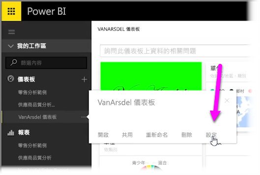
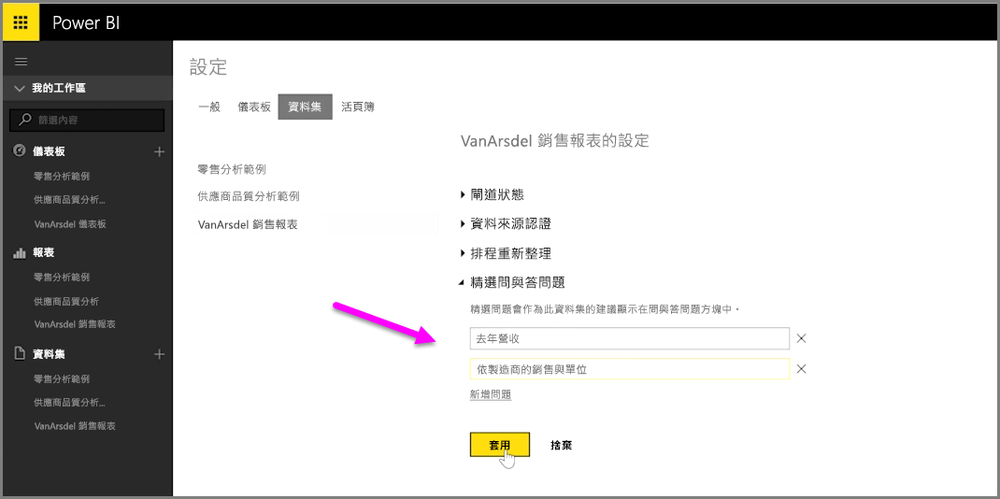

使用 Power BI 時，您可新增自己的建議問題，以供使用儀表板自然語言查詢方塊 (通常是指**問與答**方塊) 的其他使用者參考。 當使用者按一下儀表板頂端的輸入方塊時，即會顯示這些建議的問題。

若要新增自己的問題，請選取您想要使用之儀表板名稱旁的省略符號 (三個點...)，然後選取功能表的 [設定]  。

 這會開啟儀表板的 [設定]  頁面與基礎資料集或活頁簿。 [設定]  頁面的 [儀表板]  區段，可讓您完全停用問與答搜尋輸入方塊，但我們想要新增問題，因此選取 [資料集]  區段。

[資料集]  區段中會顯示已與儀表板建立關聯的所有資料集。 從清單中選取已與儀表板建立關聯的資料集，再選取 [精選問與答問題]  ，然後選取 [新增問題]  連結。 在輸入方塊中，輸入您的問題或提示，然後選取 [套用]  。

現在，只要使用者按一下所選儀表板的搜尋輸入方塊，就會在提示清單上方看到您建議的項目，使用者只要選取其中的問題，即可得到問與答的答案。 這是一個寶貴的方法，可讓儀表板使用者思考可用的資料類型以及如何善用這些資料類型。

