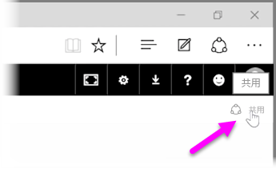
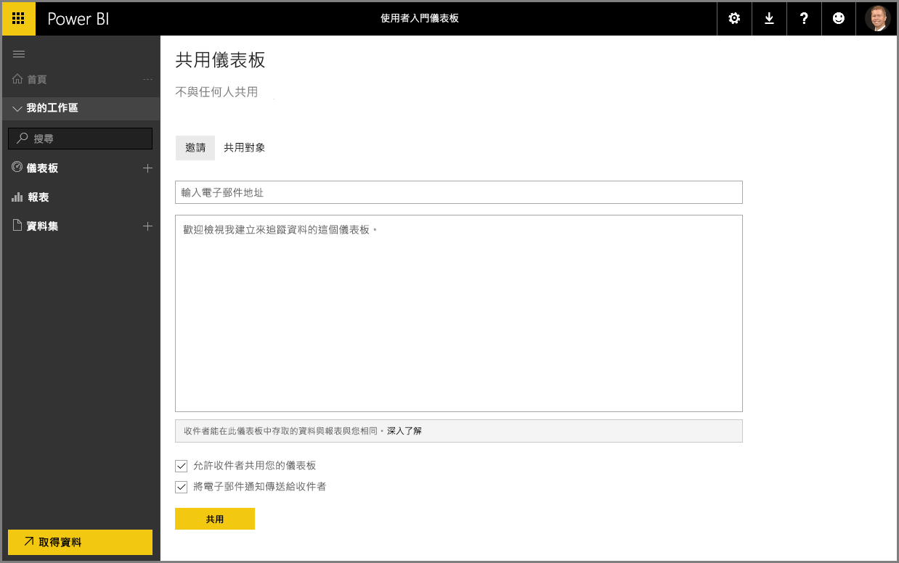

我們已經了解 Power BI 可如何協助您尋找資料、在資料模型中收集資料，並使用該資料建立報表和視覺效果。 我們也已了解如何將這些報表發佈至 Power BI 服務，並建立儀表板，以助您監視一段時間的資訊。 如果您想讓所有功能發揮更強大的效果，可與組織其他使用者共用您的深入資訊。 幸好，共用儀表板一點都不麻煩。

若要共用儀表板，請在 Power BI 服務中開啟儀表板，然後選取右上角的 [共用]  連結。

隨即顯示 [共用儀表板]  頁面，您可以在其中選取 [邀請]  區段，然後在 [電子郵件地址]  輸入方塊中，填入要授與儀表板存取權的使用者。 Power BI 會在您輸入電子郵件地址時，將其與您的網域和 Office 365 網域中的帳戶進行比對，並盡快自動完成。 您也可以將電子郵件地址複製並貼入此方塊，或使用通訊群組清單、安全性群組或 Office 365 群組，一次連線到多名使用者。

如果您選取底端的 [將電子郵件通知傳送給收件者]  核取方塊 ，則收件者會收到一封電子郵件，其中說明您已與他們共用儀表板，並包括儀表板的連結。 您可以在收件者將收到的電子郵件中新增附註，或傳送 Power BI 為您建立的附註 (位於您輸入收件者電子郵件地址之方塊的正下方)。

>[!NOTE]
>如果收件者沒有現有的 Power BI 帳戶，系統會引導他們完成註冊程序，之後才能檢視儀表板。
> 
> 

當您與任何人共用儀表板時，他們就可以跟您一樣查看儀表板並與其互動。 不過，他們只有基礎報表的 *唯讀* 存取權，且 *不能存取* 基礎資料集。

您也可以選取 \[共用儀表板] 頁面的 \[Shared With]  \(共用對象) 索引標籤，查看先前已與哪些使用者共用此儀表板。

