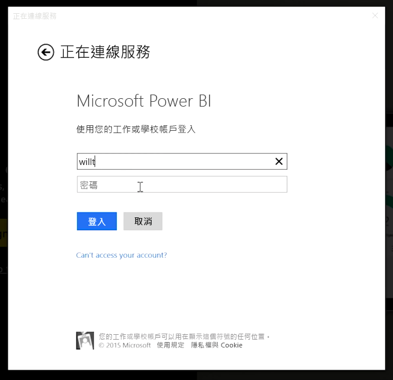
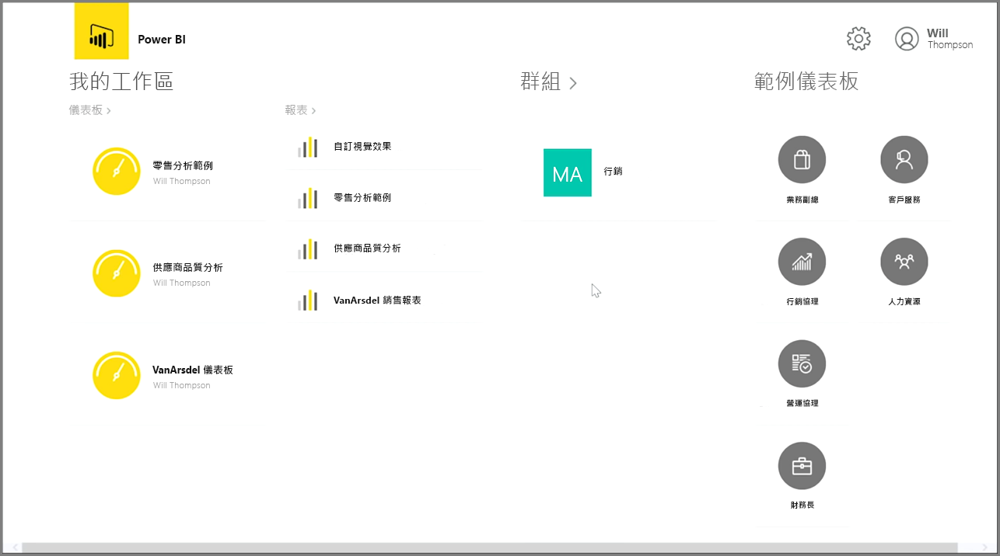
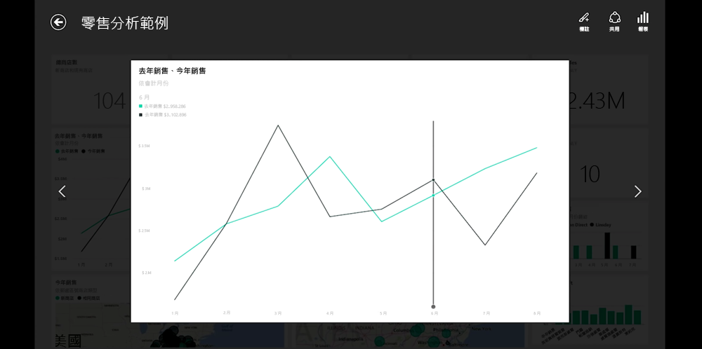
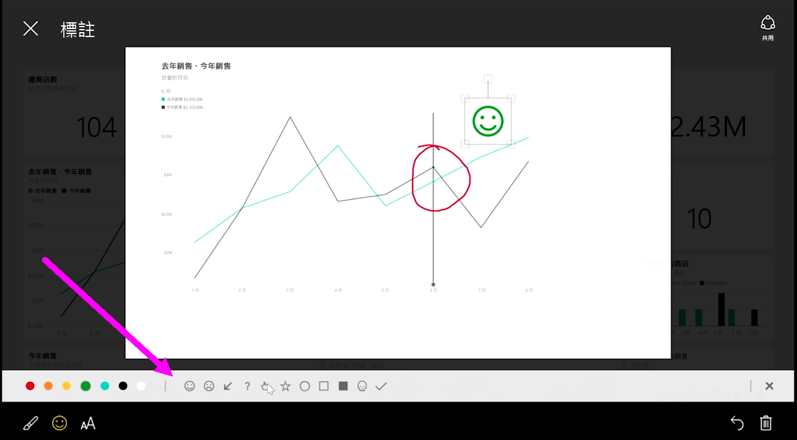

如果您想要在移動時追蹤資料，可以使用適用於 iOS、Android 和 Windows 裝置的其中一個 Power BI 行動應用程式。

在使用 Power BI 應用程式時，請先使用您的 Power BI 服務帳戶資訊登入帳戶。 在 Windows 行動裝置上 (此案例為平板電腦)，登入程序應類似如下。

第一個畫面會顯示您可存取的所有內容，包括報表、儀表板以及群組。 其中也有一些範例儀表板，可激發您的靈感，或單純查看 Power BI 的功能。 此應用程式專為觸控量身打造：只要點選儀表板或報表即可全螢幕檢視，並可用手指捲動內容。

您可點選開啟任何儀表板。 您可點選儀表板內的儀表板磚，以較大檢視來仔細研究。

您也可以點選右上角的 [註釋] 按鈕，針對發現的任何深入資訊加上註釋。 此功能可讓您在聚焦的磚上繪製，以將感興趣的特定區域反白顯示。 註釋工具位於畫面底部。

點選右上角的 [共用] 連結，即可共用您註釋過的磚。

點選右上角的 [報表] 連結，即可檢視磚的基礎報表。 這會顯示與網頁瀏覽器或 Power BI Desktop 中完全相同的視覺效果，並包含點選橫條、向下鑽研或使用交叉分析篩選器等與報表互動的功能。

