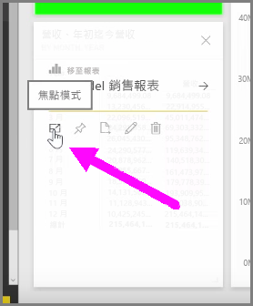
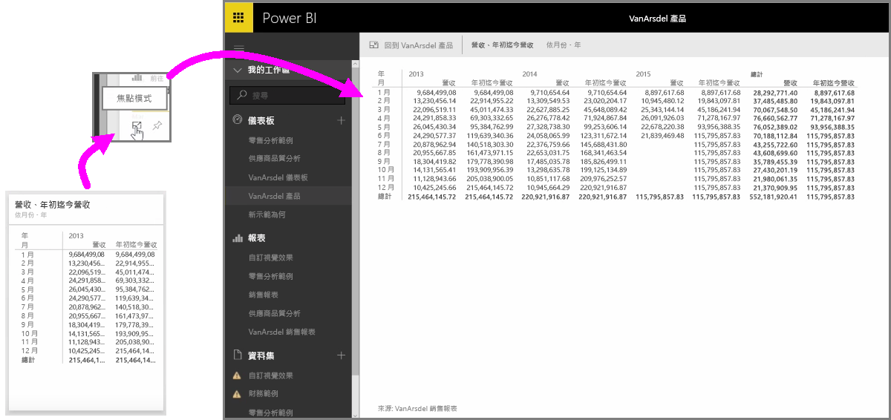

當您查看 Power BI 儀表板或服務中的報表時，有時可能需要將重點放在個別的圖表或視覺效果上。 您可以使用兩種不同的方式，來進行這項作業。

若您是使用儀表板，可將滑鼠停留在磚上方，即會在右上角看到幾個不同的圖示選項。 當您選取省略符號 (三個點) 時，即會看到圖示集合，這些圖示代表您可在磚上採取哪些動作。

最左邊的圖示標記為 [焦點模式]  。 選取該圖示可將磚展開至整個儀表板空間的大小。

[焦點模式]  可讓您查看視覺效果和圖例的更多詳細資料。 比方說，當您在 Power BI 中調整磚的大小時，由於磚的可用空間有限，某些資料行可能不會顯示。

而使用 [焦點模式]  時，您就可以看到所有的資料。 您也可以選取**釘選**圖示，直接從 [焦點模式] 將視覺效果釘選至不同的儀表板。 若要結束 [焦點模式]  ，請選取 [焦點模式]  左上角的**返回...** 圖示。

在檢視報表時，進行此程序的方法也類似。 將滑鼠停留在視覺效果上，即會在右側看到三個圖示，然後選取 [焦點模式]  圖示。 選取此圖示會將視覺效果展開至整個報表畫布的大小。 雖然您會暫時失去任何視覺效果之間的交叉篩選效果，但在此模式中，您仍可與視覺效果進行互動。

將滑鼠停留在展開的磚或報表上，然後選取左上角的**返回...** 左插入號圖示，即可返回上一個檢視。

