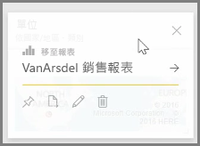
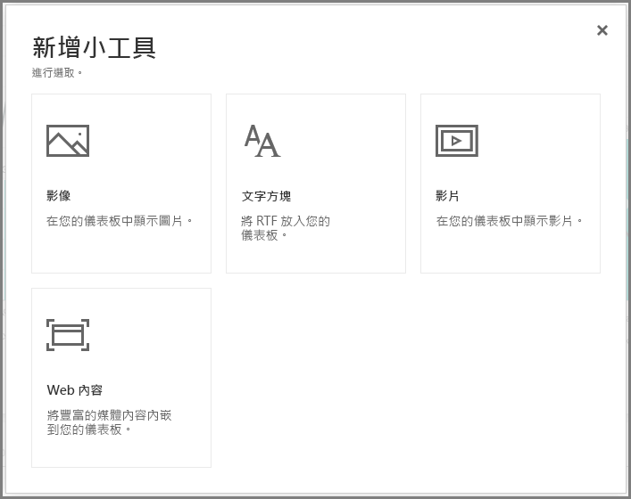
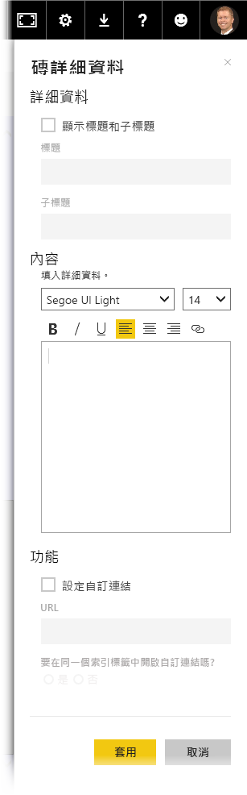

建置儀表板之後，您就可以在 Power BI 服務中編輯儀表板的 *磚* ，以進行幾個格式化變更。

若要變更磚，請將滑鼠停留在磚上並選擇省略符號 (三個點) 以顯示圖示集合，這些圖示可讓您進行磚的變更。

選取**畫筆**圖示，以開啟 [磚詳細資料]  窗格。 您可以在這裡變更磚的**標題**、**子標題**，包括上次重新整理的時間和日期，以及建立自訂連結等其他詳細資料。

根據預設，當您按一下儀表板的磚，即會進入磚的來源報表。 若要變更此行為，請使用 [磚詳細資料]  窗格中的 [設定自訂連結]  欄位。 您可以將這項功能設為在使用者按一下標誌影像時，將其導向組織首頁；這是常見的用法之一。

## 將 Widget 新增至您的儀表板
您也可以將 Widget 新增至儀表板。 **Widget** 是一種特殊的儀表板磚，其中包含影像、線上影片、文字方塊或豐富的 Web 內容等視覺化效果以外的其他項目。

當您選取 [儀表板] 右上角的 [新增 Widget] 連結時，即會開啟 [新增 Widget]  對話方塊。

比方說，當您新增文字方塊時，[磚詳細資料]  窗格會顯示在右側，您可以使用任何編輯磚詳細資料的類似功能，在此編輯詳細資料。 而使用 Widget 時，還會提供定義或修改 Widget 內容的區段，例如文字方塊的 RTF 編輯器。

因此，只要搭配使用 Widget 和編輯磚詳細資料的功能，您即可自訂儀表板，使其外觀完全符合您的需求。

