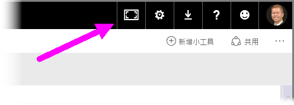
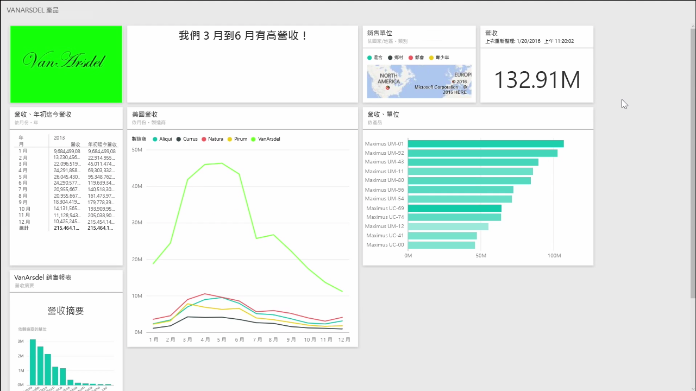
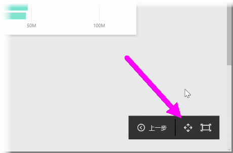
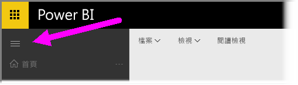

有時候，在建立儀表板時，您可能會發現您的內容超過畫布的容納量。 下列幾個解決方案有助您管理儀表板空間的顯示方式，以取得儀表板內容的完整檢視。

若要在一個畫面中顯示完整的儀表板，最簡單的方式是選取儀表板右上角的 [全螢幕模式]  按鈕。

選取 [全螢幕模式]  按鈕時，瀏覽器會進入全螢幕模式，同時移除儀表板周圍的所有組件區塊項目，藉此增加可檢視的空間量。

在 [全螢幕模式]  中，您可以選取 [全螢幕]  選項，藉此壓縮所有的磚，使其符合單一畫面大小，而不需使用捲軸。 通常，這稱為 *電視模式* ，適合用於搭配儀表板進行簡報，或是在走廊監視器上顯示儀表板的情況下。

管理儀表板空間的另一種方式是選取漢堡圖示，以摺疊頁面左側的瀏覽窗格。 再次按一下圖示，即可展開瀏覽窗格。

您可在 URL 的結尾附加下列文字，以確保儀表板一律會將導覽列摺疊起來：

> ?collapseNavigation=true
> 
> 

當使用者前往該連結時，開啟的儀表板就會摺疊導覽列。

