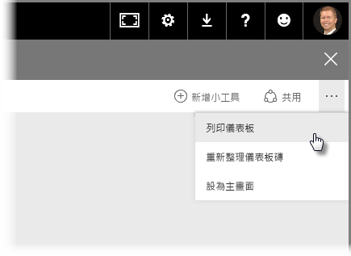
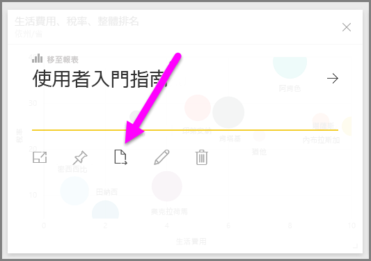
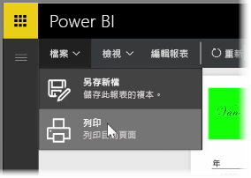

有時候，您可能想將列印的報表或儀表板帶去開會，以便與其他人共用。 透過 Power BI，您可以用多種方式將視覺效果列印出來。

在 Power BI 服務中，選取服務右上角的省略符號 (三個點)，然後選取 [列印儀表板]。

[列印] 對話方塊隨即出現，您可在其中選取要將儀表板傳送至哪部印表機，以及 [直式] 或 [橫式] 方向等標準列印選項。

## 匯出視覺效果的資料
在 Power BI 服務中，您也可以匯出任何視覺效果的資料。 只要選取任何視覺效果上的省略符號，然後選取 [匯出資料] 按鈕 (中間的按鈕) 即可。 當您這樣做時，系統會建立 .CSV 檔並將其下載到本機電腦，接著瀏覽器會出現訊息以讓您知道下載已完成 (如同任何其他瀏覽器起始的下載一樣)。

您也可以直接從報表進行列印或匯出作業。 在 Power BI 服務中檢視報表時，您可以選取 [檔案] > [列印] 以開啟 [列印] 對話方塊。

就像使用儀表板一樣，您也可以在報表內匯出視覺效果的資料，方法是選取視覺效果上的 [匯出] 按鈕。

