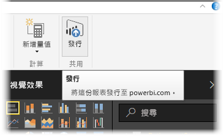
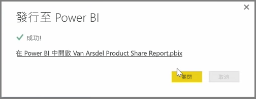

您可以更新已從 Power BI 發佈至 Desktop Power BI 服務的報表和資料集。 若要執行這項操作，請選取功能區中 [常用] 索引標籤的 [發佈]。

如果您發佈的報表已存在於 Power BI 服務中，系統會提示您確認是否要以剛選擇更新的已編輯版本，來取代先前的資料集和報表。

若您選取 [取代]，系統會將 Power BI 服務中的資料集和報表覆寫為 Power BI Desktop 的最新版本資料集和報表檔案。

如同 Power BI Desktop 的任何其他**發佈**事件一樣，系統會顯示一個對話方塊，說明發佈事件已成功，並會提供 Power BI 服務中的報表連結。

以上即為手動重新整理資料的方式。 您也可以自動更新資料集和報表；在其他學習主題中有談到這項程序。

