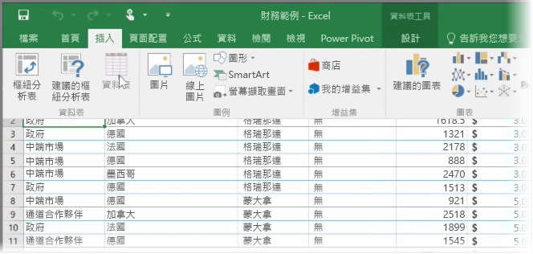
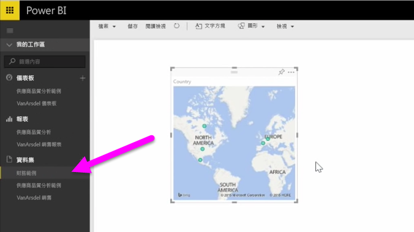

本主題中，我們會先學習如何將包含簡單資料表  的 Excel 活頁簿檔案從本機磁碟匯入 Power BI。 然後您將學習如何透過建立報表，開始探索 Power BI 中該資料表的資料。

## 請確認您的資料已格式化為資料表
為了讓 Power BI 從您的活頁簿匯入資料，該資料必須格式化為資料表  。 這很容易。 在 Excel 中，您可以反白顯示一些儲存格，然後在 Excel 功能區中的 [插入]  索引標籤，按一下 [資料表]  。

您應該確認每個資料行都具有適當的名稱。 當您在 Power BI 中建立報表時，就能更輕鬆地找到您想要的資料。

## 從本機磁碟匯入
無論您將檔案保留在何處，Power BI 都能讓您更輕鬆地加以匯入。 在 Power BI 中，您可以使用 [取得資料]   > [檔案]   > [本機檔案]  ，找出並選取所需的 Excel 檔案。

一旦匯入 Power BI，您就可以開始建立報表。

當然，您的檔案不一定要位於本機磁碟。 如果您能將檔案儲存在 OneDrive 或 SharePoint 小組網站上更好。 我們將在後續的主題中詳細討論。

## 開始建立報表
一旦匯入您活頁簿的資料，就會在 Power BI 中建立資料集。 其會出現在 [資料集]  下方。 現在您可以建立報表和儀表板，開始探索您的資料。 只要按一下資料集旁邊的開啟功能表  圖示，然後按一下 [探索]  ， 就會出現新的空白報表畫布。 您會在右側 [欄位]  下方，看到您的資料表和資料行。 只要選取您想要在畫布上建立新視覺效果的欄位。

您可以變更視覺效果的類型，並套用篩選  以及 [視覺效果]  下的其他屬性。

