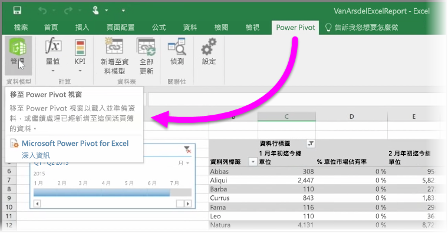

如果您使用 Excel 的任何進階 BI 功能，例如：\[Power Query] \(在 Excel 2016 中稱為 \[Get & Transform] \(取得與轉換)) 來查詢和載入資料、\[Power Pivot]  來建立功能強大的資料模型，以及 \[Power View] 來建立動態報表，則您也可將這些功能匯入 Power BI。

如果您使用 [Power Pivot] 建立進階資料模型，例如包含多個相關資料表、量值、計算結果欄和階層的資料模型，則 Power BI 也會將其全部匯入。

如果您的活頁簿包含 Power View 工作表，那也沒問題。 Power BI 會將其重新建立為新 Power BI 報表。 您可立即開始將視覺效果釘選到儀表板。

以下是 Power BI 其中一項絕佳的功能︰如果您使用 Power Query 或 Power Pivot 連接及查詢資料，以及從外部資料來源載入資料，則在您將活頁簿匯入 Power BI 之後，就可以設定排程的重新整理作業。 透過使用排程的重新整理作業，Power BI 會使用您活頁簿中的連接資訊以直接連接至資料來源和查詢，並載入任何已變更的資料。 報表中的任何視覺效果也會自動更新。

