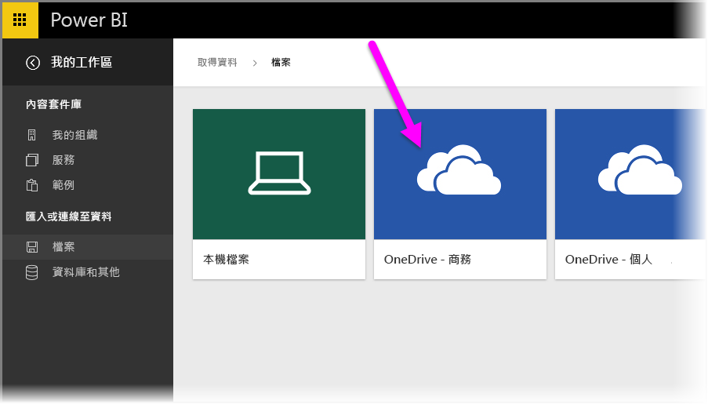
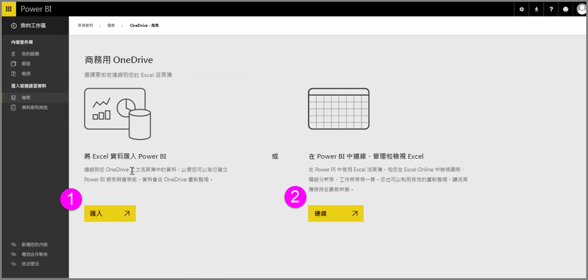
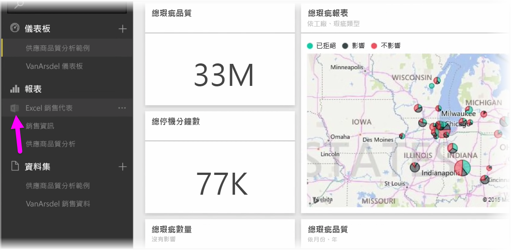
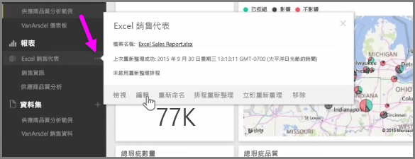

在您將 Excel 活頁簿儲存到 OneDrive 時，就能感受 Power BI 與 Excel 完美的整合。

因為 OneDrive 和 Power BI 一樣位於雲端，所以可在兩者間即時連線。 如果您對 OneDrive 上的活頁簿進行變更，這些變更會以 Power BI 自動同步處理  。 您報表與儀表板中的視覺效果會維持最新狀態。 如果您的活頁簿連接到外部資料來源 (例如資料庫或 OData 摘要)，您可以使用 Power BI 的 [排程重新整理]  功能檢查更新。 需要詢問與您活頁簿中資料有關的問題嗎？ 沒問題。 您可以使用 Power BI 的 [Q & A]  功能發問。

有兩種方式可連接到您商務用 OneDrive 上的 Excel 檔案：

1. 將 Excel 資料匯入 Power BI
2. 在 Power BI 中連接、管理及檢視 Excel

### 將 Excel 資料匯入 Power BI
當您選擇將 Excel 資料匯入 Power BI 時，便會從您的活頁簿將資料表資料載入 Power BI 中的新資料集。 如果您的活頁簿中有任何 Power View  工作表，則也會一併匯入，且會在 Power BI 中自動建立新的報表。

Power BI 將會保持其與您商務用 OneDrive 上活頁簿檔案的連接。 如果您對活頁簿進行變更，當您儲存變更時，這些變更會與 Power BI 自動同步處理  *，通常 1 小時內即可完成。 如果您的活頁簿連接至外部資料來源，您可以設定排程的重新整理作業，如此 Power BI 中的資料集就會維持最新狀態。 因為報表及 Power BI 儀表板中的視覺效果會使用資料集中的資料，當您探索時，您的查詢會快速亮起。

### 在 Power BI 中連接、管理及檢視 Excel
當您選擇連接到 Excel 活頁簿時，您就能享受到 在 Excel 和 Power BI 中流暢使用活頁簿的體驗。 當您以此方式連接，活頁簿的報表旁會有個小型 Excel 圖示。

在報表中，您會在 Power BI 中看到您的 Excel 活頁簿，如同在 Excel Online  中看到的一樣。 您可以探索及編輯 Excel Online 中的活頁簿，方法為從省略符號功能表中選取 [編輯]。 當您進行變更時，系統會自動更新任何已釘選到儀表板的視覺效果。

未在 Power BI 中建立任何資料集。 所有的資料會保留在 OneDrive 上的活頁簿中。 這種方法有許多優點，其中一項是您可在活頁簿連接至外部資料來源時，設定排程的重新整理作業  。 您可選取如樞紐分析表及圖表等元素，然後將其直接釘選  到 Power BI 儀表板。 如果您進行任何變更，這些變更會自動反映在 Power BI 中。 而且，您可以使用超棒的 Power BI [Q & A]  功能，詢問有關您活頁簿中資料的問題。  

