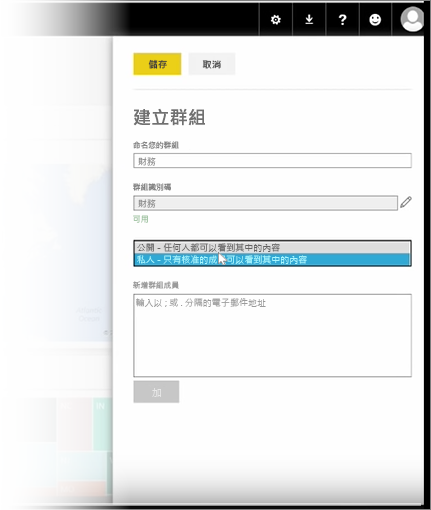
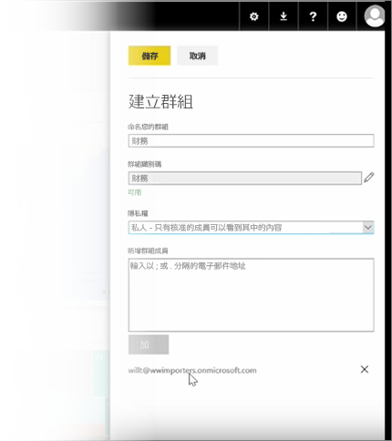

在本課程中，我們先建立群組。 群組會定義一組使用者，其可存取特定儀表板、報表和資料。

Power BI 中的群組以 Office 365 中的群組為依據，如果您已經使用 Office 365 群組管理群組的電子郵件、行事曆及文件，則您會發現 Power BI 提供相同的功能，且不只如此。 當您在 Power BI 中建立群組時，您實際上是建立了 Office 365 群組。

此模組會使用設定新財務群組的案例。 我們將示範如何設定群組、在群組中共用儀表板、報表和資料集，並新增可存取群組中項目的成員。

我從 [我的工作區] 開始。 這些是我所建立或其他人與我共用的儀表板、報表及資料集。

若我展開 [我的工作區]，便可以選取 [建立群組]。

我可以在這裡為它命名。 我們將使用財務群組的案例，因此我稱它為 Finance。 Power BI 會確保名稱尚未存在網域中。

我可以透過決定是否讓組織中的任何人查看群組內容，或僅限群組成員查看，進而設定隱私權等級。

我在這裡輸入電子郵件地址、安全性群組及通訊群組清單。 我選取 [新增] 讓其成為群組成員，然後儲存群組。

前往下一個課程！

