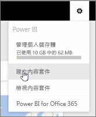
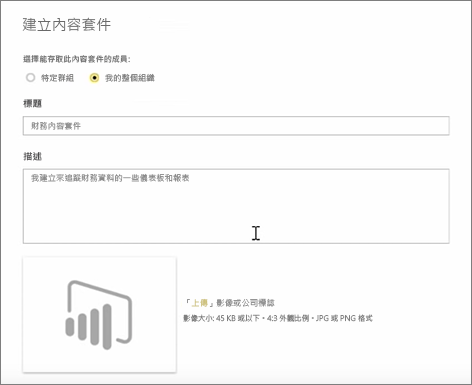
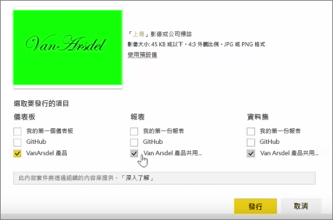
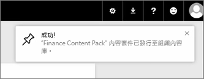

在本課程中，我們使用 Power BI 中現有的構件建立內容套件  ，並與同事加以共用。 

在 [我的工作區]  中有儀表板、下方的報表以及資料集。 我想要將其封裝並與我組織中的人員共用，以便他們可以重複使用。

當我選取**設定**圖示 （在服務的右上方的齒輪），我可以看到我用過，多少儲存體，並建立應用程式 （先前稱為 「 內容套件 」）。

在出現的對話方塊中，我可以選擇是否要將其散發給特定人員或群組，並為其指定標題。 它也是個不錯的主意，提供詳細的描述中**描述** 方塊中，瀏覽應用程式的了解它所包含或它所提供的人員。

在對話方塊底部，我可以上傳的映像應用程式，然後按一下 最重要的步驟：選取 我想要包含在應用程式中的儀表板，當我這麼做時，Power BI 會自動選取的報表和資料集所使用的儀表板。 我無法取消選取的報表或資料集，因為我想要包含在應用程式中的儀表板需要它們。

我也可以選取其他儀表板、報表和資料集，但我現在不打算這麼做。

當我發行時，應用程式會新增至組織的內容庫中。

前往下一個課程！

