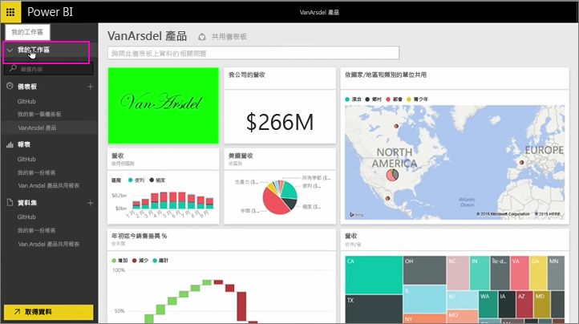
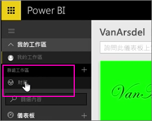
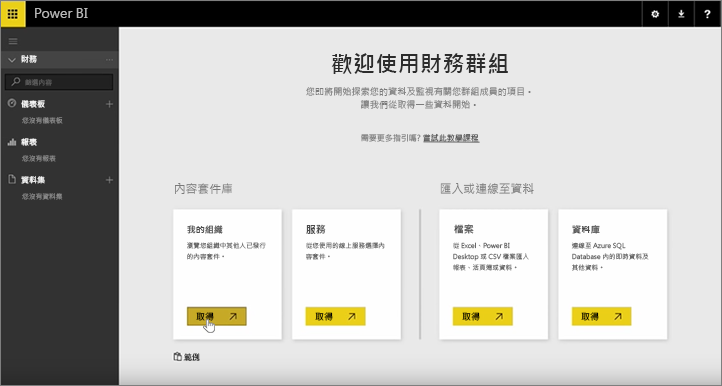
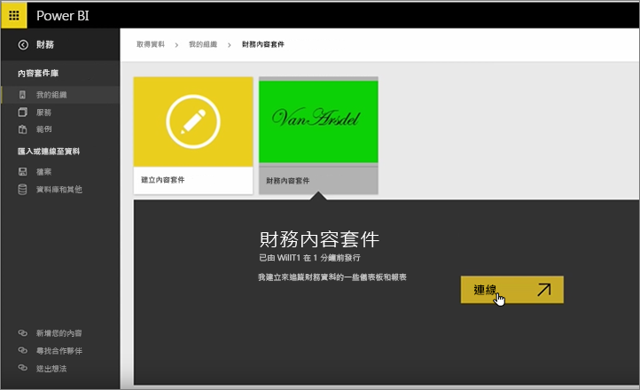
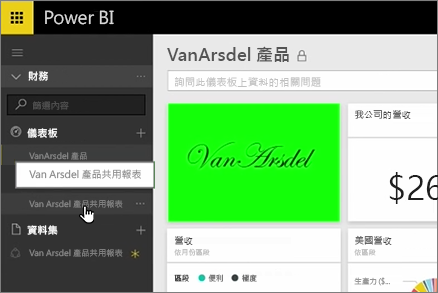
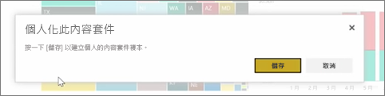
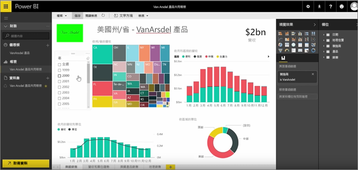

在先前課程中，我們已建立內容套件及群組。 在本課程中，我們要為群組中的每個人建立內容套件的執行個體。

我從 [我的工作區] 開始...

...然後切換回我在先前的課程中所建立的 Finance 群組。

群組尚未擁有任何儀表板、報表及資料集。 我使用我所建立的應用程式。 我瀏覽應用程式從我的組織而非從協力廠商服務。

我發現我一分鐘前建立的應用程式。 於是我了解為何好的標題、描述和影像如此重要，因為這樣可以吸引大家的注意。 我連接至此內容套件。

Power BI 匯入儀表板、 報表和應用程式中的資料集。

當我選取資料集時，Power BI 會詢問是否要個人化應用程式。

我要建立一份應用程式，我可以進行變更，並中斷應用程式的已發行版本。 如果應用程式建立者會對已發行的版本進行變更，我將不會自動收到這些更新。

但我仍能隨意編輯儀表板、報表甚至是資料集。

因此應用程式是簡單的方式來重複使用您組織中其他人所建立的內容。

前往下一個課程！

