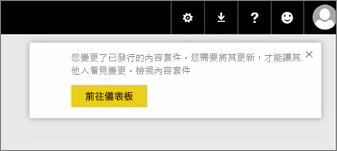
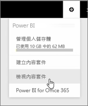
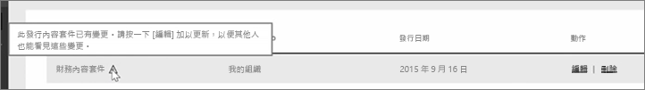

在本堂課中，我們要編輯先前所建立的原始內容套件，並查看這會如何更新其他已連接至此的人員。

我回到 [我的工作區]，編輯我的原始儀表板。

每當我對儀表板進行任何變更，我都會收到此提醒，告知我已變更內容套件中與其他人共用的項目，並提示我需更新共用的版本。

我回到設定圖示，然後選取 [檢視內容套件] 查看我已發佈的內容套件。

我看到所做的內容套件。 這個小圖示告知我已變更內容套件中的項目，且我需要編輯內容套件，才能讓其他人看到我的變更。

在我選取 [編輯] 時，我所回到的螢幕可讓我編輯標題和描述，不過這次它有了 [更新]  按鈕，所以我加以選取。

Power BI 會採用這些變更，並將更新的內容套件發佈至內容套件庫。

任何已連接到我的內容套件的人員皆會收到訊息，得知內容套件已變更，且訊息會詢問該人員是否要接受變更，或是要保留較舊的版本。

內容套件擁有者也是，您可以管理您的同事正在使用的版本。

