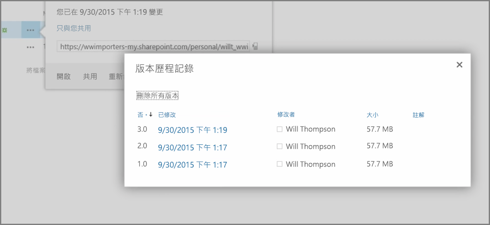
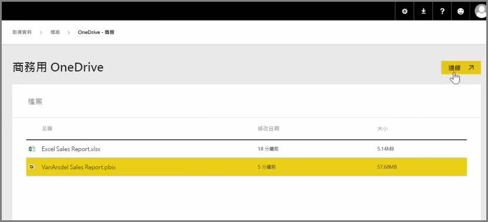
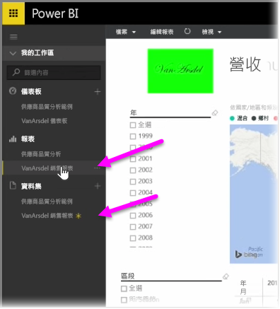

在之前的文章中，我們已檢閱透過建立群組來協助組織管理及共同處理 Power BI 中的內容。 您也可以使用 Power BI / Office365 群組，透過「商務用 OneDrive」進行共同作業及共用。

您可透過將商務用 OneDrive 用作 Power BI 內容的來源，以便存取許多實用的工具，例如版本歷程記錄。 您也可以從商務用 OneDrive 中與 Office365 群組共用您的檔案，讓多人同時存取及處理相同的 Power BI 或 Excel 檔案。

若要連接至商務用 OneDrive 上的 PBIX (Power BI Desktop) 檔案，請登入 Power BI 服務，然後選取 [取得資料]。 在 [匯入或連接至資料] 下選擇 [檔案]，然後選取 [OneDrive - 商務]。 將所需的檔案反白，然後選取 [連接]。

您的內容會出現在左側導覽列中。

現在，任何對「商務用 OneDrive」上的檔案所作的變更皆會自動反映在 Power BI 環境中，並記錄在版本歷程記錄中。

