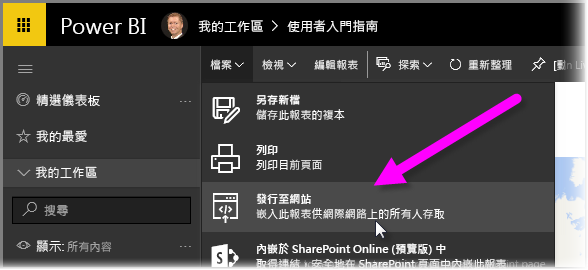
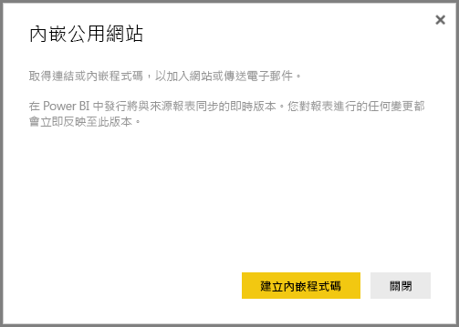
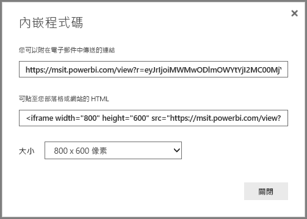
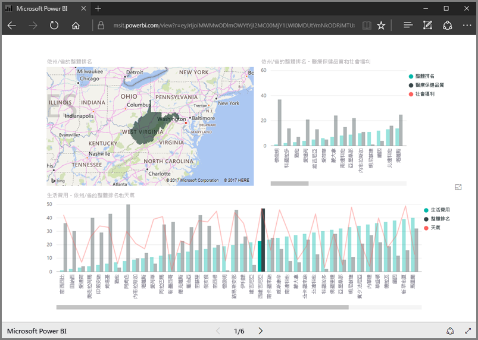
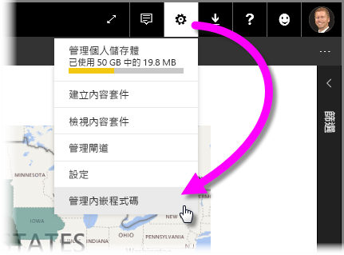
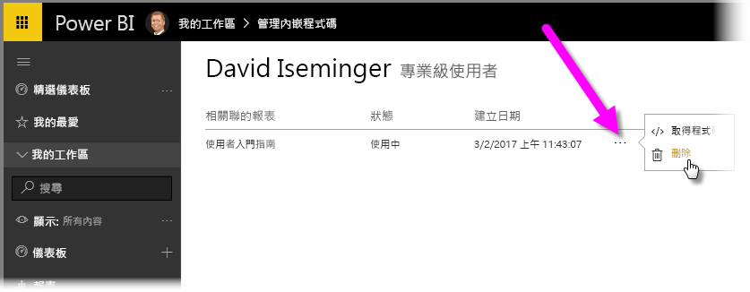

在本課程中，我們將了解如何在網頁上分享 Power BI 報表，或透過電子郵件分享，只要幾個簡單步驟就能達成目的。 這項 Power BI 功能通常稱為 [發佈至網路]  ，使用及管理起來很容易。

在 Power BI 中，選取您想要分享的報表，讓它顯示在畫布上。 然後從功能表，選取 [檔案] > [發佈至網路]  。

在這裡，您會看到一個對話方塊，說明您將取得可讓您在網站或郵件中包含報表的「內嵌程式碼」  。

當您選取 [建立內嵌程式碼]  時，Power BI 會顯示另一個對話方塊，再次通知您，您即將與網際網路上的所有人分享資料。 請確定這樣做沒問題！

Power BI 會顯示一個對話方塊，其中包含兩個連結：

* 您可以在電子郵件中分享的連結，會將報表顯示為網頁
* HTML 程式碼 (IFrame 內的額外連結)，以便您將報表直接嵌入網頁

針對 HTML 連結，您可以從內嵌報表預先定義的大小中進行選擇，您也可以自行修改 IFrame 程式碼並自訂其大小。

您可以直接將電子郵件連結貼入瀏覽器，然後以網頁形式查看報表。 您可以與該網頁互動，就像是在 Power BI 中檢視報表一樣。 下圖顯示當其連結直接從該對話方塊複製到瀏覽器時的 [發佈至網路]  頁面：

您也可以將該 IFrame 連結嵌入部落格文章或網站，或是 Sway。

要刪除您建立的內嵌程式碼嗎？ 沒問題。 在 Power BI 中，選取右上角的**齒輪**圖示，然後選取 [管理內嵌程式碼]  。

Power BI 工作區顯示您已建立的內嵌程式碼 (在下圖中只有一個)。 當您按一下省略符號時，您可以接著選擇取得內嵌程式碼的程式碼，或完全刪除內嵌程式碼。

以上就是將 Power BI 報表發佈至網路，並與全世界分享的所有課程內容。 就是這麼簡單！

