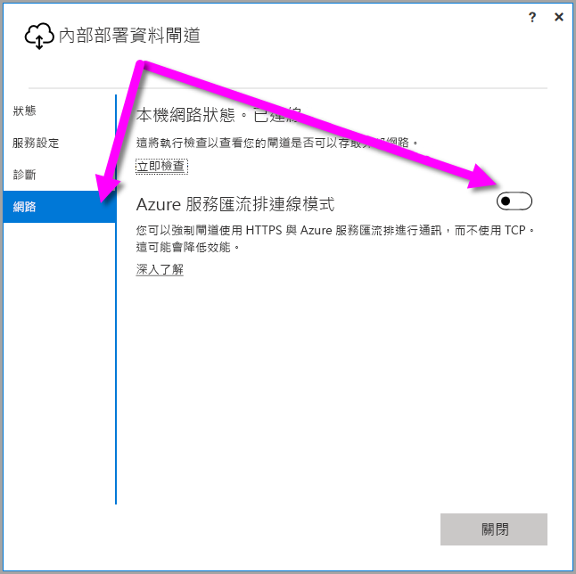
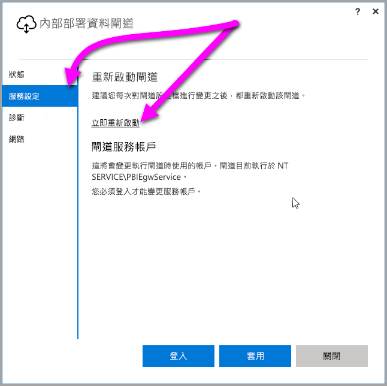

## <a name="sign-in-account"></a>登入帳戶
使用者將會使用公司或學校帳戶登入。 這是您的組織帳戶。 如果您註冊 Office 365 供應項目，而且未提供實際的公司電子郵件，其看起來可能會類似 nancy@contoso.onmicrosoft.com。您在雲端服務中的帳戶會儲存在 Azure Active Directory (AAD) 租用戶中。 在大部分情況下，您的 AAD 帳戶 UPN 會與電子郵件地址相符。

## <a name="windows-service-account"></a>Windows 服務帳戶
內部部署資料閘道已設定為使用 NT SERVICE\PBIEgwService 來表示 Windows 服務的登入認證。 根據預設，其具有「以服務方式登入」的權限。 這在您要安裝閘道的電腦內容中。

> [!NOTE]
> 如果您選取個人模式，請另外設定 Windows 服務帳戶。
> 
> 

這不是用來連接至內部部署資料來源的帳戶。  這也不是您登入雲端服務所用的工作或學校帳戶。

若您的 Proxy 伺服器發生驗證問題，可以將 Windows 服務帳戶變更為網域使用者或受管理的服務帳戶。 您可以學習如何從 [Proxy 設定](../service-gateway-proxy.md#changing-the-gateway-service-account-to-a-domain-user)變更此帳戶。

## <a name="ports"></a>連接埠
閘道會建立 Azure 服務匯流排的輸出連線。 它會在輸出連接埠上進行通訊：TCP 443 (預設)、5671、5672、9350 到 9354。  閘道不需要輸入連接埠。 [深入了解](https://azure.microsoft.com/documentation/articles/service-bus-fundamentals-hybrid-solutions/)

建議您將您資料區域的 IP 位址加入防火牆的允許清單中。 您可以下載 [Microsoft Azure 資料中心的 IP 清單](https://www.microsoft.com/download/details.aspx?id=41653)。 此清單會每週更新。 閘道會使用 IP 位址及完整網域名稱 (FQDN) 來與 Azure 服務匯流排通訊。 如果您強制閘道器使用 HTTPS 進行通訊，閘道器會嚴格限於使用 FQDN，使用 IP 位址則不會發生通訊。

> [!NOTE]
> Azure Datacenter IP 清單中所列的 IP 位址採用 CIDR 標記法。 例如 10.0.0.0/24 並不等於 10.0.0.0 到 10.0.0.24。 深入了解 [CIDR 標記法](http://whatismyipaddress.com/cidr)。
> 
> 

下列清單包含閘道所使用的完整網域名稱。

| 網域名稱 | 輸出連接埠 | 描述 |
| --- | --- | --- |
| *.download.microsoft.com |80 |下載安裝程式所使用的 HTTP。 |
| *.powerbi.com |443 |HTTPS |
| *.analysis.windows.net |443 |HTTPS |
| *.login.windows.net |443 |HTTPS |
| *.servicebus.windows.net |5671-5672 |進階訊息佇列通訊協定 (AMQP) |
| *.servicebus.windows.net |443, 9350-9354 |透過 TCP 之服務匯流排轉送上的接聽程式 (需要 443 以取得存取控制 Token) |
| *.frontend.clouddatahub.net |443 |HTTPS |
| *.core.windows.net |443 |HTTPS |
| login.microsoftonline.com |443 |HTTPS |
| *.msftncsi.com |443 |在 Power BI 服務無法與閘道連線時，用於測試網際網路連線。 |
| *.microsoftonline-p.com |443 |用於依據組態進行驗證。 |

> [!NOTE]
> 前往 visualstudio.com 或 visualstudioonline.com 的流量是供 App Insights 使用，對閘道的運作並非必要。
> 
> 

## <a name="forcing-https-communication-with-azure-service-bus"></a>強制與 Azure 服務匯流排進行 HTTPS 通訊
您可以強制閘道器使用 HTTPS 與 Azure 服務匯流排進行通訊，而不使用直接 TCP。 這可能會對效能產生影響。 若要這樣做，請修改 *Microsoft.PowerBI.DataMovement.Pipeline.GatewayCore.dll.config* 檔案，方法是將值從 `AutoDetect` 變更為 `Https`，如本段後面接著的程式碼片段所示。 該檔案 (依預設) 位於 C:\Program Files\On-premises data gateway。

```
<setting name="ServiceBusSystemConnectivityModeString" serializeAs="String">
    <value>Https</value>
</setting>
```

ServiceBusSystemConnectivityModeString 參數的值有區分大小寫。 有效值為「自動偵測」和「Https」。

您也可以使用 [2017 年 3 月](https://powerbi.microsoft.com/blog/power-bi-gateways-march-update/)版本開始提供的閘道器使用者介面，強制閘道器採用此行為。 在閘道器使用者介面中選取 [網路]，然後將 [Azure 服務匯流排連線模式] 切換為 [開啟]。



變更後，當您選取 [套用] \(進行變更才出現的按鈕) 時，「閘道 Windows 服務」會自動重新啟動，讓變更生效。

為供日後參考，您可以選取 [服務設定]，然後選取 [立即重新啟動]，從使用者介面對話方塊重新啟動「閘道 Windows 服務」。



## <a name="support-for-tls-1112"></a>TLS 1.1/1.2 支援
有了 2017 年 8 月更新和以上版本之後，內部部署資料閘道預設會使用傳輸層安全性 (TLS) 1.1 或 1.2，以與 **Power BI 服務**進行通訊。 舊版內部部署資料閘道預設會使用 TLS 1.0。 在 2018 年 1 月 15 日，TLS 1.0 支援將結束 (包括閘道使用 TLS 1.0 與 **Power BI 服務**互動的功能)，因此您必須在屆期前將內部部署資料閘道安裝升級為 2017 年 8 月版本或更新版本，以確保閘道持續運作。

請務必注意，在 11 月 1 日之前，內部部署資料閘道仍然支援 TLS 1.0，而且閘道會使用它作為後援機制。 若要確保所有閘道流量使用 TLS 1.1 或 1.2 (以及避免在閘道上使用 TLS 1.0)，您必須新增或修改執行閘道服務之電腦上的下列登錄機碼：

        [HKEY_LOCAL_MACHINE\SOFTWARE\Microsoft\.NETFramework\v4.0.30319]"SchUseStrongCrypto"=dword:00000001
        [HKEY_LOCAL_MACHINE\SOFTWARE\Wow6432Node\Microsoft\.NETFramework\v4.0.30319]"SchUseStrongCrypto"=dword:00000001

> [!NOTE]
> 新增或修改這些登錄機碼會將變更套用至所有 .NET 應用程式。 如需影響其他應用程式之 TLS 之登錄變更的資訊，請參閱 [Transport Layer Security (TLS) registry settings](https://docs.microsoft.com/windows-server/security/tls/tls-registry-settings) (傳輸層安全性 (TLS) 登錄設定)。
> 
> 

## <a name="how-to-restart-the-gateway"></a>如何重新啟動閘道
閘道會當作 Windows 服務來執行。 您可以像是任何 Windows 服務啟動及停止這項服務。 有多種方式可以執行這項操作。 以下示範如何從命令提示字元執行這項操作。

1. 在執行閘道的電腦上，啟動系統管理員命令提示字元。
2. 使用下列命令停止服務。
   
   net stop PBIEgwService
3. 使用下列命令啟動服務。
   
   net start PBIEgwService

