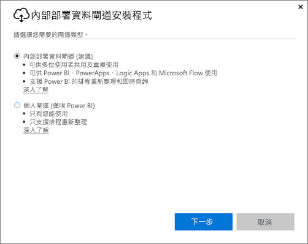
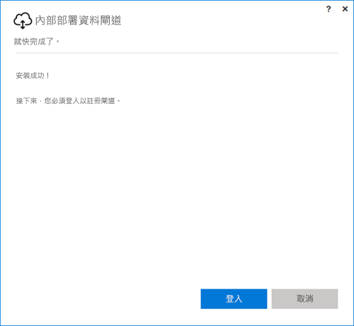
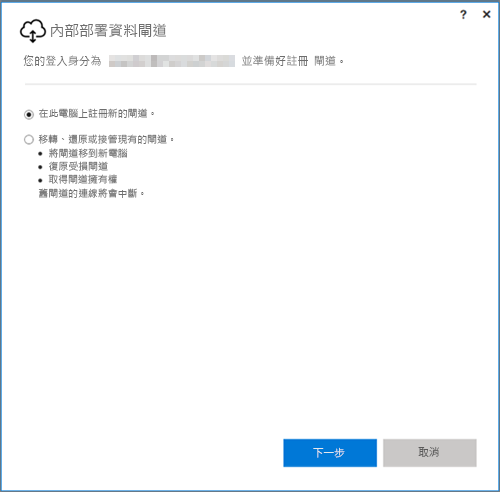
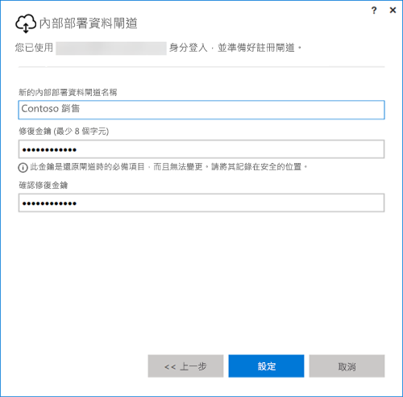

## 安裝內部部署資料閘道
資料閘道會在您的電腦上安裝並執行。 閘道最好安裝在可以一直保持執行的電腦上。

> [!NOTE]
> 閘道僅適用於 64 位元的 Windows 作業系統。
> 
> 

您必須為 Power BI 做的第一個選擇是閘道模式。

* **內部部署資料閘道︰** 在此模式中，多位使用者可以共用及重複使用閘道。 Power BI、PowerApps、Flow 或 Logic Apps 都可以使用此閘道。 若為 Power BI，還支援排程重新整理和 DirectQuery。
* **個人︰** 僅限 Power BI，不需要任何系統管理員設定即可以個人身分使用。 僅供用於隨選重新整理和排程重新整理。 此選取項目會啟動個人閘道的安裝。

安裝任一種模式下的閘道須注意一些事項：

* 兩個閘道都需要 64 位元 Windows 作業系統
* 閘道不能安裝在網域控制站上
* 同一部電腦最多可安裝兩個內部部署資料閘道，每個閘道各執行一種模式 (個人和標準)。 
* 同一部電腦不可有一個以上的閘道執行相同的模式。
* 不同電腦上可安裝多個內部部署資料閘道，並可從相同的 Power BI 閘道管理介面一併管理 (個人模式除外，請參閱下列的項目符號)
* 每個 Power BI 使用者只能執行一個個人模式閘道。 如果為相同的使用者安裝另一個個人模式閘道 (即使在不同的電腦上)，最新的安裝都會取代先前的既有安裝。

以下是安裝閘道前要考慮的事項。

* 如果要安裝在膝上型電腦，而您的膝上型電腦關機未連線到網際網路，或處於睡眠狀態，則閘道會無法運作，且雲端服務的資料不會與內部部署資料同步。
* 如果電腦連線到無線網路，閘道執行速度可能會變慢，使其需要更長的時間來同步處理雲端服務資料和內部部署資料。

閘道安裝後，您必須使用工作或學校帳戶登入。

登入後，您可以選擇要設定新的閘道，還是要移轉、還原或取代現有的閘道。

## 設定新的閘道
1. 輸入**閘道**的名稱
2. 輸入**修復金鑰**。 至少必須有 8 個字元。
3. 選取 [設定]。

> [!NOTE]
> 如果需要移轉、還原或取代閘道，就會需要修復金鑰。 請務必將此金鑰存放在安全的地方。
> 
> 

### 移轉、還原或取代現有的閘道
您需要選取想要復原的閘道，並提供最初建立閘道時所使用的修復金鑰。

### 已連接內部部署資料閘道
閘道一經設定，您就能夠用它連接至內部部署資料來源。

如果閘道用於 Power BI，您就必須將資料來源加入 Power BI 服務的閘道中。 這會在 [管理閘道] 區域內完成。 如需詳細資訊，請參閱管理資料來源文章。

若為 PowerApps，您必須為支援的資料來源選取已定義連線的閘道。 若為 Flow 和 Logic Apps，您可以隨時使用此閘道和內部部署連線。

