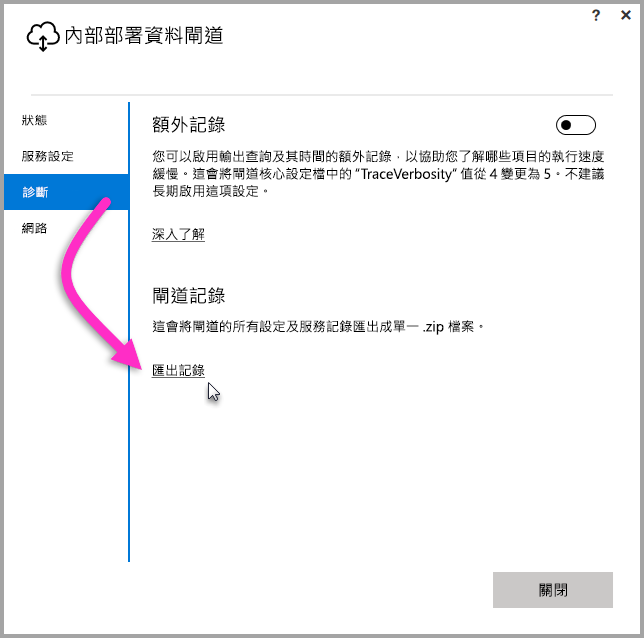
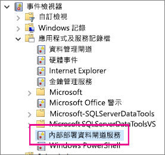

## 疑難排解的工具
<a name="logs" />

### 從閘道設定程式收集記錄檔
您可為閘道收集數個記錄檔，並應一律從記錄檔開始收集起。 安裝閘道之後，收集記錄檔最簡單的方式是透過使用者介面來收集。 在 [內部部署資料閘道] 使用者介面選取 [診斷]，然後選取靠近頁面底的 [匯出記錄檔] 連結，如下圖所示。

**安裝程式記錄檔**

    %localappdata%\Temp\On-premises_data_gateway_*.log

**設定記錄檔**

    %localappdata%\Microsoft\On-premises Data Gateway\GatewayConfigurator*.log

**內部部署資料閘道服務記錄**

    C:\Users\PBIEgwService\AppData\Local\Microsoft\On-premises Data Gateway\Gateway*.log

### 事件記錄檔
**內部部署資料閘道服務**事件記錄檔位於 [應用程式及服務記錄檔] 下。

<a name="fiddler" />

### Fiddler 追蹤
[Fiddler](http://www.telerik.com/fiddler) 是 Telerik 提供的免費工具，可用來監視 HTTP 流量。  您可以從用戶端電腦使用 Power BI 服務來回查看。 這可能會顯示錯誤和其他相關資訊。

