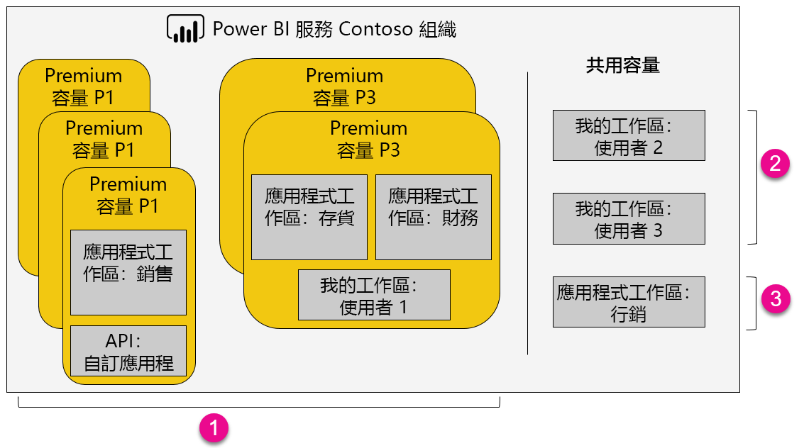

1. 進階容量內的項目
   
   * 需要有 Power BI Pro 授權才能 (以成員或管理員身分) 存取應用程式工作區並發佈應用程式。

   * 共用應用程式時需要 Pro 授權，但使用應用程式時不需要。

   * 所有儀表板收件者都可以設定資料警示，而不論獲指派的授權為何。

   * 用於內嵌的 REST API 會搭配使用服務帳戶與 Pro 授權，而不是使用者帳戶。

2. 共用容量中我的工作區
   
   * 共用和使用應用程式都需要 Pro 授權。

3. 共用容量中的應用程式工作區
   
   * 使用任何應用程式都需要 Pro 授權。

