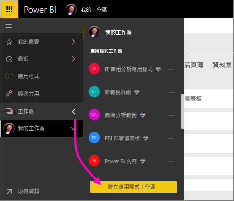
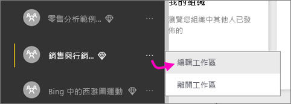

1. 開始建立工作區。 選取 [工作區] > [建立應用程式工作區]。 
   
     
   
    這會是放置您與同事共同作業之內容的位置。

2. 提供工作區的名稱。 如果對應的 [工作區識別碼] 無法使用，請編輯它，使其具有唯一識別碼。
   
     這也會成為應用程式的名稱。
   
     

3. 您可以設定幾個選項。 如果您選擇 [公用]，則組織中的所有人都可以看到工作區中的內容。 相反地，[私用] 則表示只有工作區的成員才能看到其內容。
   
     
   
    建立群組之後，您無法變更公用/私人設定。

4. 您也可以選擇成員是否可以**編輯**還是具有**僅限檢視**存取權。
   
     
   
     僅將人員新增到應用程式工作區，讓他們可以編輯內容。 如果人員只會檢視內容，則請不要將他們新增至工作區。 您可以在發佈應用程式時再納入這些人員。

5. 新增想要讓他們存取工作區之人員的電子郵件地址，然後選取 [新增]。 您無法新增群組別名，只能新增個人。

6. 決定每一個人是成員還是系統管理員。
   
     
   
    系統管理員可以編輯工作區本身，包括新增其他成員。 除非成員具有僅限檢視存取權，否則成員可以編輯工作區中的內容。 管理員和成員都可以發佈應用程式。

7. 選取 [儲存]。

Power BI 會建立並開啟工作區。 它會出現在您所屬的工作區清單中。 因為您是系統管理員，所以您可以選擇省略符號 (…) 返回，並透過新增成員或變更其權限來進行變更。

