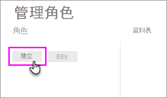
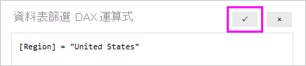

## 在 Power BI Desktop 中定義角色和規則
您可以在 Power BI Desktop 中定義角色和規則。 當發行至 Power BI 時，也會發行角色定義。

如果想要利用動態安全性，您必須啟用預覽切換 [啟用 DirectQuery 的雙向交叉篩選功能]。 這會啟用交叉篩選的功能，並在兩個方向都套用安全性篩選。

若要定義安全性角色，您可以執行下列作業。

1. 將資料匯入 Power BI Desktop 報表，或設定 DirectQuery 連線。
   
   > [!NOTE]
   > 您不能在 Power BI Desktop 中定義 Analysis Services 即時連線的角色。 您必須在 Analysis Services 模型中執行此作業。
   > 
   > 
2. 選取 [模型] 索引標籤。
3. 選取 [管理角色]。
   
   
4. 選取 [建立]。
   
   
5. 提供角色名稱。 
6. 選取要套用 DAX 規則的資料表。
7. 輸入 DAX 運算式。 此運算式應該傳回 true 或 false。 例如：[Entity ID] = “Value”。
   
   > [!NOTE]
   > 這個運算式中可以使用 *username()*。 請注意，*username()* 在 Power BI Desktop 中的格式為「網域\使用者名稱」。 在 Power BI 服務中的格式則是使用者的 UPN。 或者，您可以使用 *userprincipalname()*，這一律會以使用者主體名稱的格式傳回使用者。
   > 
   > 
   
   
8. 建立 DAX 運算式之後，您可以選取運算式上方的核取方塊，以驗證運算式。
   
   
9. 選取 [儲存]。

您無法將使用者指派給 Power BI Desktop 內的角色。 Power BI 服務會在內部完成此作業。 在 Power BI Desktop 內，您可以使用 *username()* 或 *userprincipalname()* DAX 函式，並設定合適的關聯性，以啟用動態安全性。

