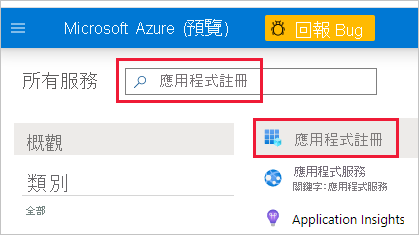
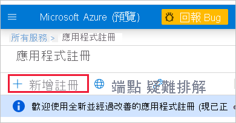

1. 登入 [Microsoft Azure](https://ms.portal.azure.com/#allservices)。

2. 搜尋 [應用程式註冊]，然後按一下 [應用程式註冊] 連結。

    

3. 按一下 [新增註冊]。

    

4. 填寫必要資訊：
    * **名稱** - 輸入應用程式的名稱
    * **支援的帳戶類型** - 選取支援的帳戶類型
    * (選擇性) **重新導向 URI** - 必要時輸入 URI

5. 按一下 [註冊] 。

6. 註冊之後，您可以從 [概觀] 索引標籤取得「應用程式識別碼」。複製並儲存「應用程式識別碼」以供稍後使用。

    