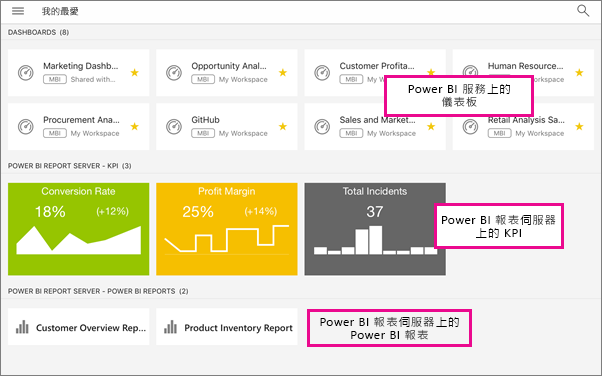

# 在 Power BI 行動裝置應用程式中檢視內部部署報表伺服器報表和 KPI
適用於︰

|  |  |  |  |
|:--- |:--- |:--- |:--- |
| iPhone |iPad |Android 手機 |Android 平板電腦 |

Power BI 行動裝置應用程式提供 Power BI 報表伺服器及 SQL Server 2016 Reporting Services (SSRS) 中，內部部署商務資訊的即時觸控式行動存取。 

 

## 最重要的第一件事
**行動裝置應用程式是您檢視 Power BI 內容的位置，不是建立內容的位置。**

* 您和貴組織的其他報表建立者[使用 Power BI Desktop 建立 Power BI 報表，然後將其發行至 Power BI 報表伺服器](report-server/quickstart-create-powerbi-report.md)入口網站。 
* 您可[直接在入口網站中建立 KPI](https://docs.microsoft.com/sql/reporting-services/working-with-kpis-in-reporting-services)、在資料夾中加以整理及標示您的最愛，以便輕鬆找到這些 KPI。 
* 使用 SQL Server 2016 Enterprise Edition 行動報表發行工具[建立 Reporting Services 行動報表](https://docs.microsoft.com/sql/reporting-services/mobile-reports/create-mobile-reports-with-sql-server-mobile-report-publisher)，並將其發行至 [Reporting Services 入口網站](https://docs.microsoft.com/sql/reporting-services/web-portal-ssrs-native-mode)。  

然後在 Power BI 行動裝置應用程式中，連線到最多五部報表伺服器，以檢視資料夾中整理或收集為我的最愛的 Power BI 報表及 KPI。 

## 在沒有伺服器連線的行動裝置應用程式中探索範例
即使您沒有 Reporting Services 入口網站的存取權，您仍然可以探索 Reporting Services 行動報表與 KPI 的功能。 

1. 點選左上角的  全域導覽按鈕，然後點選右上方的齒輪圖示 .
2. 點選 [Reporting Services 範例]，然後瀏覽至範例 KPI 和行動報表與之互動。
   
   

## 連線到內部部署伺服器
您可在 Power BI 行動裝置應用程式中檢視內部部署 Power BI 報表、Reporting Services 行動報表和 KPI。 

1. 在您的行動裝置上開啟 Power BI 應用程式。
2. 如果您還沒有登入 Power BI，請點選 [報表伺服器]。
   
   
   
   如果您已經登入 Power BI 應用程式，請點選全域導覽按鈕 ，然後點選右上方的齒輪圖示  。
3. 點選 [連線到伺服器]。
   
    
4. 請填入伺服器位址以及使用者名稱和密碼。 請使用此格式的伺服器位址：
   
     `http://<servername>/reports`
   
     或
   
     `https://<servername>/reports`
   
   > [!NOTE]
   > 請在連接字串前面包含 **http** 或 **https**。
   > 
   > 
   
    
5. (選擇性) 在 [進階選項] 下，您可以依需要提供伺服器易記的名稱。
6. 左側的導覽列中現在會看到伺服器，本例中稱為「Power BI 報表伺服器」。
   
   

## 在 Power BI 應用程式中檢視 Power BI 報表與 KPI
Power BI 報表、Reporting Services 行動報表和 KPI 皆顯示在 Reporting Services 入口網站的同一個資料夾中。 

* 點選 Power BI 報表 . 它會以橫向模式開啟，而且您可以在 Power BI 應用程式中與之互動。
  
    
* 在 Power BI Desktop 中，報表擁有者可以為 Power BI 行動裝置應用程式[最佳化報表](desktop-create-phone-report.md)。 在您的行動電話上，最佳化的報表會有特殊圖示和配置。
  
    
* 點選 KPI，以焦點模式查看。
  
    

## 檢視您最愛的 KPI 和報表
您可以在入口網站中，將 KPI 和報表標示為 [我的最愛]，然後將其與您 Power BI 最愛的儀表板放置在行動裝置方便存取的資料夾中並加以檢視。

* 點選 [我的最愛]。
  
   
  
   入口網站上您最愛的 KPI 和報表以及在 Power BI 服務中的 Power BI 儀表板，都在這個頁面上：
  
   

## 移除報表伺服器的連接
1. 請在左側導覽列底部點選 [設定]。
2. 點選您不要連線的伺服器名稱。
3. 點選 [移除伺服器]。

## 後續步驟
* [開始使用 Power BI](service-get-started.md)  
* 有問題嗎？ [嘗試在 Power BI 社群提問](http://community.powerbi.com/)

