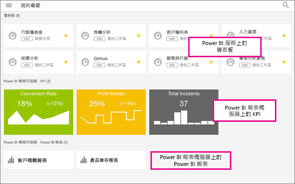

# 在 Power BI 行動應用程式中建立及檢視我的最愛項目
適用於︰

|  |  |  |  |  |
|:--- |:--- |:--- |:--- |:--- |
| iPhone |iPad |Android 手機 |Android 平板電腦 |Windows 10 裝置 |

了解如何在行動應用程式中建立及檢視我的最愛 Power BI 儀表板、報表和應用程式，以及我的最愛內部部署「Power BI 報表伺服器」和 Reporting Services KPI 與報表。

當您在 Power BI 行動裝置應用程式中建立我的最愛項目時，即可在 Power BI 服務 ([https://powerbi.com](https://powerbi.com)) 及所有行動裝置的 [我的最愛] 頁面上看到該項目。 

您也可以[在 Power BI 服務中將 Power BI 儀表板與應用程式設為我的最愛](service-dashboard-favorite.md)。 這些項目隨後會出現在行動應用程式的 [我的最愛] 頁面。

您可以在 Power BI 報表伺服器或 Reporting Services 入口網站中，將 KPI 和報表標示為 [我的最愛]，然後在方便的行動裝置資料夾中，檢視它們和 Power BI 的 [我的最愛] 儀表板。

## 檢視您的 Power BI 我的最愛項目
* 點選頂端瀏覽功能表 ，然後點選 [我的最愛]。
  
  
  
  您可在此頁面查看所有 [我的最愛]：
  
  

## 將應用程式設為我的最愛
1. 在行動應用程式的應用程式清單中，點選應用程式旁邊的省略符號 (...) > [我的最愛]。
   
    
   
    接著便會與其他最愛儀表板與應用程式一同列出。
   
    ![[我的最愛] 中的應用程式](media/mobile-apps-favorites/power-bi-android-favorite-apps.png)

## 在 iOS 與 Windows 10 行動應用程式中將儀表板或報表設為我的最愛
您可以從儀表板或報表清單，或是從儀表板或報表本身，將 Power BI 儀表板或報表設為我的最愛。

* 在行動應用程式的儀表板或報表清單中，點選名稱旁邊的空心星號 ![[不是我的最愛] 圖示](media/mobile-apps-favorites/power-bi-mobile-not-favorite-icon.png). 星號會變成黃色 ![[我的最愛] 圖示](media/mobile-apps-favorites/power-bi-mobile-yes-favorite-icon.png).
  
    
* 在儀表板或報表上，點選功能區中的空心星號 ![[不是我的最愛] 圖示](media/mobile-apps-favorites/power-bi-mobile-not-favorite-icon.png). 星號會變成黃色 ![[我的最愛] 圖示](media/mobile-apps-favorites/power-bi-mobile-yes-favorite-icon.png).
  
    ![已選取的 [我的最愛] 圖示](media/mobile-apps-favorites/power-bi-mobile-favorite-selected.png)

## 在 Android 行動應用程式中將儀表板或報表設為我的最愛
您可以從儀表板或報表清單，或是從儀表板或報表本身，將儀表板或報表設為我的最愛。

* 在行動應用程式的儀表板或報表清單中，點選名稱旁邊的垂直省略符號 (...)，然後點選 [我的最愛]。 您會在名稱旁看到黃色星號 ![[我的最愛] 圖示](media/mobile-apps-favorites/power-bi-mobile-yes-favorite-icon.png)。
  
    ![Android 的 [我的最愛] 功能表](media/mobile-apps-favorites/power-bi-android-make-favorite.png)
* 在儀表板或報表上，點選功能區中的空心星號 ![[不是我的最愛] 圖示](media/mobile-apps-favorites/power-bi-mobile-not-favorite-icon.png). 星號會變成暗灰色 ![[我的最愛] 圖示](media/mobile-apps-favorites/power-bi-android-favorite-icon.png).
  
    ![Android 的 [我的最愛] 星號](media/mobile-apps-favorites/power-bi-android-favorite-in-dashboard.png)

## 建立最愛的 Power BI 報表伺服器和 Reporting Services 報表與 KPI
您可以在 Power BI 行動裝置應用程式中，檢視您最愛的 Power BI 報表伺服器和 Reporting Services 報表與 KPI，但無法將它們設成行動裝置應用程式的 [我的最愛]。 [在入口網站中將其標記為 [我的最愛]](report-server/tutorial-explore-report-server-web-portal.md#tag-your-favorites)。 

## 後續步驟
* [Power BI 服務中我的最愛儀表板](service-dashboard-favorite.md) 
* 有問題嗎？ [嘗試在 Power BI 社群提問](http://community.powerbi.com/)

