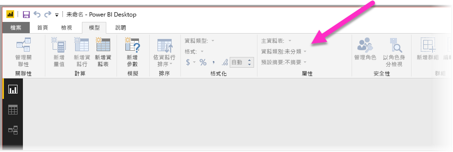
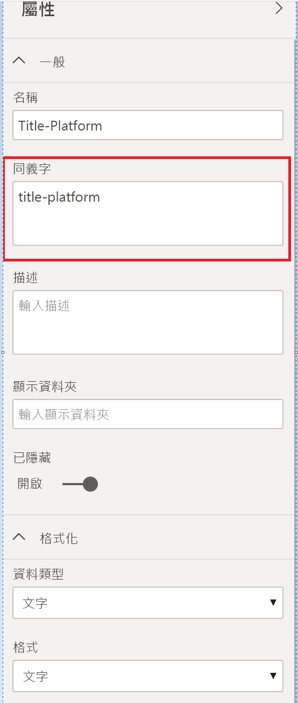

# 將 Power BI 問與答最佳化的最佳做法
使用一般片語和自然語言來詢問資料問題的功能十分強大。 如果您的資料能夠回答，就更厲害了，而 Power BI 的問與答就有這樣的能耐。

若要讓問與答成功解譯可回應的大量問題，問與答必須對模型進行假設。 如果您模型的結構不符合其中一或多個假設，則需要調整模型。 不論是否使用問與答，這些問與答調整都是 Power BI 中任何模型的相同最佳做法最佳化。

在下列各節中，我們會描述如何調整您的模型，讓它適用於 Power BI 問與答。

## 問與答所做的自動調整

### 量值資料表

在舊版的問與答中，量值資料表會混淆問與答，因為基礎資料表已中斷連接。 問與答現在能與量值資料表搭配運作。

### 資料表名稱與資料行名稱衝突

在舊版的問與答中，如果資料表和資料行具有相同的名稱，則資料表會優先使用該名稱。 此問題已獲得解決，因此您不再需要在模型中修正此問題。

## 改善問與答的手動步驟

### 使用新的問與答工具來修正問題

使用問與答工具時，您可以教學 Q&A 核心商務字詞，並修正終端使用者所詢問的問題。 有時由於資料的成形不正確或資料遺失，而使得某些問題仍然無法獲得解決。 在此情況下，請閱讀以下其他章節，以協助您進行最佳化。 深入了解[問與答工具](q-and-a-tooling-intro.md)。

## 新增遺漏的關聯性

如果您的模型遺漏資料表之間關聯性，則 Power BI 報表和問與答都無法解譯如何聯結這些資料表。 關聯性是良好模型的基石。 例如，如果遺漏「訂單」  資料表與「客戶」  資料表之間關聯性，則無法詢問「西雅圖客戶總銷售額」。 下圖顯示一個有待加強的模型，以及一個已備妥可供問與答的模型。 

**有待加強**

在第一個影像中，「客戶」、「銷售額」與「產品」資料表之間沒有任何關聯性。

**已備妥可供問與答**

在第二個影像中，資料表之間已定義關聯性。

## 重新命名資料表和資料行

選擇的資料表和資料行對於問與答而言十分重要。 例如，假設您有一個名為「客戶摘要」  的資料表，其中包含一份客戶清單。 您必須詢問像是「列出芝加哥客戶摘要」這樣的問題，而不是「列出芝加哥客戶」。 

雖然問與答可以對複數執行一些基本斷詞和偵測，但問與答假設您的資料表和資料行名稱正確地反映其內容。

請考慮另一個範例。 假設您有一個名為「人數」  的資料表，其中包含名字與姓氏，以及員工編號。 您有另一個名為「員工」  的資料表，其中包含員工編號、工作編號和開始日期。 熟悉模型的人員可能會了解這個結構。 詢問「計算員工人數」的其他人員會從「員工」資料表中取得資料列計數。 這可能不是人員想要的結果，因為這是每個員工曾經從事過的所有工作計數。 最好重新命名這些資料表，以確實反映它們所包含的內容。

**有待加強**

*StoreInfo* 和 *Product List* 等資料表名稱有待加強。

**已備妥可供問與答**

名為 *Store* 和 *Products* 的資料表較理想。

## 修正不正確的資料類型

已匯入資料的資料類型可能不正確。 請特別留意，問與答不會將匯入為「字串」  的「日期」  和「數字」  資料行解譯為日期和數字。 請務必在 Power BI 模型中選取正確的資料類型。

## 將年和識別碼資料行標示為「不摘要」

Power BI 預設會積極地彙總數值資料行，因此「年度總銷售額」這類問題有時可能會導致總銷售量以及年度總銷售額。 如果您有不想讓 Power BI 顯示此行為的特定資料行，請將資料行上的 [預設摘要]  屬性設定為 [不摘要]  。 請注意「年」  、「月」  、「日」  和「識別碼」  資料行，因為這些資料行最常發生問題。 其他與加總無關的資料行 (例如「年齡」  ) 也可以獲益於將 [預設摘要]  設定為 [不摘要]  或 [平均]  。 您可以在 [模型]  索引標籤中找到此設定。

## 選擇每個日期和地理位置資料行的資料類別

「資料類別」  提供其資料類型以外之資料行內容的其他語意知識。 例如，您可以將整數資料行標示為「郵遞區號」，並將字串資料行標示為「縣/市」、「國家/地區」等。 問與答會透過兩個重要方式使用這項資訊：視覺效果選取和語言偏差。

首先，問與答會使用**資料類別**資訊，協助選擇要使用的視覺效果顯示類型。 例如，它會辨識具有日期或時間「資料類別」  的資料行通常是折線圖水平軸或泡泡圖播放軸的不錯選擇。 而且，它假設包含具有地理位置**資料類別**之資料行的結果在地圖上可能可呈現不錯的效果。

其次，問與答會對使用者可能如何討論日期和地理位置資料行進行有根據的猜測，有助於了解特定類型的問題。 例如，“When was John Smith hired?” 中的 “when” 幾乎確定是對應至日期資料行，而 “Count customers in Brown” 中的 “Brown” 最可能是縣 (市)，而不是頭髮顏色。

## 為相關資料行選擇依資料行排序

[依資料行排序]  屬性允許根據一個資料行排序，以自動改為排序不同的資料行。 例如，當您詢問「依襯衫大小排序客戶」時，可能會想要依基礎大小數字 (XS、S、M、L、XL) 排序「襯衫大小」資料行，而不是依字母順序 (L、M、S、XL、XS)。

## 將模型正規化

請放心，我們不會建議您需要重新調整整個模型。 但有某些結構是問與答難以處理的。 如果您對模型結構執行一些基本正規化，則 Power BI 報表的使用性會大幅增加，且問與答結果的精確度也會大幅增加。

請遵循以下的一般規則：使用者所談論的每個唯一「項目」都應該只由一個模型物件 (資料表或資料行) 表示。 因此，如果您的使用者談論客戶，則應該有一個「客戶」  物件。 而且，如果您的使用者談論銷售額，則應該有一個「銷售額」  物件。 聽起來很簡單，不是嗎？ 根據您開始使用的資料形式，這可能是這樣。 如果您需要資料成形功能，則 [查詢編輯器]  中提供豐富的資料成形功能，而且只要在 Power BI 模型中使用計算就可以進行許多更直接的轉換。

下列各節包含您可能需要執行的一些常見轉換。

### 建立多資料行實體的新資料表

如果您有多個資料行作為較大資料表內的單一不同單位，則這些資料行應該分割成其專屬資料表。 例如，假設您的「公司」  資料表中有連絡人名稱、連絡人職稱和連絡人電話資料行。 較好的設計是使用個別的「連絡人」  資料表包含名稱、職稱和電話，以及一個連回「公司」  資料表的連結。 這樣可簡化有關連絡人問題的詢問，而且與本身是連絡人之公司的問題無關，並可改善顯示彈性。

**有待加強**

**已備妥可供問與答**

### 樞紐以消除屬性包

如果您的模型中有「屬性包」  ，則應該加以重建，讓一個屬性有一個資料行。 雖然屬性包方便管理大量屬性，但是有許多未設計 Power BI 報表和 Q&A 解決的固有限制。

例如，請考慮具有 CustomerID、Property 和 Value 資料行的 *CustomerDemographics* 資料表，而每個資料列都代表客戶的不同屬性 (例如，年齡、婚姻狀態、縣/市等)。 根據「屬性」資料行的內容來多載「值」資料行的意義，問與答會無法解譯大部分參考它的查詢。 「顯示每個客戶的年齡」這類簡單問題可能有用，因為它可能解譯為「顯示屬性為年齡的客戶和客戶人口統計」。 不過，模型結構不只是支援稍微複雜的問題，例如「芝加哥客戶的平均年齡」。 雖然直接編寫 Power BI 報表的使用者有時可能會找到聰明的方式來取得所尋找的資料，但是問與答只適用於每個資料行只有單一意義時。

**有待加強**

**已備妥可供問與答**

### 聯集以消除資料分割

如果將您的資料分割為多個資料表，或具有跨多個資料行的樞紐值，則您的使用者很難或無法達成數個常見作業。 請先考慮一般資料表資料分割：*Sales2000-2010* 資料表和 *Sales2011-2020* 資料表。 如果所有重要報表限制為特定十年，則可能可以用於 Power BI 報表。 不過，問與答彈性會導致使用者預期會有「年度總銷售額」這類問題的解答。 若要讓此查詢正常運作，您需要將資料聯集至單一 Power BI 模型資料表。

同樣地，請考慮一般樞紐值資料行：包含 Author、Book、City1、City2 和 City3 資料行的 *BookTour* 資料表。 具有與此類似的結構，甚至無法正確解譯「依縣 (市) 計算書籍數」這類簡單問題。 若要讓此查詢運作，您應該建立個別的 *BookTourCities* 資料表，將縣 (市) 值聯集到單一資料行。

**有待加強**

**已備妥可供問與答**

### 分割格式化資料行

如果您從中匯入資料的來源包含已格式化資料行，則 Power BI 報表 (和問與答) 不會到達要剖析其內容的資料行。 因此，如果您的「完整地址」  資料行包含地址、縣 (市) 和國家/地區，則也應該將它分割為「地址」、「縣 (市)」和「國家/地區」資料行，讓使用者可以個別對它們查詢。

**有待加強**

**已備妥可供問與答**

同樣地，如果您有人員的任何全名資料行，請新增 [名字]  和 [姓氏]  資料行，以免有人想要使用一部分姓名來詢問問題。 

### 建立多重值資料行的新資料表

在類似情況下，如果您從中匯入資料的來源包含多值資料行，則 Power BI 報表 (和問與答) 無法到達要剖析內容的資料行。 因此；例如，如果您的「作曲者」資料行包含某首歌的多位作曲者姓名，則應該將它分割為不同「作曲者」  資料表中的多個資料列。

**有待加強**

**已備妥可供問與答**

### 反正規化以刪除非作用中關聯性

取得從某個資料表到另一個資料表的多個路徑時，會發生「正規化更好」規則的其中一個例外狀況。 例如，假設您的 *Flights* 資料表 包含 SourceCityID 和 DestinationCityID 資料行，則每個資料行都會與 *Cities* 資料表有關。 而其中一個關聯性必須標示為非作用中。 因為問與答只可以使用作用中關聯性，所以您無法詢問有關來源或目的地的問題 (根據您選擇的問題)。 如果您改為將縣 (市) 名稱資料行反正規化到 *Flights* 資料表，就可以詢問這類問題：「列出明天起飛的班機，起飛縣 (市) 是西雅圖，而目的地縣 (市) 是舊金山」。

**有待加強**

**已備妥可供問與答**

### 將同義字新增至資料表和資料行

此步驟專用於問與答，而且一般不適用於 Power BI 報表。 使用者通常會有用來參考相同事物的各種詞彙，例如總銷售額、淨銷售額、總淨銷售額。 您可以將這些同義字新增至 Power BI 模型中的資料表和資料行。 

這個步驟非常重要。 即使使用明顯易懂的資料表和資料行名稱，問與答使用者會使用首次出現的詞彙來詢問問題。 使用者不會從預先定義的資料行清單中進行選擇。 您新增的同義字越有意義，報表的使用者體驗就會越好。 若要新增同義字，請在 Power BI Desktop 中移至模型檢視，選取 [模型] 索引標籤，然後選取一個欄位或資料表。 [屬性] 窗格會顯示 [同義字]  方塊，您可以在其中新增同義字。

 新增同義字時請小心。 將相同的同義字新增至多個資料行或資料表會造成模稜兩可。 如果可行，問與答會使用內容以在模稜兩可的同義字之間進行選擇，但並非所有問題都有足夠的內容。 例如，當使用者詢問「計算客戶數」時，如果模型中有三個具有同義字「客戶」的項目，則客戶可能無法取得所要的解答。 在這些情況下，請確定主要同義字是唯一的，因為這是用於重新陳述的同義字。 它可以警告使用者發生模稜兩可 (例如重新陳述「顯示已封存客戶記錄的數目」)，以提示他們可能想要以不同的方式詢問。
