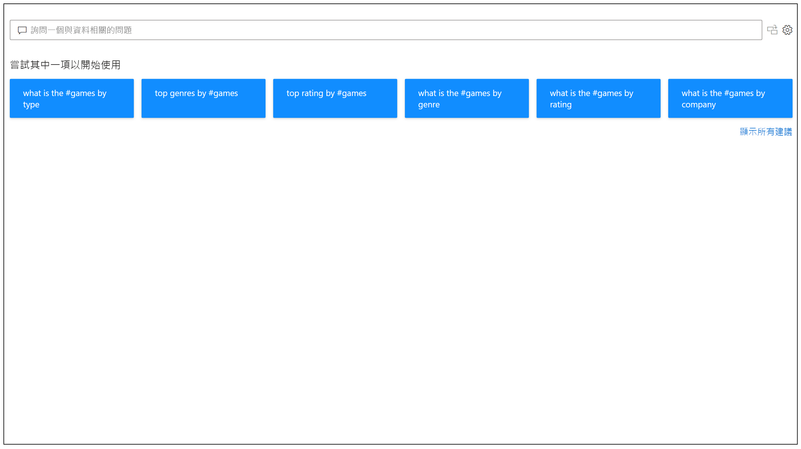
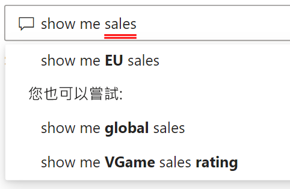
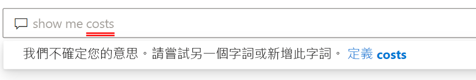

# Power BI 問與答簡介

有時若要從資料獲得解答，最快的方法是使用自然語言來對資料執行搜尋。 Power BI 中的問與答功能可讓您使用自然語言，以您自己的用語來探索資料。 問與答易於互動，甚至充滿樂趣。 通常，一個問題會帶來更多其他問題，原因在於視覺效果會顯示可探索的有趣路徑。 提問只是第一步。 查閱資料、縮小或擴充問題、探索新資訊、聚焦於詳細資料，或放寬條件以求得更廣泛的檢視。 這是易於互動且快速的體驗，由記憶體內部儲存體提供。 

Power BI 問與答完全免費，並可供所有使用者使用。 在 Power BI Desktop 中，報表設計師可以使用問與答來探索資料並建立視覺效果。 在 Power BI 服務中，所有人都可以使用問與答來探索其資料。 如果您有編輯儀表板或報表的權限，您也可以釘選問與答結果。

## 如何使用問與答

即使您還沒開始輸入，問與答也會顯示包含建議的新畫面，以協助您提出問題。 請從其中一個建議的問題開始，或鍵入您自己的問題。 問與答支援各種問題，包括但不限於：

- **詢問自然問題**：哪些銷售額具有最高的收益？
- **使用相對日期篩選**：顯示去年銷售額
- **只傳回前 N 項**：依銷售額的前 10 項產品
- **提供篩選條件**：顯示美國地區銷售額
- **提供複雜的條件**：顯示產品類別是類別 1 或類別 2 的銷售額
- **傳回特定視覺效果**：以圓形圖顯示依產品的銷售額
- **使用複雜的彙總**：顯示依產品的銷售額中間值
- **排序結果**：顯示依國碼/地區碼所排序銷售額的前 10 個國家/地區
- **比較資料**：顯示總銷售額與總成本的比較資料
- **檢視趨勢**：顯示一段時間內的銷售額

### 自動完成

當您鍵入問題時，Power BI 問與答會顯示內容相關建議，以協助您很快就能更有效率地使用自然語言。 當您鍵入時，您會立即收到意見反應和結果。 該體驗類似於在搜尋引擎中鍵入。

### 紅色/藍色底線

問與答會以底線顯示字組，以協助您查看系統了解或無法辨識哪些字組。 藍色實心底線表示系統已成功比對此字組與資料模型中的欄位或值。 以下範例顯示問與答已辨識「歐洲銷售額」  這個字。

通常當您在問與答中鍵入字組時，該字組會以紅色底線標示。 紅色底線可能表示兩個潛在問題的其中一個。 第一種問題類型可分類為「低信賴度」  。 如果您鍵入含糊或不明確的字組，此欄位會加紅色底線。 其中一個例子可能是「銷售額」這個字。 多個欄位可能會包含「銷售額」這個字，因此系統會使用紅色底線來提示您選擇所指的欄位。 低信賴度的另一個例子可能是如果您鍵入「區域」這個字，但其所符合的資料行是「區域」。 多虧與 Bing 和 Office 的整合，Power BI 問與答可辨識代表同一件事的字組。 問與答會在字組加紅色底線，讓您知道這不是直接相符的項目。

第二種問題類型是當問與答完全無法辨識該字組時。 如果使用資料中任何位置都未提及的特定領域字詞，或資料欄位的名稱不正確，都可能會遇到此問題。 其中一個例子可能是使用不存在於資料中任何位置的「成本」這個字。 該字出現在英文字典中，但問與答以紅色底線標示此字詞。

> [!NOTE]
> 您可以在問與答的 [Visual formatting] \(視覺效果格式化\)  窗格中，自訂藍色/紅色底線色彩。 此外，[問與答工具](q-and-a-tooling-teach-q-and-a.md)一文將說明您用來定義問與答所無法辨識字詞的「教學 Q&A」  。

### 視覺效果結果

當您鍵入問題時，問與答會嘗試立即解譯答案並將其視覺化。 在最新的更新中，問與答現在會嘗試解譯問題，並自動將欄位繪製到正確的座標軸。 例如，如果您鍵入「依年份的銷售額」，問與答會偵測到該年份是日期欄位，並一律優先將此欄位放在 X 軸上。 如果您想要變更視覺效果類型，請在問題後面鍵入「以圖表類型  顯示」。 問與答目前支援下列視覺效果類型：

- 折線圖
- 橫條圖
- 矩陣圖
- 資料表
- card
- 區域
- 圓形圖
- 散佈圖/泡泡圖
 

## 將問與答新增至報表

您可以透過兩種方式將問與答新增至 Power BI Desktop 或 Power BI 服務中的報表：

- 新增問與答視覺效果。
- 新增問與答按鈕。

若要將問與答視覺效果新增至報表，請選取新的**問與答**圖示，然後在 [視覺效果] 窗格中選取新的問與答視覺效果。 或者，在報表畫布的任何位置上按兩下來插入問與答視覺效果。

若要新增按鈕，請在 [首頁]  功能區上，選取 [按鈕]   > [問與答]  。您完全可以自訂問與答按鈕影像。

> [!NOTE]
> 當您從按鈕啟動問與答時，仍會使用舊的問與答。 Power BI 的後續版本將會變更這點。

## 針對儀表板使用問與答

根據預設，問與答位於儀表板頂端。 若要使用問與答，請在 [Ask a question on your data] \(詢問資料的相關問題\)  方塊中鍵入。

## 後續步驟

您可以透過各種方式將自然語言整合至報表中。 如需詳細資訊，請參閱下列文章：

* [問與答視覺效果](../visuals/power-bi-visualization-q-and-a.md)
* [問與答最佳做法](q-and-a-best-practices.md)
