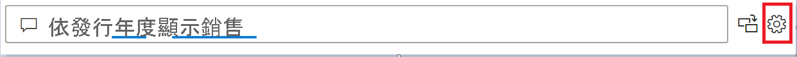

# 用於訓練 Power BI 問與答 (預覽) 的問與答工具簡介

使用 Power BI 問與答「工具」  ，您可以改善使用者的自然語言體驗。 身為設計師或系統管理員，您可以與自然語言引擎互動，並在三個領域中進行改善： 

- 檢閱使用者已詢問的問題。
- 教學 Q&A 以了解問題。
- 管理您已教學 Q&A 的字詞。

除了這些專用工具功能以外，Power BI Desktop 中的 [模型]  索引標籤還提供更多選項：  

- 同義字
- 資料列標籤
- 從問與答隱藏
- 設定語言結構描述 (進階)

## 開始使用問與答工具

問與答工具僅適用於 Power BI Desktop，且目前僅支援匯入模式。

1. 開啟 Power BI Desktop 並使用問與答來建立視覺效果。 
2. 選取視覺效果角落的齒輪圖示。 

    

    [開始使用] 頁面隨即開啟。  

    ![問與答的 [開始使用]](media/q-and-a-tooling-intro/qna-tooling-dialog.png)

### 欄位同義字

選取 [欄位同義字]，查看屬於該模型的所有資料表與資料行。 此檢視可讓您新增替代名稱以比對資料行，以協助使用者。 您也可以選擇向問與答隱藏資料行或資料表。

![問與答 [欄位同義字] 首頁](media/q-and-a-tooling-intro/qna-tooling-field-synonyms-home.png)

按一下展開其中一份資料表，您會看到類似下面的對話方塊。

![問與答 [欄位同義字] 已展開](media/q-and-a-tooling-intro/qna-tooling-field-synonyms-expanded.png)

此對話方塊會顯示使用者向資料集提出問題時，可供使用的所有資料行與資料表，及其個別的詞彙/同義字。 您可以在同一個位置快速查看所有詞彙，以及新增或移除多個資料行的詞彙。 

- [新增字彙] - 如有稱為「銷售」的欄位，您可能會決定新增「營收」一詞供使用者使用，而不需要使用「銷售額」一詞。 按一下加號可快速新增詞彙

- [加入問與答] - 此選項允許省略問與答中的資料行或資料表，這表示不會顯示該項目，也不會顯示此資料行的結果。 例如在處理日期時，您可能會決定不加入資料行。 若有許多日期欄位或外部索引鍵，您可能會決定移除所有的日期欄位，而不是其中一個日期欄位，以在使用者詢問日期相關的問題時，挑選正確的日期資料行。

- [建議的字詞] - 問與答也會建議從我們的建議引擎中擷取建議字詞，以利快速新增詞彙/同義字。 若未新增建議，其仍然可以運作，但會向使用者顯示橙色虛線，表示問與答認為有答案，但並不確定。 若建議的同義字正確，請按一下 + 圖示作為同義字使用。 若建議不正確，請按一下 x 移除該詞彙，以確保不作為詞彙/同義字使用，也不在問與答中運作。 這些建議是由 Office 字典提供，也出自於報表中找到的重新命名所用名稱

### 檢閱問題

選取 [檢閱問題]**** 以查看租用戶 Power BI 服務中所使用的資料集清單。 [檢閱問題]**** 頁面也會顯示資料集擁有者、工作區和上次重新整理日期。 您可以從這裡選取資料集，然後查看使用者已詢問的問題。 此資料也會顯示無法辨識的字組。 這裡顯示的所有資料都是過去 28 天內資料。

![問與答的 [檢閱問題]](media/q-and-a-tooling-intro/qna-tooling-review-questions.png)

### 教導問與答

[教學 Q&A]**** 區段可讓您訓練問與答來辨識字組。 若要開始進行，請鍵入一個問題，其中包含問與答無法辨識的一或多個字組。 問與答會提示您輸入該字詞的定義。 請輸入對應至該字組所代表內容的篩選條件或欄位名稱。 然後，問與答會重新解譯原始問題。 如果您對結果感到滿意，您可以儲存輸入。 若要深入了解，請參閱[教學 Q&A](q-and-a-tooling-teach-q-and-a.md)

### 管理字詞

您從 [教學 Q&A] 區段儲存的任何內容都會顯示在這裡，因此您可以檢閱或刪除已定義的字詞。 您目前無法編輯現有的定義，因此若要重新定義字詞，您必須刪除並重新建立該字詞。

![問與答的 [管理字詞]](media/q-and-a-tooling-intro/qna-manage-terms.png)

### 建議問題

> [!NOTE]
> 建議的問題將顯示於所有問與答視覺效果的執行個體中。 無法為每個問與答視覺效果建立一組個別的建議。
> 
> 

在不進行任何設定下，問與答視覺效果會建議幾個問題，以協助您開始使用。 這些問題是根據資料模型所自動產生的。 在 [建議問題] 中，您可使用自有問題來覆寫自動產生的問題。

若要開始，請在文字方塊中鍵入所要新增的問題。 在預覽區段中，您可看到結果在問與答視覺效果中的外觀。 

:::image type="content" source="media/q-and-a-tooling-intro/power-bi-qna-suggest-questions.png" alt-text="建議的問與答問題":::
 
選取 [新增] 按鈕來將此問題新增到 [您的建議問題]。 每個新增的問題都會新增到清單結尾。 問題在問與答視覺效果中顯示的順序都會與其在清單中順序相同。 

:::image type="content" source="media/q-and-a-tooling-intro/power-bi-qna-save-suggest-questions.png" alt-text="儲存建議的問題":::
 
請務必選取 [儲存] 來在問與答視覺效果中顯示建議的問題清單。 

## 其他問與答設定

### 設定資料列標籤

資料列標籤可讓您定義哪一個資料行 (或「欄位」**) 最能識別資料表中的單一資料列。 例如，對於名為「客戶」的資料表，資料列標籤通常是「顯示名稱」。 提供此額外的中繼資料可讓問與答在使用者鍵入「依客戶顯示我的銷售額」時，繪製更有用的視覺效果。 問與答不會將「客戶」視為資料表，而是改用「顯示名稱」，並以橫條圖顯示每個客戶的銷售額。 您只能設定資料列標籤模型檢視。 

1. 在 Power BI Desktop 中，選取模型檢視。

2. 選取一個資料表以顯示 [屬性]**** 窗格。

3. 在 [資料列標籤]**** 方塊中，選取一個欄位。

## 設定語言結構描述 (進階)

在 Power BI 中，您完全可以訓練並增強問與答中的自然語言引擎，包括變更基礎自然語言結果的計分和加權。 若要了解做法，請參閱[編輯問與答語言結構描述和新增片語](q-and-a-tooling-advanced.md)。

## 後續步驟

有一些最佳做法可以改善自然語言引擎。 如需詳細資訊，請參閱 [Q&A 最佳做法](q-and-a-best-practices.md)。
