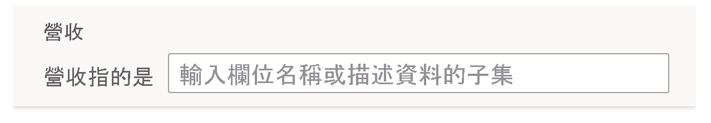
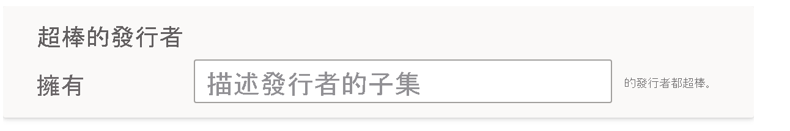

# 教學 Q&A 以了解 Power BI 問與答中的問題和字詞

在問與答安裝程式的 [教學 Q&A]  區段中，您可以訓練問與答來了解其無法辨識的自然語言問題和字詞。 若要開始進行，請提交一個問題，其中包含問與答無法辨識的一或多個字組。 然後，問與答會提示您定義該字詞。 您可以輸入對應至該字組所代表內容的篩選條件或欄位名稱。 然後，問與答會重新解譯原始問題。 如果您對結果感到滿意，請加以儲存。

> [!NOTE]
> [教學 Q&A] 功能僅支援匯入模式。 此外，目前尚不支援連接到內部部署或 Azure Analysis Services 資料來源。 Power BI 的後續版本中應該會移除此限制。

## 開始教學 Q&A

1. 在 Power BI Desktop 的 [模型]  功能區上，選取 [問與答安裝程式]   > [教學 Q&A]  。

    

2. 鍵入一個句子，其中包含問與答無法辨識的字詞，然後選取 [提交]  。

3. 選取加紅色底線的字組。 

    問與答會提供建議，並提示您提供正確的字詞定義。 
    
3. 在 [Define the terms Q&A didn't understand] \(定義問與答不了解的字詞\)  下，提供定義。

    

4. 選取 [儲存]  以預覽更新的視覺效果。

5. 輸入下一個問題，或選取 [X]  以關閉。

在您將報表發佈回服務之前，您的報表取用者不會看到此變更。

## 定義名詞和形容詞

您可以教學 Q&A 兩種字詞類型：

- 名詞
- 形容詞

### 定義名詞同義字

使用資料時，您通常可能會有使用別名來參照的欄位名稱。 其中一個例子可能是「銷售額」。 許多字組或片語都可能是指銷售額，例如「收益」。 如果資料行的名稱為「銷售」，且報表取用者鍵入「收益」，問與答可能無法挑選正確的資料行來適當回答問題。 在此情況下，您需要告知問與答「銷售額」與「收益」是指同一件事。

問與答會使用來自 Microsoft Office 的知識，自動偵測無法辨識字組為名詞的情況。 如果問與答偵測到名詞，則會下列列方式提示您：

- <your term>**參照至** 

您會在方塊中填入來自資料的字詞。

如果您提供的內容不同於資料模型中欄位，則可能會獲得不想要的結果。

### 定義形容詞篩選條件

有時您可能想要定義字詞作為基礎資料的條件。 其中一個例子可能是「優秀的發行者」。 「優秀的」可能是一項條件，表示只會選取已發佈 X 項產品的發行者。 問與答會嘗試偵測形容詞，並顯示不同的提示：

- <field name>**具有**  

您會在方塊中填入條件。

您可以定義的一些範例條件如下：

- 國家/地區是美國
- 國家/地區不是美國
- Products > 100
- Products 大於 100
- Products = 100
- Products 等於 100
- Products < 100
- Products 小於 100

在這些範例中， 'Products' 可以是資料行名稱或量值。 

您也可以在問與答運算式本身指定彙總。 例如，如果「熱門產品」為銷售超過 100 單位的產品，則可將「銷售的單位總和 > 100」定義為熱門產品。  

:::image type="content" source="media/q-and-a-tooling-teach-q-and-a/power-bi-qna-popular-products.png" alt-text="定義「熱門產品」":::

您只能在工具中定義單一條件。 若要定義更複雜的條件，請使用 DAX 來建立計算結果欄或量值，然後使用工具區段為該資料行或量值建立單一條件。

## 管理字詞

提供定義之後，您可以返回以查看您所做的所有修正，並加以編輯或刪除。 

1. 在 [問與答安裝程式]  中，移至 [管理字詞]  區段。

2. 刪除您不再需要的任何字詞。 您目前無法編輯字詞。 若要重新定義字詞，請刪除該字詞，再加以定義。

    ![問與答的 [管理字詞]](media/q-and-a-tooling-teach-q-and-a/qna-manage-terms.png)

## 後續步驟

有一些最佳做法可以改善自然語言引擎。 如需詳細資訊，請參閱[問與答最佳做法](q-and-a-best-practices.md)。
