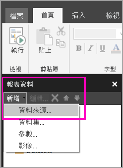

# 在 Power BI 服務中建立適用於編頁報表的內嵌資料來源

在此文章中，您會了解如何在 Power BI 服務中建立及修改適用於編頁報表的內嵌資料來源。 您會在單一報表中定義內嵌資料來源，並將它僅用於該報表中。 目前，發行至 Power BI 服務的編頁報表需要內嵌的資料集和內嵌的資料來源，且可以連線到這些資料來源：

- Azure Analysis Services
- Azure SQL Database 與 
- Azure SQL 資料倉儲
- SQL Server
- SQL Server Analysis Services
- Oracle 
- Teradata 

針對下列資料來源，使用 [SQL Server Analysis Services 連線](service-premium-connect-tools.md)選項：

- Power BI Premium 資料集

分頁報表會透過 [Power BI 閘道](service-gateway-onprem.md)連線至內部部署資料來源。 您會在將報表發行至 Power BI 服務之後設定閘道。

請參閱 [Power BI 報表產生器中的報表資料](report-builder-data.md)以取得詳細資訊。

## 建立內嵌的資料來源
  
1. 開啟 Power BI 報表產生器。

1. 在 [報表資料] 窗格中的工具列上，選取 [新增]   > [資料來源]  。 [資料來源屬性]  對話方塊隨即開啟。

    
  
2.  在 [名稱]  文字方塊中，輸入資料來源的名稱或接受預設值。  
  
3.  選取 [使用內嵌於報表中的連接]  。  
  
1.  從 [選取連接類型]  清單中，選取資料來源類型。 

1.  使用下列其中一種方法指定連接字串：  
  
    -   直接在 [連接字串]  文字方塊中輸入連接字串。 
  
    -   選取運算式 (**fx)** 按鈕來建立能評估為連接字串的運算式。 在 [運算式]  對話方塊中，於 [運算式] 窗格中輸入運算式。 選取 [確定]  。 
  
    -   選取 [建置]  以開啟適用於您在步驟 2 中所選擇之資料來源的 [連接屬性]  對話方塊。  
  
        在 [連接屬性]  對話方塊的欄位中，填入適用於該資料來源類型的內容。 連接屬性包括資料來源的類型、資料來源的名稱，以及要使用的認證。 在您於此對話方塊中指定值之後，請選取 [測試連接]  以確認資料來源可用，且您所指定的認證是正確的。  
  
4.  選取 [認證]  。  
  
     指定要針對此資料來源使用的認證。 資料來源的擁有者會選擇支援的認證類型。 如需詳細資訊，請參閱[指定報表資料來源的認證及連接資訊](https://docs.microsoft.com/sql/reporting-services/report-data/specify-credential-and-connection-information-for-report-data-sources)。
  
5.  選取 [確定]  。  
  
     資料來源會出現在 [報表資料] 窗格中。  
     
## 限制與考量

連線到 Power BI 資料集的已編頁報表遵循 Power BI 中共用資料集的規則，但有一些微幅變更。  為讓使用者正確地檢視使用 Power BI 資料集的已編頁報表，並確定資料列層級安全性 (RLS) 已啟用且已針對您的強制套用，請確定您依照這些規則執行：

### 傳統應用程式與工作區

- 與資料集相同之工作區中的 .rdl (相同擁有者)：支援
- 與資料集不同之工作區中的 .rdl (相同擁有者)：支援
- 共用 .rdl：您必須為在資料集層級檢視報表的每個使用者指派建置權限
- 共用應用程式：您必須為在資料集層級檢視報表的每個使用者指派建置權限
- 與資料集相同之工作區中的 .rdl (不同使用者)：支援
- 與資料集不同之工作區中的 .rdl (不同使用者)：您必須為在資料集層級檢視報表的每個使用者指派建置權限
- 資料列層級安全性：您必須為在資料集層級檢視報表的每個使用者指派建置權限以加以強制套用。

### 新體驗應用程式與工作區

- 與資料集相同之工作區中的 .rdl：支援
- 與資料集不同之工作區中的 .rdl (相同擁有者)：支援
- 共用 .rdl：您必須為在資料集層級檢視報表的每個使用者指派建置權限
- 共用應用程式：您必須為在資料集層級檢視報表的每個使用者指派建置權限
- 與資料集相同之工作區中的 .rdl (不同使用者) - 支援
- 與資料集不同之工作區中的 .rdl (不同使用者)：您必須為在資料集層級檢視報表的每個使用者指派建置權限
- 資料列層級安全性：您必須為在資料集層級檢視報表的每個使用者指派建置權限以加以強制套用

## 後續步驟

- [在 Power BI 服務中建立適用於編頁報表的內嵌資料集](paginated-reports-create-embedded-dataset.md)
- [什麼是 Power BI Premium 中的編頁報表？](paginated-reports-report-builder-power-bi.md)
