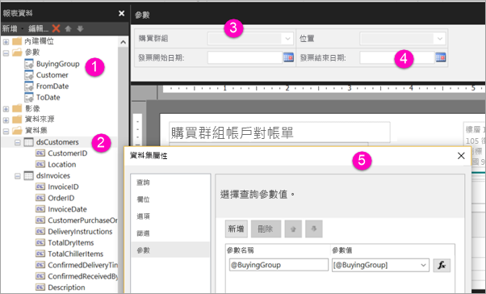

# 使用 Power BI 服務建立編頁報表的參數

您將在此文章中了解如何使用 Power BI 服務中立編頁報表的參數。  報表參數提供一個方式讓您選擇報表資料及改變報表呈現方式。 您可以提供預設值和一份可用值清單，讓報表讀者可以變更選擇。  

下圖顯示具有 @BuyingGroup、@Customer、@FromDate 和 @ToDate 參數之報表在 Power BI 報表產生器中的設計檢視。 
  

  
1.  [報表資料] 窗格中的報表參數。  
  
2.  包含資料集中其中一個參數的資料表。  
  
3.  [參數] 窗格。 您可以自訂參數窗格中參數的版面配置。 
  
4.  @FromDate 和 @ToDate 參數的資料類型為 **DateTime**。 檢視報表時，您可以在文字方塊中輸入日期，或在日曆控制項中選擇日期。 

5.  [資料集屬性]  對話方塊中的其中一個參數。  

  
## 建立或編輯報表參數  
  
1.  在 Power BI 報表產生器中開啟您的分頁報表。

1. 在 [報表資料]  窗格中，以滑鼠右鍵按一下 [參數]  節點 > [新增參數]  。 就會開啟 [報表參數屬性]  對話方塊。  
  
2.  在 [名稱]  中，輸入參數名稱或接受預設名稱。  
  
3.  在 [提示]  中，輸入當使用者執行報表時，要在參數文字方塊旁邊顯示的文字。  
  
4.  在 [資料類型]  中，選取參數值的資料類型。  
  
5.  如果參數可以包含空白值，請選取 [允許空白值]  。  
  
6.  如果參數可以包含 Null 值，請選取 [允許 Null 值]  。  
  
7.  若要允許使用者選取多個參數值，請選取 [允許多個值]  。  
  
8.  設定可見性選項。  
  
    -   若要在報表頂端的工具列中顯示參數，請選取 [可見]  。  
  
    -   若不想在工具列中顯示參數，請選取 [隱藏]  。  
  
    -   若要隱藏參數並防止發佈報表之後在報表伺服器上遭到修改，請選取 [內部]  。 之後就只能在報表定義中檢視報表參數。 您必須針對這個選項設定預設值，或允許參數接受 Null 值。  
  
9. 選取 [確定]  。 

## 考量與疑難排解

- 如果使用 Power BI 資料集或 Analysis Services 模型作為資料來源，則由於 DAX 限制，您無法在單一要求中傳遞超過 1,000 個參數值。 

 
## 後續步驟

請參閱[檢視編頁報表的參數](consumer/paginated-reports-view-parameters.md)以了解參數在 Power BI 服務中的樣子。

如需分頁報表中參數的詳細資訊，請參閱 [Power BI 報表產生器中的報表參數](report-builder-parameters.md)。
