# 教學課程：建立編頁報表並將它上傳至 Power BI 服務 (預覽)

在此教學課程中，您將會連線到範例 Azure SQL Database。 接著會使用報表產生器中的精靈來建立編頁報表，其中包含要自動分成多頁的資料表。 隨後會在 Power BI 服務中，將編頁報表上傳至 Premium 容量中的工作區。 Power BI 服務中的編頁報表目前處於預覽狀態。

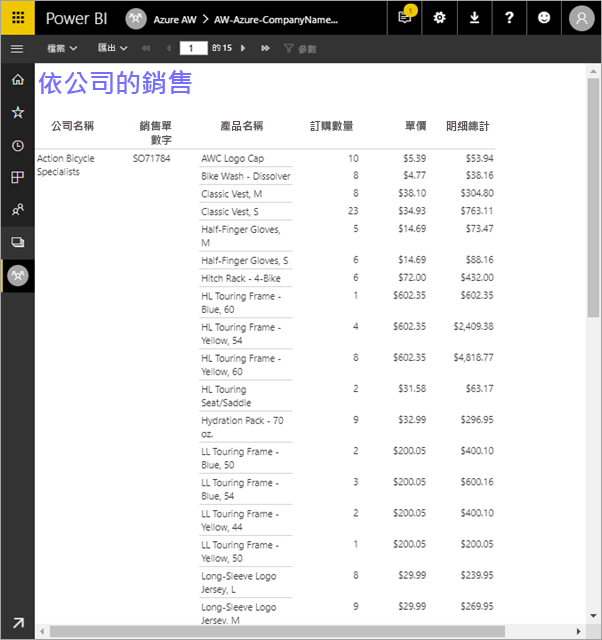

以下是您將在此教學課程中完成的步驟：

> [!div class="checklist"]
> * 建立 Azure 範例資料庫。
> * 透過精靈的協助，在報表產生器中建立矩陣。
> * 將報表格式化，在每頁上包含標題、頁碼和資料行標題。
> * 將貨幣格式化。
> * 將報表上傳至 Power BI 服務。

如果您沒有 Azure 訂用帳戶，請先建立[免費帳戶](https://azure.microsoft.com/free/?WT.mc_id=A261C142F)，再開始進行。
 
## 先決條件  

以下是建立編頁報表的必要條件：

- 安裝[從 Microsoft 下載中心取得的報表產生器](http://go.microsoft.com/fwlink/?LinkID=734968)。 

- 遵循快速入門：[在 Azure 入口網站中建立 Azure SQL Database 範例](https://docs.microsoft.com/azure/sql-database/sql-database-get-started-portal)。 複製並儲存 [概觀] 索引標籤上 [伺服器名稱] 方塊中的值。請記住您在 Azure 中建立的使用者名稱和密碼。

以下是將編頁報表上傳至 Power BI 服務的必要條件：

- 您需要 [Power BI Pro 授權](service-admin-power-bi-pro-in-your-organization.md)。
- 您需要在 [Power BI Premium 容量](service-premium.md)中的服務上具備應用程式工作區。 它在工作區名稱旁邊有一個鑽石圖示 。

## 使用精靈建立矩陣
  
1.  從您的電腦啟動報表產生器。  
  
     [開始使用] 對話方塊隨即開啟。  
  
     
  
1.  在左窗格中，確認已選取 [新增報表]，然後在右窗格中，選取 [資料表或矩陣精靈]。  
  
4.  在 [選擇資料集] 頁面中，選取 [建立資料集] > [下一步]。  

    
  
5.  在 [選擇與資料來源的連接] 頁面中，選取 [新增]。 

    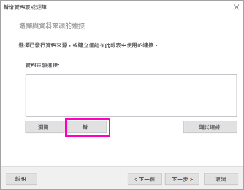
  
     [資料來源屬性] 對話方塊隨即開啟。  
  
6.  您可以使用字元和底線，以您想要的任何項目來為資料來源命名。 針對此教學課程，在 [名稱] 方塊中，輸入 **MyAzureDataSource**。  
  
7.  在 [選取連線類型] 方塊中，選取 [Microsoft Azure SQL Database]。  
  
8.  選取 [連接字串] 方塊旁的 [建置]。 

    

9. **在 Azure 中：** 返回 Azure 入口網站，然後選取 [SQL 資料庫]。

1. 選取您在此文章的**必要條件**一節中，於快速入門＜在 Azure 入口網站中建立 Azure SQL Database 範例＞中建立的 Azure SQL Database。

1. 在 [概觀] 索引標籤上，複製 [伺服器名稱] 方塊中的值。

2. **在報表產生器中：**：在 [連接屬性] 對話方塊中的 [伺服器名稱] 下方，貼上您複製的伺服器名稱。 

1. 針對 [登入伺服器]，確定已選取 [使用 SQL Server 驗證]，然後針對範例資料庫輸入您在 Azure 中建立的使用者名稱和密碼。

1. 在 [連接到資料庫] 下方，選取下拉式箭號，然後選取您在 Azure 中建立的資料庫名稱。
 
    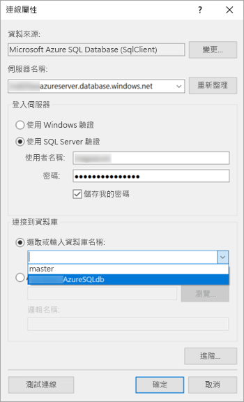

1. 選取 [測試連接]。 您會看到**測試結果**訊息，指出**測試連接成功**。

1. 選取 [確定] > [確定]。 

   現在，報表產生器會在 [連接字串] 方塊中顯示您剛建立的連接字串。 

    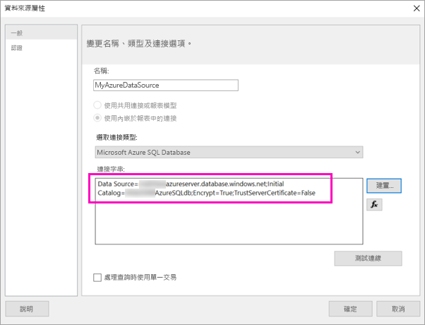

1. 選取 [確定] 。
  
9. 在 [選擇與資料來源的連接] 頁面中，您會在剛建立的資料來源連接下方看到「(在此報表中)」。 選取該資料來源 > [下一步]。  

    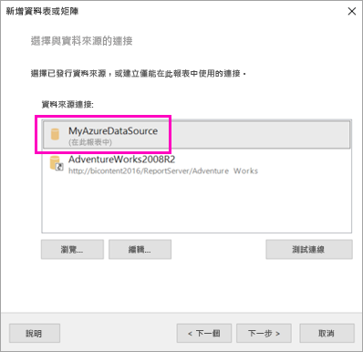

10. 在方塊中輸入相同的使用者名稱和密碼。 
  
10. 在 [設計查詢] 頁面中，依序展開 SalesLT 和資料表，然後選取這些資料表：

    - 位址
    - 客戶
    - 產品
    - ProductCategory
    - SalesOrderDetail
    - SalesOrderHeader

     由於已選取 [關聯性] > [自動偵測]，因此，報表產生器會偵測這些資料表之間的關聯性。 
    
    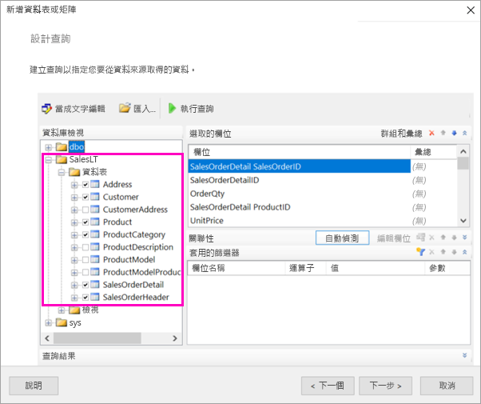
 
1.  選取 [執行查詢]。 報表產生器會顯示 [查詢結果]。 
 
     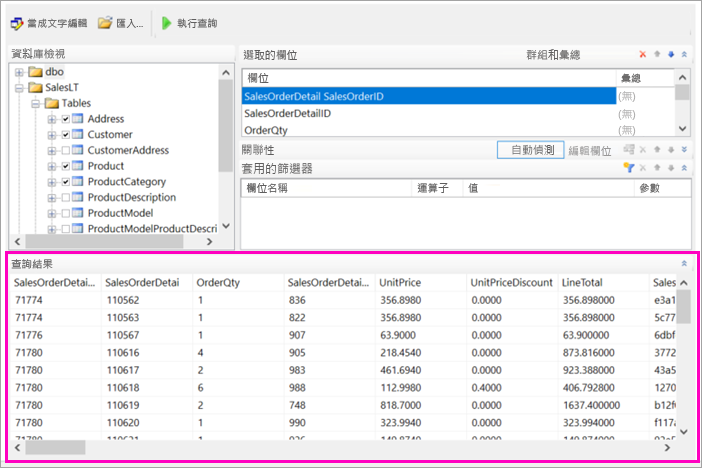

18. 選取 [下一步] 。 

19. 在 [選擇資料集] 頁面中，選擇您剛建立的資料集 > [下一步]。

    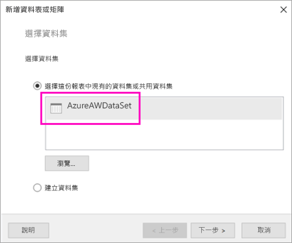

1. 在 [排列欄位] 頁面中，將這些欄位從 [可用的欄位] 方塊拖曳至 [資料列群組] 方塊：

    - CompanyName
    - SalesOrderNumber
    - Product_Name

1. 將這些欄位從 [可用的欄位] 方塊拖曳至 [值] 方塊：

    - OrderQty
    - UnitPrice
    - LineTotal

    報表產生器會自動加總 [值] 方塊中的欄位。

    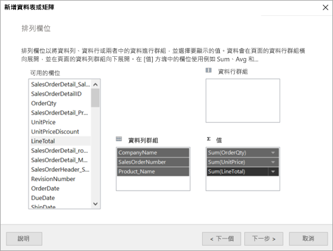

24. 在 [選擇版面配置] 頁面中，保留所有預設設定，但清除 [展開或摺疊群組]。 通常，展開或摺疊群組功能就很好用，但這次，您想要讓資料表自動分成多頁。

1. 選取 [下一步] >  [完成]。 資料表即會顯示於設計介面上。
 
## 您所建立的內容

讓我們暫停一下，先查看精靈的結果。

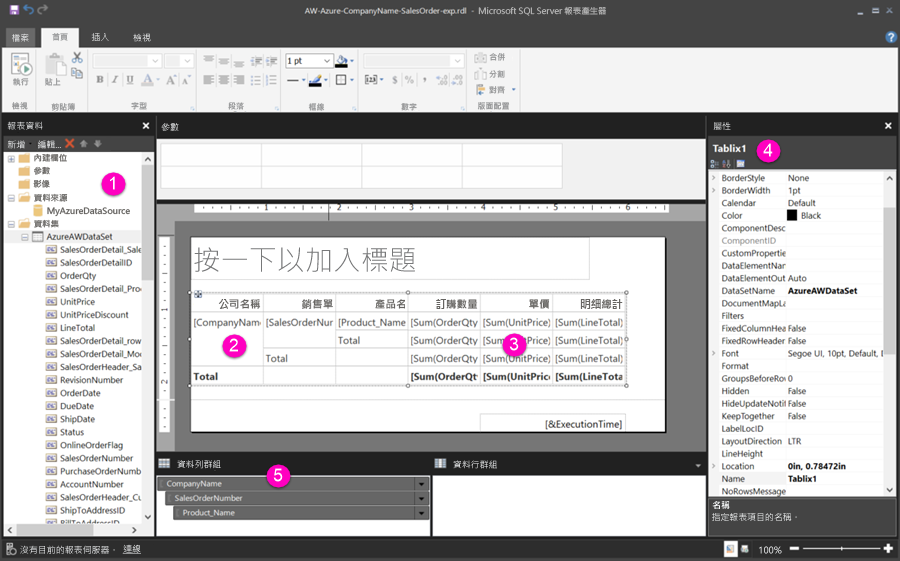

1. 在 [報表資料] 窗格中，您會看到內嵌的 Azure 資料來源和以它為基礎的內嵌資料集，這兩者都是您建立的。 

2. 設計介面大約 6 英吋寬。 在設計介面上，您所看到的矩陣會顯示資料行標題和預留位置值。 矩陣有六個資料行，而且高度看起來只有五個資料列。 

3. 訂單數量、單價及項目總數都是總和，而且每個資料列群組都是小計。 

    您仍然看不到實際的資料值。 您需要執行報表，才能看到它們。

4. 在 [屬性] 窗格中，選取的矩陣稱為 Tablix1。 報表產生器中的 *tablix* 是在資料列和資料行中顯示資料的資料區域。 它可以是資料表或矩陣。

5. 在 [群組] 窗格中，您可以看到您在精靈中建立的三個資料列群組： 

    - CompanyName
    - 銷售單
    - 產品名稱

    這個矩陣沒有任何資料行群組。

### 執行報表

若要查看實際的值，您需要執行報表。

1. 在 [常用] 工具列中，選取 [執行]。

   您現在會看到值。 矩陣的資料列數目比您在 [設計] 檢視中所看到的更多！ 請注意，報表產生器顯示它是頁面 **1** 之 **2?**。 報表產生器會儘速載入報表，因此它一次只會擷取足以分成數頁的資料。 問號表示報表產生器尚未載入所有資料。

   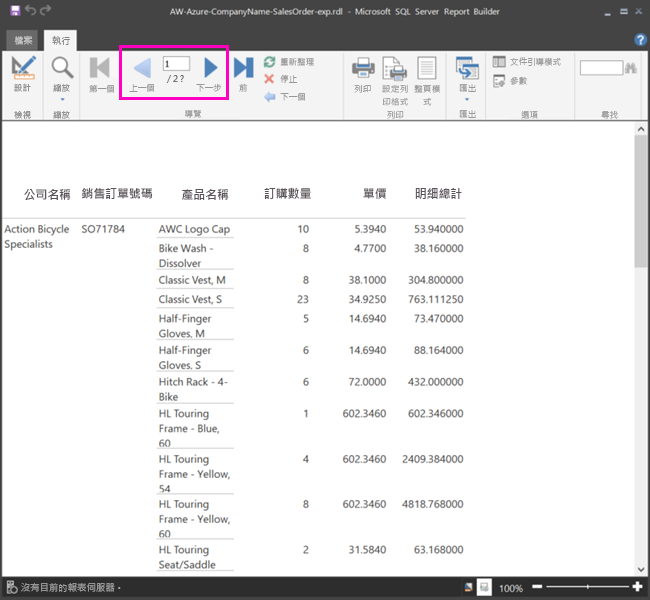

2. 選取 [整頁模式]。 當您列印報表時，其格式如下。 報表產生器現在知道報表有 33 頁，並已自動在頁尾新增日期和時間戳記。

## 將報表格式化

現在您的報表含有會自動分成 33 頁的矩陣。 讓我們新增一些其他功能，並改善其外觀。 如果您想要查看報表的進展，可在每一個步驟之後執行該報表。

- 在功能區的 [執行] 索引標籤上，選取 [設計]，讓您能夠繼續修改它。  

### 設定頁寬

通常會基於列印目的來將編頁報表格式化，而一般頁面為 8 1/2 X 11 英吋。 

1. 拖曳尺規，使設計介面的寬度成為 7 英吋。 預設邊界是每一側 1 英吋，因此需要較窄的側邊界。

1. 按一下設計介面周圍的灰色區域，以顯示 [報表] 屬性。

    如果您看不到 [屬性] 窗格，請按一下 [檢視] 索引標籤 > [屬性]。

2. 展開 [邊界]，然後將 [左邊] 和 [右邊] 從 1in 變更為 0.75in。 

    
  
### 新增報表標題  

1. 選取頁面頂端的**按一下以新增標題**一詞，然後輸入**由公司銷售**。  

2. 選取標題文字，然後在 [字型] 下方的 [屬性] 窗格中，將 [色彩] 變更為 [藍色]。
  
### 新增頁碼

您已注意到報表的頁尾含有日期和時間戳記。 您也可以在頁尾新增頁碼。

1. 在設計介面底部，您會在頁尾右邊看到 [&ExecutionTime]。 

2. 在 [報表資料] 窗格中，展開 [內建欄位] 資料夾。 將 [頁碼] 拖曳到頁尾左邊，高度與 [&ExecutionTime] 相同。

3. 拖曳 [&PageNumber] 方塊的右側，以使其成為正方形。

4. 在 [插入] 索引標籤上，選取 [文字方塊]。

5. 按一下 [&PageNumber] 右邊、輸入「之」，然後使文字方塊成為正方形。

6. 將 [整體總頁數] 拖曳至頁尾「之」的右邊，然後也要拖曳它的右側，以使其成為正方形。

    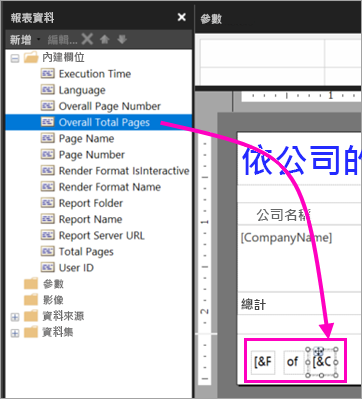

### 將資料表加寬  

現在您可以將矩陣加寬，使其足以填滿頁面的寬度，並將文字資料行加寬，好讓名稱不需捲動。 
 
1. 選取矩陣，然後選取 [公司名稱] 資料行。

3. 將滑鼠暫留在矩陣中 [公司名稱] 資料行上方灰色列的右邊緣上。 向右拖曳，直到該資料行的寬度最終為 1 3/8 英吋為止。 

    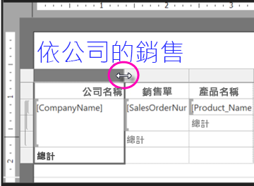

4. 拖曳 [產品名稱] 的右邊緣，直到該資料行的寬度最終為 3 3/4 英吋為止。   

矩陣現在幾乎會與列印區域等寬。

### 將貨幣格式化

假設您已在執行報表時注意到尚未將美元金額格式化為貨幣。

1. 選取左上方的 [Sum(OrderQty)] 儲存格、按住 Shift 鍵，然後選取右下方的 [Sum(LineTotal)] 資料格。

    

2. 在 [常用] 索引標籤上，選取美元記號 (**$**) 的貨幣符號，然後選取 [預留位置樣式] 旁的箭號 > [範例值]。
 
    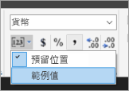

    現在您可以看到這些值都已格式化為貨幣。

    

### 在每一頁上新增資料行標頭

將報表發佈至 Power BI 服務之前，還有一個要進行的格式化改進：在報表中的每一頁上顯示資料行標頭。

1. 在 [群組] 窗格頂端列的最右側，選取下拉式箭號 > [進階模式]。

    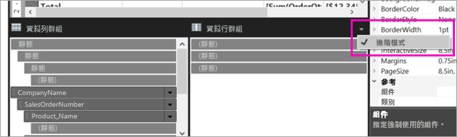

2. 在 [資料列群組]中，選取最上方的 [靜態] 列。 您會看到已選取矩陣中的 [公司名稱] 儲存格。

   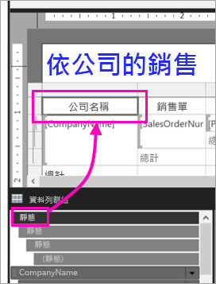

3. 在 [屬性] 窗格中，您正在查看 [Tablix 成員] 的屬性。 將 [KeepWithGroup] 設定為 [After]，並將 [RepeatOnNewPage] 設定為 [True]。

    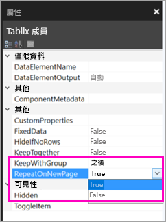

    現在執行報表，並立即查看其外觀。

5. 在 [常用] 索引標籤上，選取 [執行]。

6. 選取 [整頁模式] (如果尚未選取)。 報表現在有 29 頁。 捲動數頁。 您會看到已將貨幣格式化、資料行在每頁均有標題，而且報表中每頁的頁尾都含有頁碼與日期和時間戳記。
 
    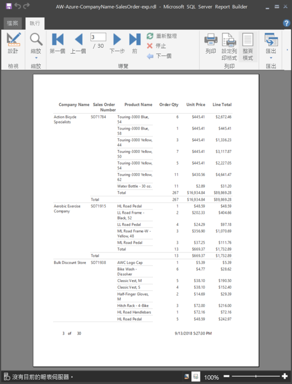

7. 將報表儲存到您的電腦。
 
##  將報表上傳至服務

既然您已建立此編頁報表，現在就可將它上傳至 Power BI 服務。

1. 在 Power BI 服務 (http://app.powerbi.com) 的左側瀏覽窗格中，選取 [我的工作區] >  [建立應用程式工作區]。

2. 將工作區命名為 **Azure AW** 或其他唯一的名稱。 您現在是唯一的成員。 

3. 選取 [進階] 旁的箭號，然後開啟 [專用容量]。 

    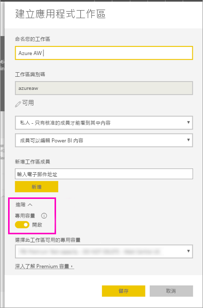

    如果您無法開啟它，就必須要求您的 Power BI 管理員為您提供權限，以將工作區新增至專用 Premium 容量。

4. 視需要選擇 [選擇此工作區可用的專用容量] > [儲存]。
    
    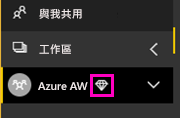

    如果工作區不在 Premium 容量中，則當您嘗試上傳報表時，就會看到「無法上傳編頁報表」的訊息。 請連絡您的 Power BI 管理員來移動工作區。

1. 在新的工作區中，選取 [取得資料]。

2. 在 [檔案] 方塊中 > [取得]。

3. 選取 [本機檔案]，瀏覽至您儲存檔案的位置 > [開啟]。

   Power BI 會匯入您的檔案，而您會在 [應用程式清單] 頁面上的 [報表] 下方看到該檔案。

    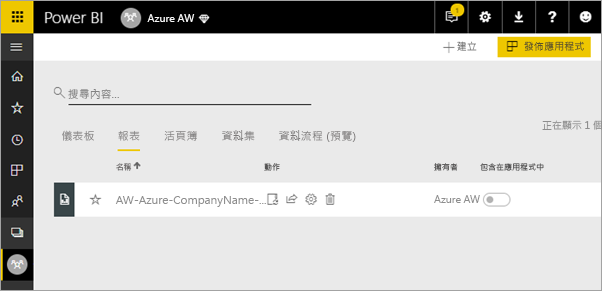

4. 選取報表來檢視它。

5. 如果您收到錯誤，則可能需要重新輸入認證。 選取 [管理] 圖示。

    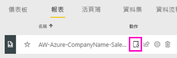

6. 選取 [編輯認證]，然後輸入當您建立 Azure 資料庫時在 Azure 中所使用的認證。

    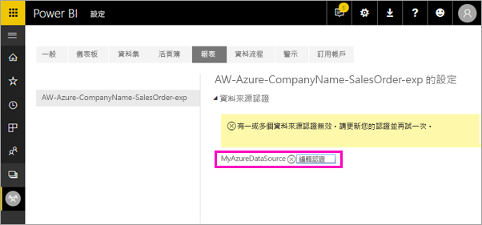

7. 現在，您可以在線上 Power BI 服務中檢視您的編頁報表。

    

## 後續步驟

[什麼是 Power BI Premium 中的編頁報表？(預覽)](paginated-reports-report-builder-power-bi.md)

