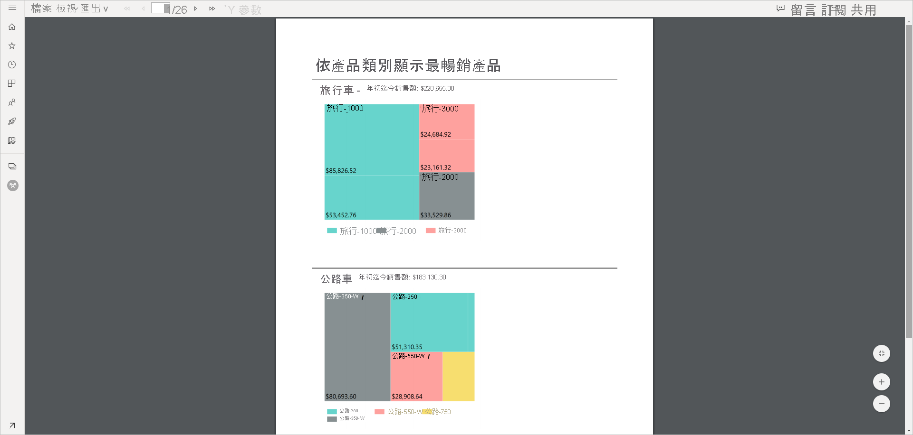

# 在 Power BI 服務中設定編頁報表的報表檢視

當在 Power BI 服務中轉譯編頁報表時，預設的檢視為 HTML 型檢視與互動式檢視。 另一種報表檢視則為新的 [頁面檢視] 選項，其適用於固定頁面格式 (如 PDF)。

**預設互動式檢視**

**頁面檢視**

在 [頁面檢視] 中，所轉譯報表會與預設檢視的外觀不同。 分頁報表中的某些屬性和概念僅適用於固定頁面。 這種檢視類似於列印或匯出報表時的檢視。 您仍然可以變更某些項目 (例如參數值)，但不會有其他互動式功能，例如資料行排序和切換。

[頁面檢視] 可支援瀏覽器 PDF 檢視器所支援的所有功能，例如 [放大]、[縮小] 和 [調整成一頁]。

## 切換至 [頁面檢視]

當開啟分頁報表時，報表預設會呈現在互動式檢視中。 如果報表有參數，請選取 [參數]，然後檢視報表。

1. 在工具列上選取 [檢視] > [頁面檢視]。

    ![切換至 [頁面檢視]](media/page-view/power-bi-paginated-page-view-dropdown.png)

2. 您可在工具列的 [檢視] 功能表中選取 [頁面設定]以變更頁面檢視的設定。 

    ![選取 [頁面設定]](media/page-view/power-bi-paginated-page-settings-dropdown.png)
    
    [頁面設定] 對話方塊中的選項，可供設定 [頁面檢視] 的 [頁面大小] 以及 [方向]。 套用 [頁面設定] 之後，當稍後列印該頁面時，也會套用相同的選項。
   
    ![[頁面設定] 對話方塊](media/page-view/power-bi-paginated-page-settings-dialog.png)

3. 若要切換回互動式檢視，請在 [檢視] 下拉式方塊中選取 [預設]。

## 瀏覽器支援

Google Chrome 和 Microsoft Edge 瀏覽器皆支援 [頁面檢視]。 請確定已啟用在瀏覽器中檢視 PDF。 此為上述瀏覽器的預設設定。

Internet Explorer 和 Safari 不支援 [頁面檢視]，所以已停用此選項。 行動裝置瀏覽器或原生 Power BI 行動裝置應用程式也不支援 [頁面檢視]。  

## 後續步驟

- [檢視 Power BI 服務中的編頁報表](../consumer/paginated-reports-view-power-bi-service.md)
- [什麼是 Power BI Premium 中的編頁報表？](paginated-reports-report-builder-power-bi.md)
