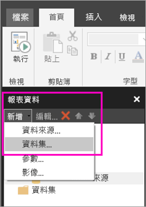

# 在 Power BI 服務中建立適用於編頁報表的內嵌資料集

在此文章中，您會了解如何根據內嵌的資料來源，在 Power BI 服務中建立適用於編頁報表的內嵌資料集。 內嵌的資料集均包含於單一編頁報表中，以便在該報表中使用。 目前，發佈至 Power BI 服務的編頁報表需要內嵌的資料集和內嵌的資料來源。 您可以在建立報表時，於 Power BI 報表產生器中建立內嵌的資料來源和資料集。 

您需要先建立資料來源，然後才能建立資料集。 若要深入了解，請參閱 Power BI 服務中[適用於編頁報表的內嵌資料來源](paginated-reports-embedded-data-source.md)。
  
## 建立內嵌的資料集
  
1. 在 Power BI 報表產生器的 [報表資料] 窗格中，選取[新增]   > [資料集]  。

1. 在 [資料集屬性]  對話方塊的 [查詢]  索引標籤中，指定資料集的名稱。 內嵌的資料來源已經位於 [資料來源]  方塊中，或者您可以選取 [新增]  來建立不同的內嵌資料來源。
 
     

3. 在 [查詢類型]  下方，選取要用於資料集的命令或查詢類型。 
    - [文字]  會執行查詢，以從資料庫擷取資料。 它是預設值，適用於大部分的查詢。 輸入查詢，或選取 [匯入]  來匯入預先存在的查詢。 若要以圖形方式建置查詢，請選取 [查詢設計工具]  。 如果您使用查詢設計工具來建置查詢，查詢的文字將出現在此方塊中。 選取 [運算式  (fx  )] 按鈕，以使用運算式動態產生查詢。 
    - [資料表]  會選取資料表中的所有欄位。 輸入您想要用來作為資料集的資料表名稱。
    - [預存程序]  會依名稱執行預存程序。

4. 在 [查詢設計工具] 中，您可以查看資料集內的資料表和欄位並與之互動、匯入查詢，或當成文字來編輯。 您也可以在此處新增篩選和參數。 

    

5. 在 [查詢設計工具] 中，選取 [執行查詢]  來測試它，然後選取 [確定]  。

1. 回到 [資料集屬性] 對話方塊，在 [逾時 (以秒為單位)]  方塊中，輸入查詢逾時之前的秒數。預設值為 30 秒。 [逾時]  的值必須空白或大於零。 如果空白，查詢就不會逾時。

7.  您可以在其他索引標籤上設定資料集的其他屬性：
    - 在 [欄位]  索引標籤上建立導出欄位。
    - 在 [選項]  索引標籤上設定進階選項。
    - 在其各自的索引標籤上，新增或更新**篩選**和**參數**。

8. 選取 [確定] 
 
   報表隨即會在 [報表設計檢視] 中開啟。 資料來源、資料集和資料集欄位集合都會出現在 [報表資料] 窗格中，而您可以繼續設計編頁報表。  

    ![[報表設計檢視] 中的資料集](media/paginated-reports-create-embedded-dataset/power-bi-paginated-embedded-dataset-report-design-view.png) 
 
## 後續步驟 

- [什麼是 Power BI Premium 中的編頁報表？](paginated-reports-report-builder-power-bi.md)  
- [教學課程：建立編頁報表並將它上傳至 Power BI 服務](paginated-reports-quickstart-aw.md)
- [將編頁報表發佈至 Power BI 服務](paginated-reports-save-to-power-bi-service.md)

