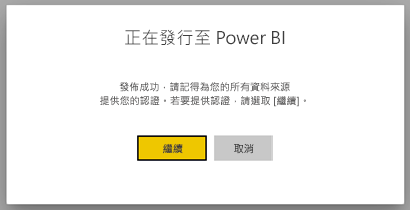
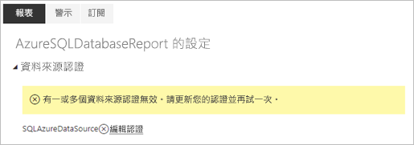
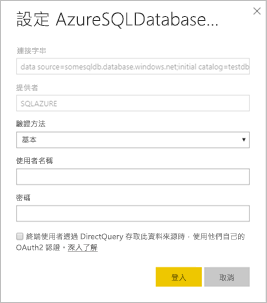

# Power BI 編頁報表支援的資料來源

在本文中，您將了解 Power BI 服務編頁報表支援的資料來源，以及如何連接 Azure SQL Database 資料來源。 有些資料來源是以原生方式來支援。 您可以透過資料閘道連接其他資料來源。

## 原生支援的資料來源

編頁報表會以原生方式支援下列資料來源清單：

| 資料來源 | 驗證 | 備忘稿 |
| --- | --- | --- |
| Azure SQL Database  Azure SQL 資料倉儲 | 基本、單一登入 (SSO)、OAuth2 |   |
| Azure SQL 受控執行個體 | 基本 | 透過使用 Azure SQL Database 延伸模組的公用端點  |
| Azure Analysis Services | SSO, OAuth2 | 必須停用 AAS 防火牆或加以設定以允許所有 IP 範圍。|
| Power BI 資料集 | SSO | Premium 和非 Premium Power BI 資料集。 需要讀取權限 |
| Premium Power BI 資料集 (XMLA) | SSO |   |
| 輸入資料 | N/A | 資料會內嵌在報表中。 |

在您將報表上傳至 Power BI 服務之後，即可使用所有資料來源，但 Azure SQL Database 除外。 資料來源預設為使用單一登入 (SSO) (若適用)。 針對 Azure Analysis Services，您可以將驗證類型變更為 OAuth2。 不過，一旦指定資料來源的驗證類型變更為 OAuth2 之後，就無法還原回使用 SSO。  此外，這項變更適用於所有在指定租用戶所有工作區上使用該資料來源的報表。  除非使用者選擇 SSO 作為驗證類型，否則分頁報表中的資料列層級安全性將無法使用。

針對 Azure SQL Database 資料來源，您必須提供詳細資訊，如[＜Azure SQL Database 驗證＞](#azure-sql-database-authentication)一節中所述。

## 其他資料來源

除了上述原生支援的資料來源之外，您還可以透過 [Power BI 資料閘道](../service-gateway-onprem.md)來存取下列資料來源：

- SQL Server
- SQL Server Analysis Services
- Oracle
- Teradata

編頁報表目前無法透過 Power BI 資料閘道來存取 Azure SQL Database 和 Azure Analysis Services。

## Azure SQL Database 驗證

針對 Azure SQL Database 資料來源，您必須先設定驗證類型之後再執行報表。 只有當您第一次在工作區中使用資料來源時，才適用上述條件。 第一次使用時，您會看到下列訊息：

如果您未提供任何認證，在執行報表時就會發生錯誤。 選取 [繼續]  前往您剛上傳報表的 [資料來源認證]  頁面：

針對指定資料來源，選取 [編輯認證]  連結，以顯示 [設定]  對話方塊：

針對 Azure SQL Database 資料來源，以下是支援的驗證類型：

- 基本 (使用者名稱和密碼)
- SSO (單一登入)
- OAuth2 (預存 AAD 權杖)

若要讓 SSO 和 OAuth2 正常運作，資料來源連接的 Azure SQL Database 伺服器必須[啟用 AAD 驗證支援](https://docs.microsoft.com/azure/sql-database/sql-database-aad-authentication-configure)。 針對 OAuth2 驗證方法，AAD 會產生權杖並加以儲存以用於未來的資料來源存取。 若要改為使用 [SSO 驗證方法](https://docs.microsoft.com/power-bi/service-azure-sql-database-with-direct-connect#single-sign-on)，請選取正下方的 SSO 選項 [終端使用者在透過 DirectQuery 存取此資料來源時，使用自己的 OAuth2 認證]  。
  
## 後續步驟

[檢視 Power BI 服務中的編頁報表](../consumer/paginated-reports-view-power-bi-service.md)

有其他問題嗎？ [試試 Power BI 社群](https://community.powerbi.com/)
