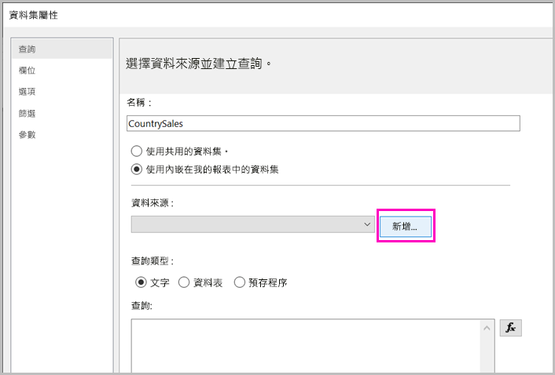
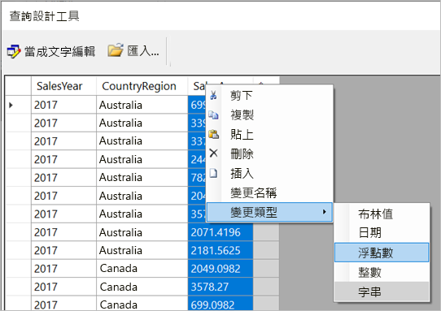
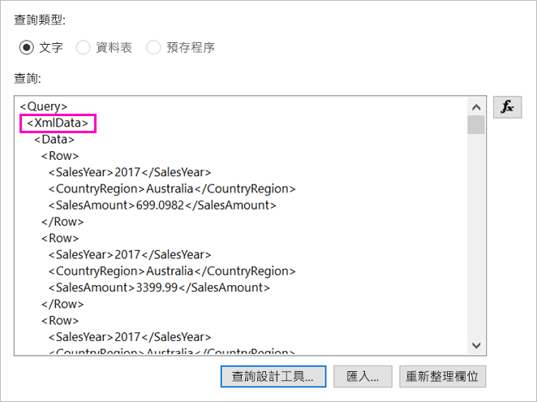

# <a name="enter-data-directly-in-a-paginated-report-in-report-builder---power-bi"></a>直接在報表產生器的編頁報表中輸入資料 - Power BI

在本文中，您將了解新版 SQL Server 2016 報表產生器中的一項功能，此功能可讓您在 RDL 報表中直接輸入資料作為內嵌資料集。  此功能類似於 Power BI Desktop。 您可以在報表的資料集中直接鍵入資料，或從另一個應用程式 (例如 Microsoft Excel) 貼上資料。 藉由輸入資料來建立資料集之後，您可以如同已建立的任何其他內嵌資料集一樣加以使用。 此外，您可以新增多個資料表，並使用某個資料表作為其他資料表的篩選條件。 對於您可能需要在報表中使用的小型靜態資料集 (例如報表參數)，這項功能特別有用。
 
## <a name="prerequisites"></a>必要條件

- 若要在編頁報表中直接輸入資料，請[從 Microsoft 下載中心](https://www.microsoft.com/download/details.aspx?id=53613)安裝新版的報表產生器。 
- 若要將編頁報表儲存至 Power BI 服務，您需要 [Power BI Pro 帳戶](../fundamentals/service-self-service-signup-for-power-bi.md)以及 [Power BI Premium 容量](../admin/service-premium-what-is.md)中工作區的寫入權限。
- 若要將編頁報表儲存至報表伺服器，您需要[編輯 RsReportServer.config 檔案](#upload-the-paginated-report-to-a-report-server)的權限。

## <a name="get-started"></a>開始使用

在下載並安裝報表產生器之後，您會遵循用來將內嵌資料來源和資料集新增至報表的相同工作流程。 在下列程序中，您會在 [資料來源]  下看到一個新選項：[輸入資料]  。  您只需要在報表中設定此資料來源一次。 之後，您可以建立多個輸入資料的資料表來作為個別資料集，其全部使用該單一資料來源。

1. 在 [報表資料]  窗格中，選取[新增]   > [資料集]  。

    

1. 在 [資料集屬性]  對話方塊中，選取 [使用內嵌在報表中的資料集]  。

1. 選取 [資料來源]  旁的 [新增]  。

    

1. 在 [資料來源屬性]  對話方塊中，選取 [使用內嵌於報表中的連接]  。
2. 在 [選取連接類型]  方塊中，選取 [輸入資料]   > [確定]  。

    ![[輸入資料] 資料來源](media/paginated-reports-enter-data/paginated-data-source-properties-enter-data.png)

1. 回到 [資料集屬性]  對話方塊中，選取 [查詢設計工具]  。
2. 在 [查詢設計工具]  窗格中，以滑鼠右鍵按一下資料表，並在其中貼上您的資料。

    ![在 [查詢設計工具] 中輸入資料](media/paginated-reports-enter-data/paginated-enter-data.png)

1. 若要設定資料行名稱，請按兩下每個 [NewColumn]  並鍵入資料行名稱。

    

1. 如果第一個資料列包含來自原始資料的資料行標題，請以滑鼠右鍵按一下該資料列並將其刪除。
    
9. 根據預設，每個資料行的資料類型是字串。 若要變更資料類型，請以滑鼠右鍵按一下資料行標頭 > [變更類型]  ，並將它設定為另一個資料類型，例如日期或浮點數。

    

1. 當您完成建立資料表時，請選取 [確定]  。  

    所產生查詢與您使用 XML 資料來源時看到的查詢相同。 實際上，我們會使用 XML 作為資料提供者。  我們已重新規劃此功能以一併啟用這個案例。

    

12. 在 [資料集屬性]  對話方塊中，選取 [確定]  。

13. 您會在 [報表資料]  窗格中看到資料來源和資料集。

    ![[報表資料] 窗格中的資料集](media/paginated-reports-enter-data/paginated-report-data-pane.png)

您可以在報表中使用資料集作為資料視覺效果的基礎。 也可以新增另一個資料集，並為其使用相同的資料來源。

## <a name="upload-the-paginated-report-to-the-power-bi-service"></a>將編頁報表上傳到 Power BI 服務

現在，Power BI 服務已支援分頁報表，您可以將分頁報表上傳到 Premium 容量。 如需詳細資訊，請參閱[上傳編頁報表](paginated-reports-save-to-power-bi-service.md)。

## <a name="upload-the-paginated-report-to-a-report-server"></a>將編頁報表上傳到報表伺服器

您還可以將編頁報表上傳到 Power BI 報表伺服器或 SQL Server Reporting Services 2016 或 2017 報表伺服器。 在這麼做之前，您需要將下列項目新增至 RsReportServer.config 作為額外的資料延伸模組。 請在進行變更之前備份 RsReportServer.config 檔案，以防您遇到任何問題。

```xml
<Extension Name="ENTERDATA" Type="Microsoft.ReportingServices.DataExtensions.XmlDPConnection,Microsoft.ReportingServices.DataExtensions">
    <Configuration>
        <ConfigName>ENTERDATA</ConfigName>
    </Configuration>
</Extension>
```

編輯完成後，設定檔中的資料提供者清單應該看起來如下：


這樣就大功告成了，您現在可以將使用這項新功能的報表發佈到報表伺服器。

## <a name="next-steps"></a>後續步驟

- [什麼是 Power BI Premium 中的編頁報表？](paginated-reports-report-builder-power-bi.md)
- [什麼是 Power BI 報表伺服器？](../report-server/get-started.md)
