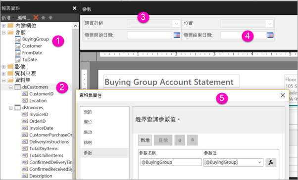

# 使用 Power BI 服務建立編頁報表的參數

您將在此文章中了解如何使用 Power BI 服務中立編頁報表的參數。  報表參數提供一個方式讓您選擇報表資料及改變報表呈現方式。 您可提供預設值和可用值的清單。 報表讀取者可變更選項， 也可以在參數文字方塊中輸入以搜尋值。 請參閱[檢視編頁報表的參數](../consumer/paginated-reports-view-parameters.md)，以查看商務使用者如何與 Power BI 服務中的參數互動。  

下圖顯示具有 @BuyingGroup、@Customer、@FromDate 和 @ToDate 參數之報表在 Power BI 報表產生器中的設計檢視。 
  

  
1.  [報表資料] 窗格中的報表參數。  
  
2.  包含資料集中其中一個參數的資料表。  
  
3.  [參數] 窗格。 您可以在參數窗格中自訂參數的配置。 
  
4.  @FromDate 和 @ToDate 參數的資料類型為 **DateTime**。 檢視報表時，您可以在文字方塊中輸入日期，或在日曆控制項中選擇日期。 

5.  [資料集屬性]**** 對話方塊中的其中一個參數。  

  
## 建立或編輯報表參數  
  
1.  在 Power BI 報表產生器中開啟您的分頁報表。

1. 在 [報表資料]**** 窗格中，以滑鼠右鍵按一下 [參數]**** 節點 > [新增參數]****。 **[報表參數屬性]** 對話方塊隨即開啟。  
  
2.  在 [名稱]**** 中，輸入參數名稱或接受預設名稱。  
  
3.  在 [提示]**** 中，輸入當使用者執行報表時，要在參數文字方塊旁邊顯示的文字。  
  
4.  在 **[資料類型]** 中，選取參數值的資料類型。  
  
5.  如果參數可以包含空白值，請選取 **[允許空白值]** 。  
  
6.  如果參數可以包含 Null 值，請選取 **[允許 Null 值]** 。  
  
7.  若要允許使用者針對參數選取多個值，請選取 **[允許多個值]** 。  
  
8.  設定可見性選項。  
  
    -   若要在報表頂端的工具列上顯示此參數，請選取 **[可見]** 。  
  
    -   若不想在工具列中顯示參數，請選取 [隱藏]。  
  
    -   若要隱藏此參數並且防止任何人在發行報表之後於報表伺服器上修改此參數，請選取 **[內部]** 。 然後，報表參數就只能在報表定義中檢視。 若要使用此選項，您必須設定預設值或允許參數接受 Null 值。  
  
9. 選取 [確定]。 

## 後續步驟

請參閱[檢視編頁報表的參數](../consumer/paginated-reports-view-parameters.md)以了解參數在 Power BI 服務中的樣子。

如需分頁報表中參數的詳細資訊，請參閱 [Power BI 報表產生器中的報表參數](report-builder-parameters.md)。
