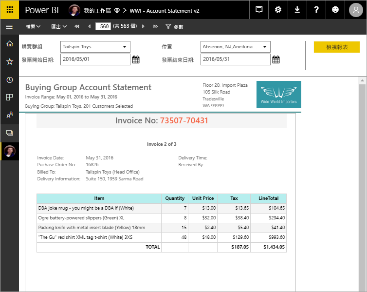

# 什麼是 Power BI Premium 中的編頁報表？

編頁報表，SQL Server Reporting Services 中長期以來的標準報表格式，現在可在 Power BI 服務中使用。 這些報表可以被列印或共用。 它們稱為「編頁」，因為已將它們格式化，使其可適當地符合頁面。 即使資料表跨越多個頁面，它們也會在資料表中顯示所有資料。 它們有時被稱為「完美像素」，因為您可以完全控制其報表頁面配置。 編頁報表是以 SQL Server Reporting Services 中的 RDL 報表技術為基礎。 報表產生器是用於撰寫編頁報表的獨立工具。 

編頁報表可以有許多頁面。 例如，此報表有 563 頁。 每頁都有精確的版面配置，每個發票一頁並重複頁首和頁尾。

試用[Hands-on lab:Create a Microsoft Power BI paginated report](https://www.microsoft.com/handsonlabs/selfpacedlabs/details/SQ00208) (實作教室：建立 Microsoft Power BI 編頁報表)。

您可以在報表產生器中預覽報表，然後將其發佈至 Power BI 服務 (https://app.powerbi.com ) 中。 您需要 Power BI Pro 授權，才能將報表發佈至服務。 只要工作區位於 Power BI Premium 容量，即可在 [我的工作區] 或工作區中發佈及共用編頁報表。 此外，Power BI 系統管理員需要在 Power BI 管理入口網站的 [Premium 容量區段](../service-admin-premium-workloads.md#paginated-reports)中啟用分頁報表。 

## 在 Power BI 報表產生器中建立報表

分頁報表有自己的設計工具，也就是 Power BI 報表產生器。 這是一種新工具，會和您先前用來建立 Power BI 報表伺服器或 SQL Server Reporting Services (SSRS) 分頁報表的工具共用相同的基礎。 實際上，您為 SSRS 2016 和 2017 或 Power BI 報表伺服器內部部署建立的編頁報表是與 Power BI 服務相容的。 Power BI 服務維持回溯相容性，因此您可以繼續向前進行報表，並且可以升級任何舊版的編頁報表。 並非所有報表功能都能在啟動時使用。 如需詳細資料，請參閱本文中的[限制與考量](#limitations-and-considerations)。
     
## 來自各種資料來源的報表

單一的編頁報表可以包含許多不同的資料來源。 與 Power BI 報表不同，它沒有基礎資料模型。 針對 Power BI 服務中編頁報表的初始版本，您可以在報表本身中建立內嵌的資料來源和資料集。 目前，您無法使用共用資料來源或共用資料集。 您可以在本機電腦上的報表產生器中建立報表。 如果報表連接至內部部署資料，則在將報表上傳至 Power BI 服務之後，您需要建立閘道並重新導向資料連線。 以下是您此時可以連線到的資料來源：

- Azure SQL Database 和資料倉儲 (透過基本和 oAuth)
- Azure Analysis Services (透過 SSO)
- 透過閘道的 SQL Server
- 透過閘道的 SQL Server Analysis Services
- Power BI 資料集
- Oracle
- Teradata

## 設計報表  

### 使用矩陣、圖表和自由形式配置建立編頁報表

資料表報表適用於資料行型的資料。 矩陣報表 (如交叉分析或樞紐分析表報表) 很適合用於摘要資料。 圖表報表能以圖形化格式呈現資料，而自由形式的「清單」  報表則可以呈現幾乎所有其他類型的資料 (例如發票)。 
  
您可以從其中一個報表產生器精靈開始。 資料表、矩陣和圖表精靈將引導您建立內嵌的資料來源連線和內嵌的資料集。 然後拖放欄位以建立資料集查詢、選取配置和樣式，並自訂報表。  
  
使用地圖精靈，可以建立根據地理或幾何背景顯示彙總資料的報表。 地圖資料可以是來自 Transact-SQL 查詢或美國環境系統研究所公司(ESRI) 形狀檔的空間資料。 您還可以加入 Microsoft Bing 地圖底圖背景。  

### 新增其他項目至您的報表

透過篩選、分組和排序資料，或是加入公式和運算式來修改資料。 加入圖表、量測計、走勢圖和指標，以視覺格式摘要資料。  使用參數和篩選來篩選自訂檢視的資料。 內嵌或參考影像與其他資源，包括外部內容。  

編頁報表中的所有內容 (從報表本身到每個文字方塊、影像、資料表和圖表) 都有一系列屬性，您可以設定這些屬性以使報表看起來完全符合您的要求。

## 建立報表定義

在設計編頁報表時，您實際上是在建立報表定義  。 它不包含資料。 它會指定要取得資料的位置、要取得哪些資料，以及如何顯示資料。 當您執行報表時，報表處理器會採用您所指定的報表定義、擷取資料，並結合報表配置來產生報表。 您可以將報表定義上傳至 Power BI 服務 (https://app.powerbi.com ) 中，也可以上載到 [我的工作區] 或是與同事共用的工作區。 如果報表資料來源位於內部部署，則在上傳報表之後，您可以將資料來源連線重新導向為通過閘道。 

## 檢視您的編頁報表
您可以在瀏覽器中以及 Power BI 行動裝置應用程式中查看 Power BI 服務中的編頁報表。 從 Power BI 服務中，您可以將報表匯出為多種格式，例如 HTML、MHTML、PDF、XML、CSV、TIFF、Word 和 Excel。 您也可以與其他人共用它。  

## 建立您報表的訂閱

您現在可以為您自己和其他人設定 Power BI 服務中分頁報表的電子郵件訂閱。 在一般情況下，流程與訂閱 Power BI 服務中的報表與儀表板相同。 在訂閱設定中，選擇您希望收到電子郵件的頻率：每天、每週或每小時。 訂閱會包含整個報表輸出的 PDF 附件。

如需詳細資料，請參閱[為您自己和其他人訂閱 Power BI 服務中的分頁報表](../consumer/paginated-reports-subscriptions.md)一文。 

## 限制與考量

以下是初始版本中不支援的一些其他功能：

- 將報表頁面或視覺效果釘選到 Power BI 儀表板。 您仍然可以從位於 Power BI 報表伺服器或 Reporting Services 報表伺服器上的內部部署編頁報表，將視覺效果釘選到 Power BI 儀表板。 請參閱[將 Reporting Services 項目釘選至 Power BI 儀表板](https://docs.microsoft.com/sql/reporting-services/pin-reporting-services-items-to-power-bi-dashboards)以取得更多資訊。
- 文件對應。
- 子報表和鑽研報表。  不過，您可以考慮使用 URL 參數搭配編頁報表來完成鑽研案例。
- 共用的資料來源和共用資料集。

 
## 後續步驟

- [從 Microsoft 下載中心安裝 Power BI 報表產生器](https://go.microsoft.com/fwlink/?linkid=2086513)
- [教學課程：建立編頁報表](paginated-reports-quickstart-aw.md)
- [直接在編頁報表中輸入資料](paginated-reports-enter-data.md)
- [Hands-on lab:Create a Microsoft Power BI paginated report](https://www.microsoft.com/handsonlabs/selfpacedlabs/details/SQ00208) (實作教室：建立 Microsoft Power BI 編頁報表)
- [教學課程：為客戶將 Power BI 編頁報表內嵌至應用程式](../developer/embed-paginated-reports-customers.md)。