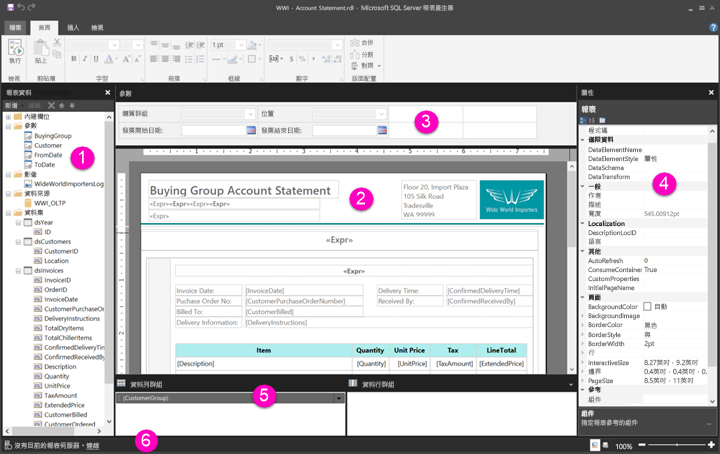

# 在報表設計檢視中瀏覽編頁報表

Power BI 報表產生器中的報表設計檢視，是用於建立可以發佈到 Power BI 服務之分頁報表的設計空間。 設計介面位於報表產生器的中心，其周圍是功能區和窗格。 設計介面是您加入和組織報表項目的位置。 此文章說明可用來加入、選取並組織報表資源，以及變更報表項目屬性的窗格。  

1. [[報表資料] 窗格](#1-report-data-pane) 
2. [[報表設計] 介面](#2-report-design-surface)  
3. [[參數] 窗格](#3-parameters-pane) 
4. [[屬性] 窗格](#4-properties-pane) 
5. [[群組] 窗格](#5-grouping-pane) 
6. [目前報表狀態列](#6-current-report-status-bar)  
  
## 1 個 [報表資料] 窗格  
 在 [報表資料] 窗格中，您可以在設計報表配置之前，定義報表所需的報表資料和報表資源。 例如，您可以將資料來源、資料集、導出欄位、報表參數和影像新增至 [報表資料] 窗格。  
  
 將項目加入到 [報表資料] 窗格後，將欄位拖曳到設計介面上的報表項目，以控制資料出現在報表中的位置。  
  
> [!TIP]  
>  如果將 [報表資料] 窗格中的欄位直接拖曳到報表設計介面，而不是將它放在資料區域 (如資料表或圖表) 中，則在執行報表時，只會看到該欄位中第一個資料的值。  
  
 您還可以將內建欄位從 [報表資料] 窗格拖曳到報表設計介面。 轉譯時，這些欄位提供報表的相關資訊，例如報表名稱、報表中的總頁數和目前的頁碼。  
  
 當您將項目新增至報表設計介面時，某些項目會自動加入到 [報表資料] 窗格中。 例如，如果您在報表中內嵌影像，則會將其加入到 [報表資料] 窗格中的 [影像] 資料夾。  
  
> [!NOTE]  
>  您可以使用 [新增]  按鈕，將新項目加入到 [報表資料] 窗格。 您可以從相同的資料來源或從其他資料來源，將多個資料集加入到報表中。 若要從相同的資料來源加入新的資料集，請以滑鼠右鍵按一下資料來源 > [加入資料集]  。  
  
## 2 個 [報表設計] 介面  
 報表產生器報表設計介面是設計報表的主要工作區域。 若要在報表中放置報表項目 (如資料區域、子報表、文字方塊、影像、矩形和線條等)，可以將它們從功能區或「報表組件庫」加入到設計介面。 在那裡，您可以為報表項目加入群組、運算式、參數、篩選、動作、可見性和格式設定。  
  
 您還可以變更下列項目：  
  
-   報表主體屬性 (例如框線和填滿色彩)，以滑鼠右鍵按一下設計介面上任何報表項目外部的白色區域，然後選取 [主體屬性]  。  
  
-   頁首和頁尾屬性 (例如框線和填滿色彩)，以滑鼠右鍵按一下頁首或頁尾區域中任何報表項目外部的設計介面的白色區域，然後選取 [標頭屬性]  或 [頁尾屬性]  。  
  
-   報表本身的屬性 (例如版面設定)，以滑鼠右鍵按一下設計介面周圍的灰色區域，並選擇 [報表屬性]  。  
  
-   報表項目的屬性，以滑鼠右鍵按一下報表項目並選取 [屬性]  。  
  
### 設計介面大小和列印區域  
設計介面大小可能與您指定來列印報表的頁面大小列印區域不同。 變更設計介面的大小並不會變更報表的列印區域。 無論您為報表設定了什麼大小的列印區域，完整的設計區域大小都不會變更。 如需詳細資訊，請參閱轉譯行為。 
  
- 若要顯示尺規，請在 [檢視]  索引標籤上，選取 [尺規]  核取方塊。  
  
## 3 個 [參數]窗格  
 您可以使用報表參數來控制報表資料、將相關的報表連接在一起，以及變更報表呈現方式。 [參數] 窗格會提供彈性的報表參數配置。  
  
 深入了解報表參數   
  
## 4 個 [屬性] 窗格
 報表中的每個項目 (包括資料區、影像、文字方塊和報表主體本身) 都有與其相關聯的屬性。 例如，文字方塊的 BorderColor 屬性會顯示文字方塊框線的色彩值，而報表的 PageSize 屬性會顯示報表的頁面大小。  
  
 這些屬性會顯示在 [屬性] 窗格中。 窗格中的屬性會根據您選取的報表項目而有所不同。  
  
- 若要查看 [屬性] 窗格，請移至 [檢視]  索引標籤上 [顯示/隱藏群組]  中的 > [屬性]  。  
  
### 變更屬性值  
 在報表產生器中，您有數種方式可以變更報表項目的屬性：  
  
-   透過選取功能區上的按鈕和清單。  
  
-   透過變更對話方塊內的設定。  
  
-   透過變更 [屬性] 窗格內的屬性值。  
  
 對話方塊和功能區中提供了最常用的屬性。  
  
 根據屬性，您可以從下拉式清單中設定屬性值、輸入值，或選取 `<Expression>` 即可建立運算式。  
  
### 變更 [屬性] 窗格檢視  
 根據預設，[屬性] 窗格中顯示的屬性會組織成廣泛的類別，例如 [動作]、[框線]、[填滿]、[字型] 和 [一般]。 每個類別都有一組與其相關聯的屬性。 下列屬性列在 [字型] 類別中：Color、FontFamily、FontSize、FontStyle、FontWeight、LineHeight 和 TextDecoration。 如果您願意，可以依字母順序排列窗格中列出的所有屬性。 這將移除類別並依字母順序列出所有屬性，而不論類別。  
  
 [屬性] 窗格的頂端有三個按鈕：[類別]  、[依字母順序排序]  和 [屬性頁]  。 選取 [類別] 和 [按字母排列] 按鈕，可在 [屬性] 窗格檢視之間切換。 選取 [屬性頁]  按鈕，以開啟所選的報表項目的 [屬性] 對話方塊。  
  
  
## 5 個 [群組] 窗格

 [群組] 用來將您的報表資料組織到視覺階層以及計算總計中。 您可以在設計介面上以及 [群組] 窗格中檢視資料區域內的資料列和資料行群組。 [群組] 窗格有兩個窗格：[資料列群組] 和 [資料行群組]。 當您選取資料區時，[群組] 窗格會顯示該資料區內所有群組的階層清單：子群組會縮排出現在其父群組底下。  
  
 您可以透過從 [報表資料] 窗格中拖曳欄位，並將其拖放到設計介面上或 [群組] 窗格中來建立群組。 在 [群組] 窗格中，您可以加入父群組、鄰近群組和子群組，變更群組屬性，以及刪除群組。  
  
 預設會顯示 [群組] 窗格，但您可以藉由清除 [檢視] 索引標籤上的 [群組] 窗格核取方塊將它關閉。[群組] 窗格不適用於圖表或量測計資料區域。  
  
 如需詳細資訊，請參閱群組窗格和了解群組。  
  
## 6 個目前報表狀態列

目前報表狀態列顯示報表連接的伺服器名稱，或者顯示「沒有目前的報表伺服器」。 您可以選取 [連線]  連接到伺服器。

## 後續步驟

[什麼是 Power BI Premium 中的編頁報表？](paginated-reports-report-builder-power-bi.md) 

  
  
