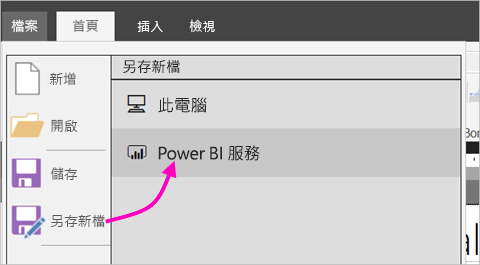
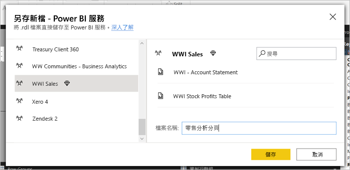
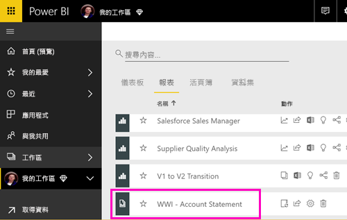
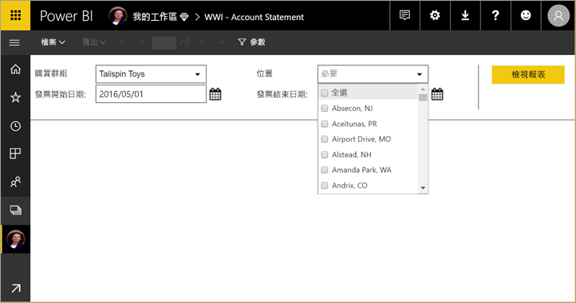
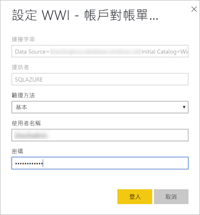

# 將編頁報表發佈至 Power BI 服務

在此文章中，您將了解如何從本機電腦上傳編頁報表，以將該報表發佈至 Power BI 服務。 只要工作區位於 Premium 容量，您就可以將編頁報表上傳到 [我的工作區] 或任何其他工作區。 尋找工作區名稱旁邊的鑽石圖示  (在工作區名稱旁邊)。 

如果您的報表資料來源位於內部部署環境，則需在上傳報表後建立閘道。 請參閱本文稍後的[建立閘道](#create-a-gateway)一節。

## 將工作區新增至 Premium 容量

如果工作區的名稱旁邊沒有鑽石圖示  ，則您需要將該工作區新增至 Premium 容量。 

1. 選取 [工作區]  、選取工作區名稱旁邊的省略符號 **...** ，然後選取 [編輯工作區]  。

    ![選取 [編輯工作區]](media/paginated-reports-save-to-power-bi-service/power-bi-paginated-edit-workspace.png)

1. 在 [編輯工作區]  對話方塊中，展開 [進階]  ，然後將 [專用容量]  滑動至 [開啟]  。

    ![選取 [專用容量]](media/paginated-reports-save-to-power-bi-service/power-bi-paginated-edit-workspace-dialog.png)

   您可能無法變更它。 如果沒有，則連絡您的 Power BI Premium 容量管理員，以為您提供指派權限來將您的工作區新增至 Premium 容量。

## 從報表產生器發佈編頁報表

1. 在報表產生器中建立編頁報表，然後將它儲存到本機電腦。

1. 在報表產生器的 [檔案]  功能表上，選取 [另存新檔]  。

    

    如果您尚未登入 Power BI，您必須立即登入或建立帳戶。 在報表產生器的右上角，選取 [登入]  並完成相關步驟。

2. 在左側工作區清單中，選取其名稱旁邊具有鑽石圖示  的工作區。 在方塊中輸入**檔案名稱**，然後按一下 [儲存]  。 

    

4. 在瀏覽器中開啟 Power BI 服務，然後瀏覽至您在其中發佈編頁報表的 Premium 工作區。 在 [報表]  索引標籤上，您會看到報表。

    

5. 選取編頁報表以在 Power BI 服務中開啟。 如果報表具有參數，則您需要選取它們，才能檢視該報表。

    

6. 如果您的報表資料來源位於內部部署環境，請參閱本文中[建立閘道](#create-a-gateway)的方式以存取資料來源。

## 從 Power BI 服務上傳編頁報表

您也可以從 Power BI 服務開始並上傳編頁報表。

1. 在報表產生器中建立編頁報表，然後將它儲存到本機電腦。

1. 在瀏覽器中開啟 Power BI 服務，然後瀏覽至您想要在其中發佈報表的 Premium 工作區。 請注意工作區名稱旁邊的鑽石圖示  。 

1. 選取 [取得資料]  。

    ![Power BI 中的 [取得資料]](media/paginated-reports-save-to-power-bi-service/power-bi-paginated-get-data.png)

1. 在 [檔案]  方塊中選取 [取得]  。

    ![Power BI 中的 [取得檔案]](media/paginated-reports-save-to-power-bi-service/power-bi-paginated-files-get.png)

1. 選取 [本機檔案]  > 瀏覽至編頁報表 > [開啟]  。

    ![選取 [本機檔案]](media/paginated-reports-save-to-power-bi-service/power-bi-paginated-local-file.png)

1. 選取 [繼續]   > [編輯認證]  。

    ![選取 [編輯認證]](media/paginated-reports-save-to-power-bi-service/power-bi-paginated-select-edit-credentials.png)

1. 設定您的認證 > [登入]  。

    

   在 [報表]  索引標籤上，您會看到報表。

    

1. 選取該報表以在 Power BI 服務中開啟它。 如果報表具有參數，則您需要選取它們，才能檢視該報表。
 
    

6. 如果您的報表資料來源位於內部部署環境，請參閱本文中[建立閘道](#create-a-gateway)的方式以存取資料來源。

## 建立閘道

就像任何其他 Power BI 報表，如果報表資料來源位於內部部署，則您需要建立或連線至閘道，才能存取資料。

1. 在報表名稱旁邊，選取 [管理]  。

   

1. 如需詳細資料和後續步驟，請參閱 Power BI 服務文章：[什麼是內部部署資料閘道](../connect-data/service-gateway-onprem.md)。

## 後續步驟

- [檢視 Power BI 服務中的編頁報表](../consumer/paginated-reports-view-power-bi-service.md)
- [什麼是 Power BI Premium 中的編頁報表？](paginated-reports-report-builder-power-bi.md)
- [教學課程：為客戶將 Power BI 編頁報表內嵌至應用程式](../developer/embedded/embed-paginated-reports-customers.md)
