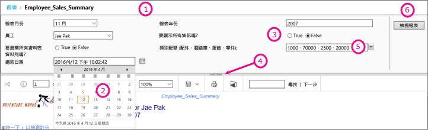
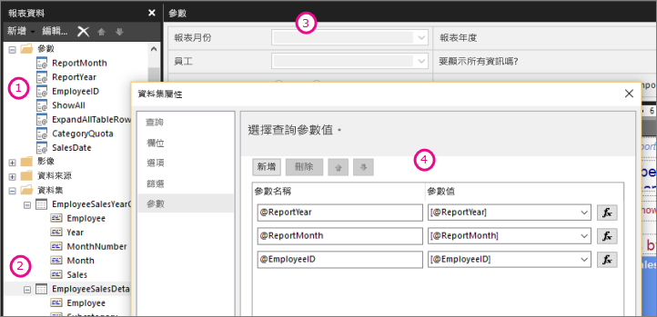

# Power BI 報表產生器中的報表參數

此主題描述 Power BI Report Builder 報表參數的常見使用案例、您可以設定的屬性等。 報表參數可以讓您控制報表資料、將相關的報表連接在一起，以及變更報表的呈現方式。 您可以在您於報表產生器中建立的分頁報表中使用報表參數。

##  參數的常見使用案例

 以下是使用參數時一些最常見的方式。  
  
**控制分頁報表資料**
  
- 透過撰寫包含變數的資料集查詢，來在資料來源篩選分頁報表資料。  
  
- 讓使用者指定值來自訂分頁報表中的資料。 例如，為銷售資料提供兩個參數，作為開始日期和結束日期。  
  
**變更報表呈現方式**
  
- 讓使用者指定值，協助自訂報表的外觀。 例如，提供布林值參數，指出是否要展開或摺疊資料表中的所有巢狀資料列群組。  
  
- 讓使用者透過在運算式中包含參數來自訂報表資料和外觀。  
  
##  檢視具有參數的報表

當您檢視具有參數的報表時，報表檢視器工具列會顯示每個參數，讓您以互動方式指定值。 下圖顯示具備 @ReportMonth、@ReportYear、@EmployeeID、@ShowAll、@ExpandTableRows、@CategoryQuota 和 @SalesDate 參數報表的參數區域。  

  
1. **參數窗格**：報表檢視器工具列會顯示提示，以及每個參數的預設值。 您可以自訂參數窗格中參數的版面配置。  
  
2. **@SalesDate 參數**：@SalesDate 參數的資料類型是 **DateTime**。 「選取日期」提示會出現在文字方塊旁邊。 若要修改日期，請在文字方塊中鍵入新日期，或是使用行事曆控制項。  
  
3. **@ShowAll 參數**@ShowAll 參數的資料類型是 **Boolean (布林值)** 。 使用選項按鈕來指定 **True** 或 **False**。  
  
4. **顯示或隱藏參數區域控點**在報表檢視工具列上，按一下此箭頭來顯示或隱藏參數窗格。  
  
5. **@CategoryQuota 參數**@CategoryQuota 參數的資料類型是 **Float (浮點數)** ，因此會接受一個數值。  @CategoryQuota 已設為允許多個值。  
  
6. **檢視報表**在您輸入參數值後，請按一下 [檢視報表]  來執行報表。 若所有參數都具有預設值，則報表會在第一個檢視上自動執行。  
  
##  建立參數

您可以透過數種不同方式建立報表參數。
  
> [!NOTE]
>  並非所有資料來源都支援參數。
  
**具備參數的資料集查詢或預存程序**
  
 新增包含變數的資料集查詢，或是包含輸入參數的資料集預存程序。 資料集參數會為每個變數或輸入參數建立，報表參數則會為每個資料集參數建立。  
  

  
 這個來自報表產生器的影像顯示：  
  
1.  [報表資料] 窗格中的報表參數。  
  
2.  具備參數的資料集。  
  
3.  [參數] 窗格。  
  
4.  在 [資料集屬性] 對話方塊中列出的參數。  
  
**手動建立參數**
  
從 [報表資料] 窗格手動建立參數。 您可以設定報表參數，讓使用者可以透過互動方式輸入值，協助自訂報表的內容或外觀。 您也可以設定報表參數，讓使用者無法變更預先設定的值。  
  
> [!NOTE]  
>  由於參數是在伺服器上獨立管理，因此使用新參數設定重新發佈主要報表，不會覆寫報表上現有的參數設定。  

### 參數值

 下列是在報表中選取參數值的選項。  
  
- 從下拉式清單選取單一參數值。  
  
- 從下拉式清單選取多個參數值。  
  
- 從下拉式清單中為一個參數選取值，決定下拉式清單中另一個參數的可用值。 這些是串聯參數。 串聯參數可讓您從上千個值中，透過連續篩選參數值來將數量縮小到可管理的數量。 如需詳細資訊，請參閱[在編頁報表中使用串聯參數](../guidance/paginated-report-cascading-parameter.md)。
  
- 在無需先選取參數值的情況下執行報表 (因為已為參數建立預設值)。  
  
##  報表參數屬性

 您可以使用 [報表屬性] 對話方塊變更報表參數屬性。 下表摘要說明您可以為每個參數設定的屬性：  
  
|屬性|描述|  
|--------------|-----------------|  
|名稱|為參數鍵入區分大小寫的名稱。 名稱必須以字母開頭，且可以包含字母、數字和底線 (_)。 名稱不可包含空格。 針對自動產生的參數，名稱與資料集查詢中的參數相符。 根據預設，手動建立的參數與 ReportParameter1 相似。|  
|提示|報表檢視器工具列上顯示在參數旁邊的文字。|  
|資料類型|報表參數必須是下列其中一種資料類型：   **Boolean** (布林值)。 使用者可以從選項按鈕中選取 True 或 False。   **DateTime**。 使用者可以從行事曆控制項中選取日期。   **Integer** (整數)。 使用者可以在文字方塊中鍵入值。   **Float** (浮點數)。 使用者可以在文字方塊中鍵入值。   **Text** (文字)。 使用者可以在文字方塊中鍵入值。   為參數定義可用值時，使用者可以從下拉式清單中選擇值，即使資料類型是 **DateTime** 也一樣。|  
|允許空白值|若參數值可以是空字串或空白，請選取此選項。   若您為參數指定有效值，且您希望將空白值作為其中一個有效值，您必須將其作為其中一個您指定的值包含在其中。 選取此選項不會自動將空白包含在可用值中。|  
|允許 Null 值|若參數值可為 Null，請選取此選項。   若您為參數指定有效值，且您希望將 Null 作為其中一個有效值，您必須將 Null 作為其中一個您指定的值包含在其中。 選取此選項不會自動將 Null 包含在可用值中。|  
|允許多個值|提供可用值來建立下拉式清單，讓您的使用者可從中選擇。 這是一種確保只會在資料集查詢中提交有效值的好方法。   若參數值可以是下拉式清單中所顯示的多個值，請選取此選項。 不得使用 Null 值。 選取此選項時，便會將核取方塊新增到參數下拉式清單中的可用值清單。 清單頂端包含 [全選]  的核取方塊。 使用者可以選擇他們想要的值。   若提供值的資料會快速變更，則使用者看到的清單可能不會是最新狀態。|  
|可見|選取此選項來在執行時於報表頂端顯示報表參數。 此選項可讓使用者在執行階段選取參數值。|  
|隱藏|選取此選項來在發佈的報表中隱藏報表參數。 報表參數值仍然可以在報表 URL、訂閱定義，或是報表伺服器上設定。|  
|內部|選取此選項來隱藏報表參數。 在發佈的報表中，只能在報表定義中檢視報表參數。|  
|可用值|若您已為參數指定可用值，則有效值一律會顯示為下拉式清單。 例如，若您為 **DateTime** 參數提供可用值，則會在參數窗格中顯示日期的下拉式清單，而非行事曆控制項。   若要確保值的清單在報表和子報表中都是一致的，您可以在資料來源上設定選項，來針對與資料來源建立關聯的資料集中所有查詢，使用單一交易。   **安全性注意事項**：在任何包含 **Text** 資料類型參數的報表中，請務必使用可用值清單 (也稱為有效值清單)，並確保任何執行報表的使用者都只有檢視報表中資料所需權限。|  
|預設值|設定查詢或靜態清單的預設值。   當每個參數都具有預設值時，報表會在第一個檢視上自動執行。|  
|進階|設定報表定義屬性 **UsedInQuery**，該值會指出此參數會直接還是間接影響報表中的資料。   **自動判斷何時應重新整理**  若您希望報表處理器決定此值的設定，請選擇此選項。 若若報表處理器偵測到直接或間接參考此參數的資料集查詢，或是報表具有子報表，則此值為 **True**。   **一律重新整理**  若資料集查詢或參數運算式中會直接或間接使用報表參數，請選擇此選項。 此選項會將 **UsedInQuery** 設為 True。   **永不重新整理**  若資料集查詢或參數運算式中不會直接或間接使用報表參數，請選擇此選項。 此選項會將 **UsedInQuery** 設為 False。   **警告**：請謹慎使用 [永不重新整理]  。 在報表伺服器上，**UsedInQuery** 會用來協助控制報表資料及轉譯報表的快取選項，以及快照報告的參數選項。 若您以不正確的方式設定 [永不重新整理]  ，可能會造成不正確報表資料或要進行快取的報表，或是導致快照報告具有不一致的資料。 |  
  
##   資料集查詢  
 若要在資料集查詢中篩選資料，您可以包含限制子句，透過指定要在結果集中包含或從結果集中排除的值，來限制擷取的資料。  
  
 使用資料來源的查詢設計工具來協助建置參數化查詢。  
  
-   針對 Transact-SQL 查詢，不同資料來源支援不同的參數語法。 支援在查詢中透過位置或名稱識別的參數範圍。 在關聯式查詢設計工具中，您必須為篩選選取參數選項，來建立參數化查詢。   
  
-   針對以多維度資料來源 (例如 Microsoft SQL Server Analysis Services) 為基礎的查詢，您可以指定是否要根據您在查詢設計工具中指定的篩選建立參數。 
  
##   已發佈報表的參數管理  
 在您設計報表時，報表參數會儲存在報表定義中。 當您發佈報表時，報表參數會儲存，並與報表定義分開管理。  
  
 針對已發佈的報表，您可以使用下列項目：  
  
-   **報表參數屬性。** 獨立於報表定義外，在報表伺服器上直接變更報表參數值。  
  
-   **報表訂閱。** 您可以指定參數值來透過訂閱篩選資料和傳遞報表。 
  
 若您重新發佈報表定義，便會保留已發佈報表的參數屬性。 若以相同報表重新發佈報表定義，則參數名稱和資料類型會保持不變，且也會保留您的屬性設定。 若您在報表定義中新增或刪除參數，或是變更現有參數的資料類型或名稱，您可能需要在已發佈的報表中變更參數屬性。  
  
 並非在所有情況下都可變更所有參數。 若報表參數從資料集查詢取得預設值，便無法為已發佈的報表修改該值，也無法在報表伺服器上進行修改。 在執行階段時使用的值會在執行查詢時決定，或是在評估運算式時決定 (適用於以運算式為基礎的參數)。  
  
 報表執行選項可能會影響參數的處理方式。 作為快照集執行的報表無法使用衍生自查詢的參數，除非查詢包含參數的預設值。  
  
##   訂閱的參數  
 您可以為隨選或快照集定義訂閱，並指定處理訂閱期間要使用的參數值。  
  
-   **隨選報表。**  針對隨選報表，您可以指定參數值，且參數值可以和為報表所列出每個參數的已發佈值不同。 例如，假設您有一個致電客戶服務中心報表，使用  參數來傳回目前日期、這一週或這一個月的客戶服務要求。 若報表的預設參數值設為 [今天]  ，您的訂閱便可以使用不同參數值 (例如 [週]  或 [月]  ) 來產生包含每一週或每個月圖表的報表。  
  
## 後續步驟

- [什麼是 Power BI Premium 中的編頁報表？](paginated-reports-report-builder-power-bi.md)  
- [在編頁報表中使用串聯參數](../guidance/paginated-report-cascading-parameter.md)
