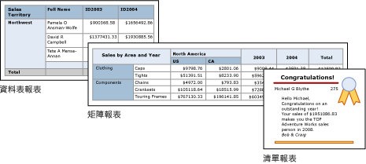

# Power BI 報表產生器中的表格、矩陣和清單
 在報表產生器中，表格、矩陣和清單都是「資料區域」  ，在排成列和行的儲存格中用來顯示分頁的報表資料。 這些儲存格通常會包含文字資料，例如文字、日期和數字，但也可以包含量測計、圖表或報表項目，例如影像。 整體而言，表格、矩陣和清單經常稱為 *tablix* 資料區域。  
  
 表格、矩陣和清單範本都以 tablix 資料區域建置，也就是可以在儲存格中顯示資料的彈性方格。 在表格和矩陣範本中，儲存格會排成列和行。 因為範本由基礎一般 tablix 資料區域變化而來，所以您可以結合範本格式來顯示資料，並變更其中的表格、矩陣或清單，以在您開發報表時，納入其他資料區域的功能。 例如，如果您新增了表格，但發現它不符您的需求，您可以新增行群組，讓該表格變成矩陣。  
  
 在表格和矩陣資料區域中加入巢狀表格、矩陣、清單、圖表和量測計，即可顯示複雜的資料關聯性。 表格和矩陣有表格式版面配置，其資料來自以單一資料來源建置而成的單一資料集。 表格和矩陣之間的主要差異是表格只能包含列群組，但矩陣可包含列群組和行群組。  
  
 清單則略為不同。 它們支援自由格式的版面配置，可以包含多份對等表格或矩陣，各自使用不同資料集的資料。 清單也可以用於表單，例如發票。  
  
 下圖說明含有表格、矩陣或清單的簡易報表。  

  
##   表格  
 使用表格可顯示詳細資料、以列群組整理資料，或兩者混合。 表格範本包含三行，有表格標題列和資料的詳細資料列。 下圖顯示在設計介面上選取的初始資料表範本：  

  
 您可以依單一欄位、多個欄位或透過撰寫自己的運算式來分組資料。 您可以建立巢狀群組或獨立的相鄰群組來顯示分組之資料的彙總值，也可將總數新增至群組。 例如，如果您的表格有稱為 [類別]  的列群組，您可以新增每個群組的小計和報表的總計。 若要改善表格的外觀，並特別標示出您想要強調的資料，您可以合併儲存格，並將格式設定套用至資料和表格標題。  
  
 您可在一開始隱藏詳細資料或分組的資料，然後加入向下鑽研切換，讓使用者能以互動方式選擇要顯示多少資料。  
  
##   矩陣  
 使用矩陣可顯示分成列和行的彙總資料摘要，類似樞紐分析表或交叉資料表。 群組的資料列數和資料行數，取決於每個資料列和資料行群組的唯一組數目。 下圖顯示在設計介面上選取的初始矩陣範本：  

![所選取從 [工具箱] 新增的報表產生器矩陣](media/report-builder-tables-matrices-lists/report-builder-new-matrix.png)
 
 您可以按列和行群組的多個欄位或運算式來分組資料。 當報表資料和資料區在執行階段結合時，如果為資料行群組加入資料行，並為資料列群組加入資料列，則矩陣會在頁面上以水平和垂直方式成長。 矩陣儲存格顯示的彙總值範圍是其所屬列和行群組的交集。 例如，如果您的矩陣有一個列群組 ([類別]) 和兩個顯示總銷售額的行群組 ([區域] 及 [年份])，則報表會有兩個儲存格，顯示 [類別] 群組中每個值的總銷售額。 資料格範圍的兩個交集是：Category 和 Territory，以及 Category 和 Year。 矩陣可以包含巢狀及相鄰的群組。 巢狀群組是父子式關聯性，而相鄰群組則是對等關聯性。 您可以為矩陣內任何和所有層級的巢狀列群組與巢狀行群組新增小計。  
  
 為使矩陣資料更方便閱讀，並特別標出您想要強調的資料，您可以水平和垂直合併或分割儲存格，以及將格式設定套用至資料和群組標題。  
  
 您也可以包含向下鑽研切換，從一開始就隱藏詳細資料；然後，使用者可以視需要按一下切換來顯示更多或更少的詳細資料。  
  
##   清單  
 使用清單可建立自由格式的版面配置。 您不是只有方格版面配置，而是可以在清單內自由放置欄位。 您可以使用清單設計顯示許多資料集欄位的表單，也可用它來容納分組的資料，並排顯示多個資料區域。 例如，您可以定義清單的群組；加入資料表、圖表與影像；以及以資料表和圖形形式顯示每個群組值的值，如同您針對員工或病患記錄所進行的處理。  

![所選取從 [工具箱] 新增的報表產生器清單](media/report-builder-tables-matrices-lists/report-builder-new-list.png)
  
##   準備資料  
 資料表、矩陣和清單資料區都會顯示資料集中的資料。 您可以在為資料集擷取資料的查詢中準備資料，或藉由在表格、矩陣或清單中設定屬性來準備資料。  
  
 您用來為報表資料集擷取資料的查詢語言 (如 TRANSACT-SQL)，可以透過套用篩選，只包含一部分資料；以讓報表更方便閱讀的常數取代 Null 值或空白；以及排序及分組資料，來準備資料。  
  
 如果您選擇在報表的表格、矩陣或清單資料區域中準備資料，請在資料區域或資料區域內的儲存格上設定屬性。 如果您想要篩選或排序資料，請在資料區域上設定屬性。 例如，若要排序資料，您要指定要排序的行和排序方向。 如果您想要為欄位提供替代值，您要設定顯示該欄位的儲存格文字值。 例如，若要在欄位為空白或 Null 時顯示空白，您要使用運算式來設定值。  
  
##   建置和設定表格、矩陣或清單  
 當您將表格或矩陣新增至報表時，您可以使用 [表格精靈] 和 [矩陣精靈]，也可從報表產生器提供的範本手動建置它們。 清單則需從清單範本手動建置。  
  
 精靈會引導您完成快速建置和設定表格或矩陣的步驟。 完成精靈後，或如果您從頭開始建置 tablix 資料區域，您可以進一步設定並改善它們。 資料區域快顯功能表提供的對話方塊，可讓您針對分頁符號、是否重複和顯示頁首和頁尾、顯示選項、篩選和排序，來設定最常用的屬性。 但是，tablix 資料區域提供如此豐富的其他屬性，只能在報表產生器的 [屬性] 窗格中設定。 例如，如果您想要在表格、矩陣或清單的資料集為空白時顯示訊息，您要在 [屬性] 窗格的 NoRowsMessage tablix 屬性中指定訊息文字。  
  
##   變更 tablix 範本  
 您一開始選定 tablix 範本後，並非再也無法變更。 當您新增群組、總計與標籤時，您可能會想要修改 tablix 設計。 例如，您可能會從表格開始，然後刪除詳細資料列並新增行群組。  
  
 您可以透過新增任何 tablix 功能，繼續開發表格、矩陣或清單。 Tablix 功能包括顯示列和行上分組資料的詳細資料或彙總。 您可以建立巢狀群組、獨立的相鄰群組或遞迴群組。 您可以篩選和排序分組資料，然後在群組定義中包含多個群組運算式輕鬆合併群組  
  
 您也可以新增群組的總計或資料區域的總計。 您可以隱藏列或行來簡化報表，讓使用者切換顯示隱藏的資料，如同向下鑽研報表一樣。 

## 後續步驟

- [什麼是 Power BI Premium 中的編頁報表？](paginated-reports-report-builder-power-bi.md)
