# 變更報表頁面的大小
在[前一篇文章及前一部影片](power-bi-report-display-settings.md)中，您學到兩種不同的方式來控制在 Power BI 報表中的頁面顯示：**檢視**和**頁面大小**。 頁面檢視和頁面大小都可在 Power BI 服務和 Power BI Desktop 使用，外觀和功能也幾乎相同，但在本教學課程中，我們會使用 Power BI 服務。

### 先決條件
- Power BI 服務   
- [零售分析範例報表](sample-retail-analysis.md)

## 首先，我們要來變更此頁面的檢視設定

1. 在 [閱讀檢視] 或 [編輯檢視] 中開啟報表，然後選取 [新門市] 的 [報表] 索引標籤。 此報表頁面預設是使用 [調整成一頁] 設定加以顯示。  在此情況下，調整成一頁會顯示沒有捲軸的報表頁面，但某些詳細資料與標題會太小而無法讀取。

   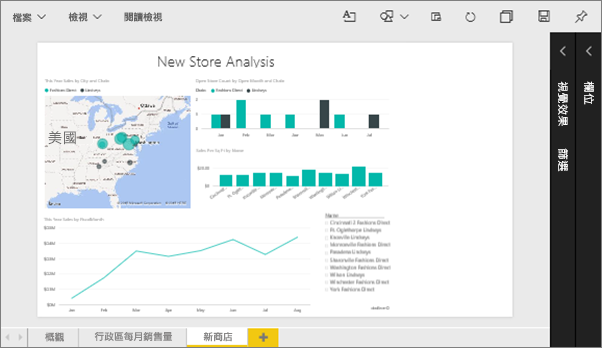
2. 請確定在畫布上未選取任何視覺效果。 選取 [檢視]  並檢閱顯示選項。

    * 在 [閱讀] 檢視中您會看到這個項目。

     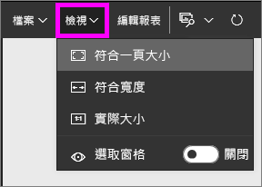
    * 在 [編輯] 檢視中您會看到這個項目。

    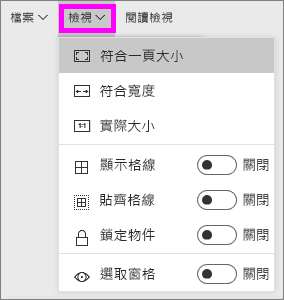

1. 讓我們使用 [實際大小] 設定來看看頁面外觀吧。

   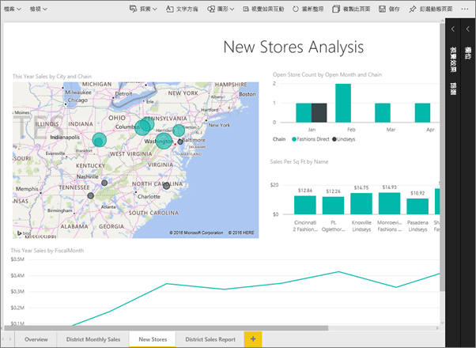

   不太好，儀表板現在有雙重捲軸。
2. 請切換至 [調整成視窗寬度] 。

   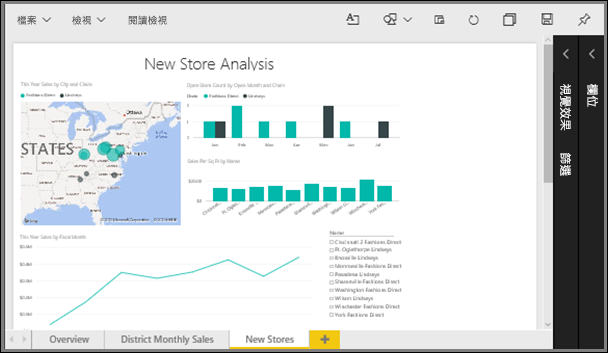

   看起來好一點，我們現在有了捲軸，但比較容易閱讀詳細資料。

## 變更報表頁面的預設檢視
如果您是報表「建立者」，則可以變更報表頁面的預設檢視。 當您與其他人共用您的報表時，將會使用您設定的檢視開啟報表頁面。 報表「取用者」將能夠變更檢視，但一旦離開報表便無法儲存變更。

1. 在報表的 \[New stores] \(新商店) 頁面中，切換回 [實際大小] 檢視。

   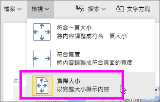

2. 在 [地區每月銷售] 報表頁面上，將 [檢視] 設為 [符合寬度]。

3. 在 [概觀] 報表頁面上，保留預設 [檢視] 設定。

4. 現在選取 [檔案] > [儲存] 來儲存報表。 下次開啟此報表時，頁面會使用新的 [檢視] 設定加以顯示。 讓我們看看。

   
3. 從上方導覽列選取目前工作區的名稱，返回該工作區。  

   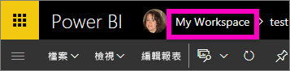
4. 選取 [報表] 索引標籤，然後選擇相同的報表 (零售分析範例)。

    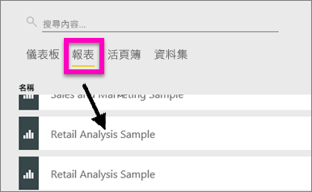
5. 開啟報表的每一頁以查看新設定。

   

## 現在讓我們來探索 [頁面大小] 設定
頁面大小設定只在[編輯檢視](service-interact-with-a-report-in-editing-view.md)中才有，因此您必須有報表的編輯 (「建立者」) 權限，才能變更頁面大小設定。 如果您已連線到我們的任何[範例](sample-datasets.md)，則會具有這些報表的「建立者」權限。

1. 在 [編輯檢視] 中開啟[零售分析範例](sample-retail-analysis.md)的「區域每月銷售額」頁面。
2. 請確定在畫布上未選取任何視覺效果。  在 [視覺效果] 窗格中，選取油漆滾筒圖示 。
3. 選取 [頁面大小] &gt; [類型] 以顯示頁面大小選項。

   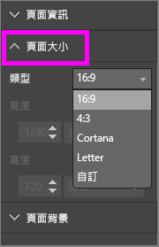
4. 選取 [信件] 。  在畫布的白色部分上，只能保留可容納在 816 x 1056 像素 (信件大小) 的內容。

   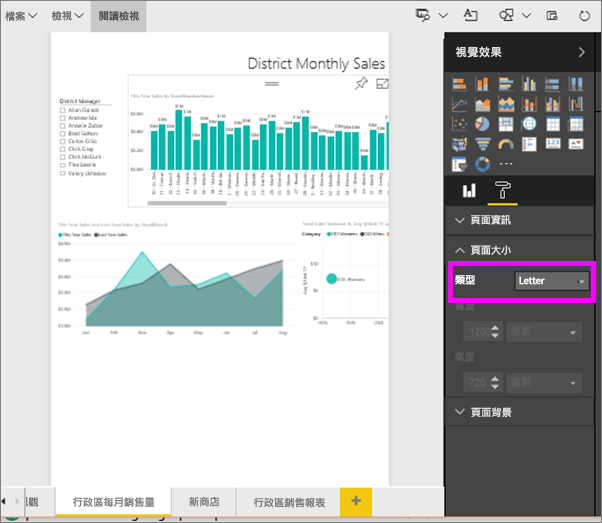
5. 選取 [頁面大小]，[16:9] 比率。

   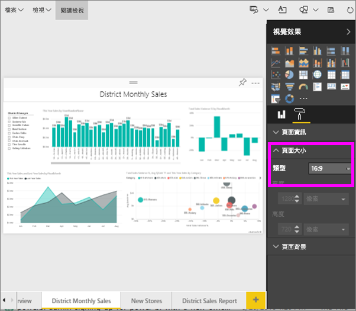

   報表頁面會使用寬度 16、高度 9 的比例顯示。 若要查看所使用的實際像素大小，請看一下灰色的寬度和高度欄位 (1280 x 720)。 報表畫布周圍有很多空白空間，這是因為我們先前將 [檢視] 設定為 [符合一頁大小]。
7. 繼續探索 [頁面大小] 選項。

## 同時使用 [頁面檢視] 和 [頁面大小]
同時使用 [頁面檢視] 和 [頁面大小]，建立在與同事共用或內嵌於另一個應用程式時顯示效果最好的報表。

在此練習中，您將建立報表頁面，它會顯示在擁有 500 像素寬、750 個像素高之空間的應用程式中。

請記住，在上一個步驟中，我們看到報表頁面目前顯示為 1280 寬、720 高。 因此我們知道，如果我們想要所有視覺效果都符合，就需要進行大量的調整大小和重新排列。

1. 調整大小並移動視覺效果，使其可以放在小於目前畫布區域一半的空間。

    
2. 選取 [頁面大小] &gt; [自訂]。
3. 請將寬度設為 500 ，並將高度設為 750。

    
4. 調整 [報表] 頁面，使顯示效果達到最佳。 切換 [檢視] > [實際大小] 和 [檢視] > [符合一頁大小] 進行調整。

    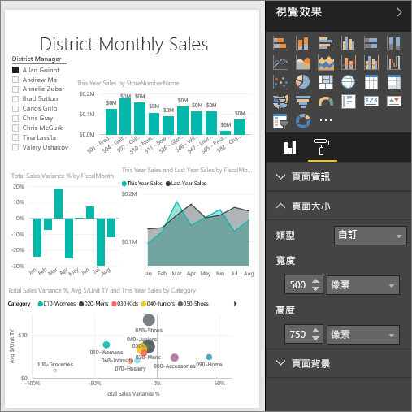

## 後續步驟
[建立 Cortana 的報表](service-cortana-answer-cards.md)

回到 [Power BI 報表的頁面顯示設定](power-bi-report-display-settings.md)

有其他問題嗎？ [試試 Power BI 社群](http://community.powerbi.com/)
