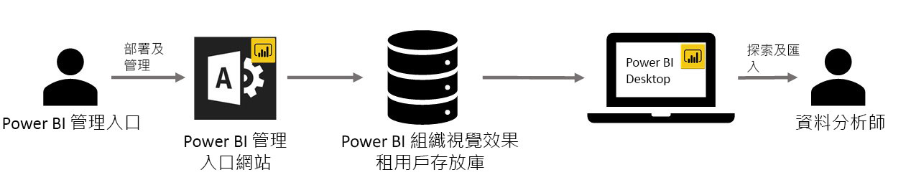

# 在 Power BI 中使用組織自訂視覺效果

您可以在 Power BI 中使用自訂視覺效果，為自己量身打造，或是針對要傳達的資料深入解析，建立獨特的視覺效果類型。 這些自訂視覺效果通常是由開發人員建立，當 Power BI 中包含的多種視覺效果不符合他們的需求時，他們經常會建立自訂視覺效果。 

在某些組織中，自訂視覺效果則更為重要，必須有它們才能傳達組織特有的特定資料或深入解析，它們也可能有特殊的資料需求，或凸顯私用商務方法。 此類組織需要開發自訂視覺效果、在整個組織中分享它們，並確保它們被妥善地維護。 Power BI 自訂視覺效果可讓組織達到此目的。

下圖所顯示的程序說明 Power BI 流程中的組織自訂視覺效果如何從系統管理員開始，經過開發及維護，最後到資料分析師手上。

組織視覺效果是由 Power BI 系統管理員從系統管理入口網站中部署及管理的。 一旦部署到組織存放庫，組織中的使用者就可以輕鬆地探索組織自訂視覺效果，並直接從 Power BI Desktop 將它們匯入至其報告中。

若要深入了解如何在您建立的報告中使用組織自訂視覺效果，請參閱下列文章：[深入了解如何將組織視覺效果匯入自己的報告](power-bi-custom-visuals.md)。

## 管理組織自訂視覺效果

若要深入了解如何管理、部署組織內的組織自訂視覺效果，請參閱下列文章：[深入了解組織自訂視覺效果的部署和管理](https://go.microsoft.com/fwlink/?linkid=866790)。

> [!WARNING]
> 自訂視覺效果可能包含有安全性或隱私權風險的程式碼。 將任何自訂視覺效果部署到組織存放庫之前，請確定您信任其作者和來源。

## 考量與限制

有數個考量和限制是您必須留意的。

系統管理員：

* 不支援舊版自訂視覺效果 (例如並非基於新版本 API 所建立的自訂視覺效果)

* 如果從存放庫刪除某個自訂視覺效果，使用已刪除之視覺效果的任何現有報告將會停止轉譯。 存放庫的刪除作業是無法復原的。 若要暫時停用自訂視覺效果，請使用「停用」功能。

使用者：

* 組織自訂視覺效果是從組織存放庫匯入的私用視覺效果。 與任何私用視覺效果一樣，當使用者[訂閱報表頁面](https://docs.microsoft.com/power-bi/consumer/end-user-subscribe)時，它們不能[匯出至 PowerPoint](https://docs.microsoft.com/power-bi/consumer/end-user-powerpoint) 或在收到的電子郵件中顯示。 僅有直接從 Marketplace 匯入的[認證的自訂視覺效果](https://docs.microsoft.com/power-bi/power-bi-custom-visuals-certified)支援這些功能。

* 來自 AppSource Marketplace 的 Visio 視覺效果、PowerApps 視覺效果、Map 方塊視覺效果和 GlobeMap 視覺效果，若透過組織存放庫部署，將不會轉譯。

如需詳細資訊和問題的解答，請瀏覽[常見問題集](power-bi-custom-visuals-faq.md#organizational-custom-visuals)。