# Power BI 的自訂視覺效果

建立或編輯 Power BI 報表時，有各式各樣的視覺效果供您使用。 這些視覺效果會顯示在 [視覺效果] 窗格。 當您下載 Power BI Desktop 或開啟 Power BI 服務 (app.powerbi.com) 時，這組視覺效果已經「內建」。

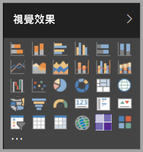

但您能夠使用的不只這組視覺效果，選取省略符號可以開啟另一個報表視覺效果來源：「自訂視覺效果」。

自訂視覺效果是由開發人員使用自訂視覺效果 SDK 所建立，可讓商務使用者以最符合業務的方式來查看資料。 報表作者之後可以將自訂視覺效果檔案匯入其報表中，並將它們當成 Power BI 視覺效果來使用。 自訂視覺效果是 Power BI 中的第一類物件，可以加以篩選、反白顯示、編輯、共用等等。

自訂視覺效果可以有三種部署通道的形式：

* 自訂視覺效果檔案
* 組織視覺效果
* Marketplace 視覺效果

## 自訂視覺效果檔案

自訂視覺效果是一種套件，其中包含的程式碼可用來轉譯提供給自訂視覺效果的資料。 任何人都可以建立自訂視覺效果，並將它封裝為單一 `.pbiviz` 檔案，以便匯入到 Power BI 報表中。

> [!WARNING]
> 自訂視覺效果可能包含具有安全性或隱私權風險的程式碼；在您將自訂視覺效果匯入至您的報表中之前，請確定您信任自訂視覺效果的作者與來源。

## 組織視覺效果

Power BI 系統管理員可以將自訂視覺效果部署到組織中，讓報表作者可以輕鬆地探索與使用系統管理員核准在組織內部使用的自訂視覺效果。 如此可讓系統管理員得以選擇要在組織中部署的特定自訂視覺效果，以及輕鬆管理 (例如，更新版本、停用/啟用) 視覺效果的方法。 報表作者可以輕易地探索組織專屬的視覺效果，而且能夠流暢地支援更新這些視覺效果。

如需取得組織自訂視覺效果的詳細資訊，請[深入了解組織視覺效果](power-bi-custom-visuals-organization.md)。

## Marketplace 視覺效果

社群成員與 Microsoft 貢獻出自訂視覺效果以供公眾使用，並將自訂視覺效果發佈至 [AppSource](https://appsource.microsoft.com/en-us/marketplace/apps?product=power-bi-visuals) Marketplace。 您可以下載這些視覺效果並將其新增至 Power BI 報表。 所有這些自訂視覺效果的功能與品質，都已通過 Microsoft 的測試與核准。

什麼是 [AppSource](developer/office-store.md)？ 簡單來說，這是為 Microsoft 軟體尋找應用程式、增益集和延伸模組的地方。 [AppSource](https://appsource.microsoft.com/en-us/) 為上百萬名 Office 365、Azure、Dynamics 365、Cortana 及 Power BI 等產品的使用者提供了尋找解決方案的管道，讓使用者能夠以更有效率、更切實且更得心應手的方式搞定工作。

### 認證的視覺效果

Power BI 認證的視覺效果為已通過額外嚴格品質測試的 Marketplace 視覺效果，且支援額外的使用案例，例如[電子郵件訂閱](https://docs.microsoft.com/power-bi/service-report-subscribe)以及[匯出至 PowerPoint](https://docs.microsoft.com/power-bi/service-publish-to-powerpoint)。
若要查看已認證的自訂視覺效果清單，或提交您自己的視覺效果，請參閱[已認證的自訂視覺效果](https://docs.microsoft.com/power-bi/power-bi-custom-visuals-certified)。

您是否為 Web 開發人員，而且有興趣將自己建立的視覺效果發佈到 AppSource 呢？ 請參閱[開發 Power BI 自訂視覺效果](developer/custom-visual-develop-tutorial.md)，並了解如何[將自訂視覺效果發佈至 AppSource](https://appsource.microsoft.com/en-us/marketplace/apps?product=power-bi-visuals)。

### 從檔案匯入自訂視覺效果

1. 從 [視覺效果] 窗格底部選取省略符號。

    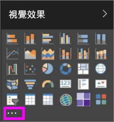

2. 在下拉式清單中，選取 [從檔案匯入]。

    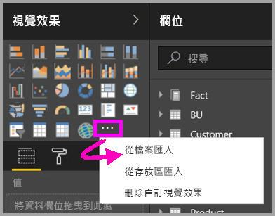

3. 從 [開啟檔案] 功能表中，選取您想要匯入的 `.pbiviz` 檔案，然後選取 [開啟]。 自訂效果的圖示會新增至 [視覺效果] 窗格的底部，並可立即用於報表中。

    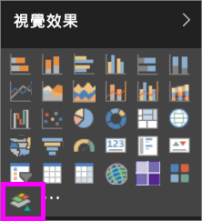

### 匯入組織視覺效果

1. 從 [視覺效果] 窗格底部選取省略符號。

    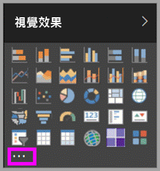

2. 在下拉式清單中，選取 [從 Marketplace 匯入]。

    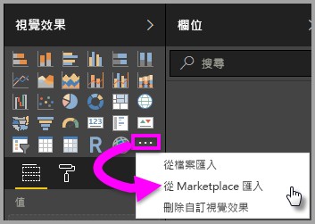

3. 選取頂端索引標籤功能表中的 [我的組織]。

    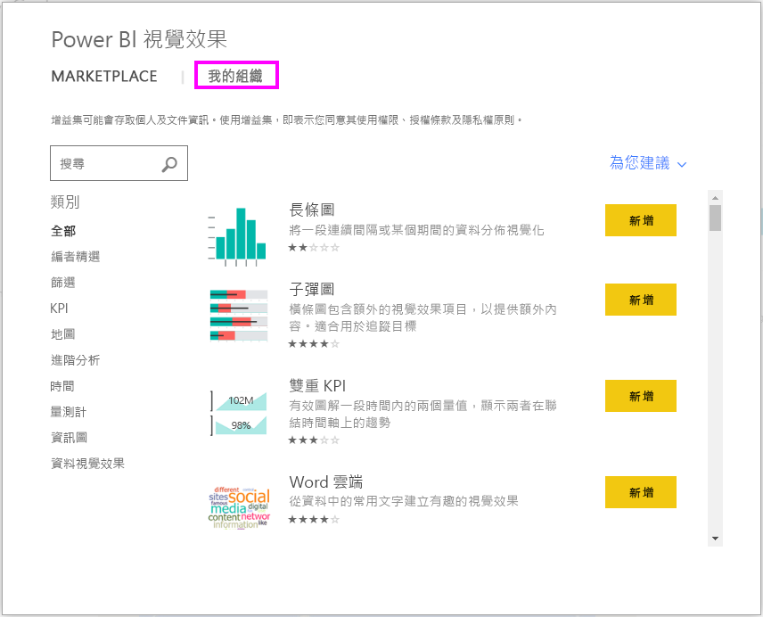

4. 捲動清單，尋找要匯入的視覺效果。

    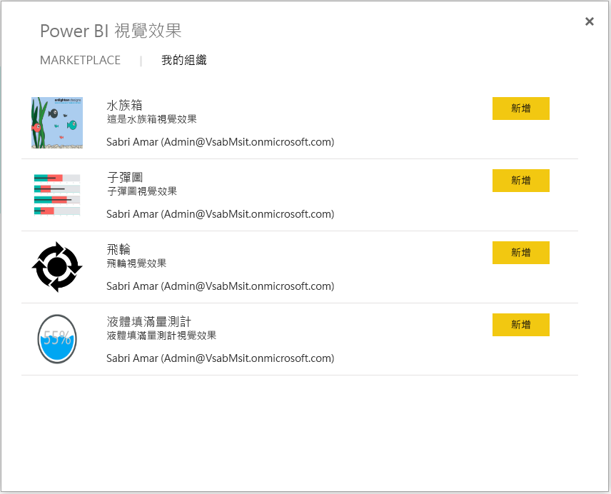

5. 選取 [新增] 匯入自訂視覺效果。 自訂效果的圖示會新增至 [視覺效果] 窗格的底部，並可立即用於報表中。

    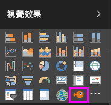

## 從 Microsoft AppSource 下載或匯入自訂視覺效果

您可以選擇從 Power BI 與 AppSource 網站下載及匯入視覺效果。

### 從 Power BI 匯入自訂視覺效果

1. 從 [視覺效果] 窗格底部選取省略符號。

    

2. 在下拉式清單中，選取 [從 Marketplace 匯入]。

    

3. 捲動清單，尋找要匯入的視覺效果。

    

4. 若要深入了解其中一個視覺效果，請加以反白並選取。

    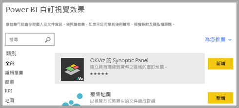

5. 您可以在詳細資料頁面上檢視螢幕擷取畫面、影片、詳細的描述等等。

    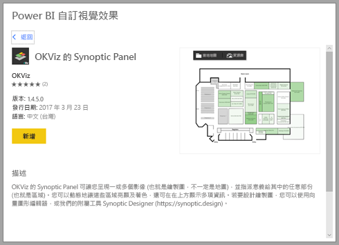

6. 捲動至底部即可看到評論。

    

7. 選取 [新增] 以匯入自訂視覺效果。 自訂效果的圖示會新增至 [視覺效果] 窗格的底部，並可立即用於報表中。

    

### 從 Microsoft AppSource 下載並匯入自訂視覺效果

1. 請先前往 [Microsoft AppSource](https://appsource.microsoft.com) 並選取 [應用程式] 索引標籤。 

    

2. 前往[應用程式結果頁面](https://appsource.microsoft.com/en-us/marketplace/apps)，您可在其中檢視各種類別的熱門應用程式，包括 *Power BI 應用程式*。 但我們要尋找的是自訂視覺效果，因此請從左方的瀏覽清單選取 [Power BI 視覺效果] 以縮小結果範圍。

    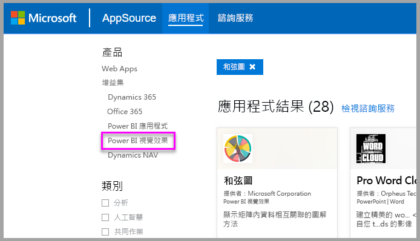

3. AppSource 會顯示每個自訂視覺效果的磚。  每個磚都具有自訂效果的快照，且提供簡短描述與下載連結。 若要查看更多詳細資訊，請選取磚。

    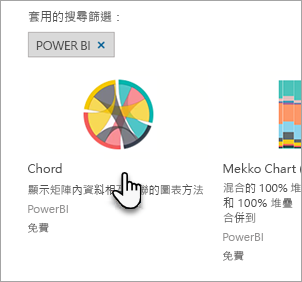

4. 您可以在詳細資料頁面上檢視螢幕擷取畫面、影片、詳細的描述等等。 選取 [立即取得] 然後同意使用條款，即可下載自訂視覺效果。

    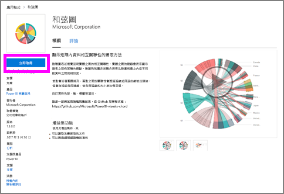

5. 選取連結以下載自訂視覺效果。

    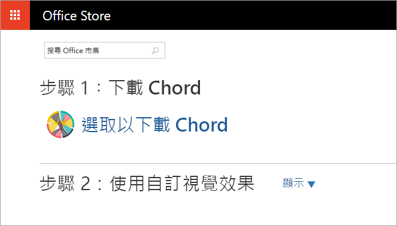

    下載頁面也包含如何將自訂視覺效果匯入 Power BI Desktop 與 Power BI 服務的指示。

    您也可以下載範例報表，包括自訂視覺效果及其功能的展示。

    

6. 儲存 '.pbiviz' 檔案並開啟 Power BI。

7. 將 '.pbiviz' 檔案匯入您的報表 (請參閱上述[從檔案匯入自訂視覺效果](#import-a-custom-visuals-from-a-file)一節)

## 考量與限制

* 自訂視覺效果在匯入後會加入特定的報表。 如果想在另一份報表中使用這個視覺效果，也必須將它匯入該報表。 使用 [另存新檔]  選項儲存具有自訂視覺效果的報表時，自訂視覺效果的複本就會與新報表一起儲存。

* 如果您沒有看到 [視覺效果] 窗格，這表示您沒有該報表的編輯權限。  您只能在您可編輯的報表中新增自訂視覺效果，而在與您共用的報表中則不能。

## 疑難排解

如需疑難排解的資訊，請前往 [Troubleshooting your Power BI custom visuals](power-bi-custom-visuals-troubleshoot.md) (針對您的 Power BI 自訂視覺效果進行疑難排解)。

## 常見問題集

如需詳細資訊和問題的解答，請前往 [Power BI 自訂視覺效果的常見問題集](power-bi-custom-visuals-faq.md#organizational-custom-visuals)。

有其他問題嗎？ [試試 Power BI 社群](http://community.powerbi.com/)。
