# 報表 [篩選] 窗格概觀
這篇文章深入探討報表 [篩選] 窗格。 您會在 Power BI 報表的 [編輯檢視] 及 [讀取檢視] 中看到窗格。

有許多不同的方式可在 Power BI 中篩選資料，建議您先閱讀[關於篩選和反白顯示](power-bi-reports-filters-and-highlighting.md)。

## 使用篩選
您可以在 [編輯檢視](service-interact-with-a-report-in-editing-view.md) 或 [閱讀檢視](service-interact-with-a-report-in-reading-view.md) 中開啟報表。 在 [編輯檢視] 中，報表擁有者可以[將篩選新增至報表](power-bi-report-add-filter.md)，而這些篩選會與報表一起儲存。 在 [閱讀檢視] 中檢視報表的人員可以與篩選互動，但無法將篩選變更儲存至報表。

## [讀取檢視] 中的篩選
在 [讀取檢視] 中開啟報表時，[篩選] 窗格會顯示於報表畫布右方。 若未看見窗格，請選取右上角的箭號展開窗格。

在此範例中，我們已選取具有 6 個篩選的視覺效果。 報表頁面也有篩選，列在 [頁面層級篩選] 標題下。 有一個[鑽研篩選](power-bi-report-add-filter.md)，整份報表也有一個篩選︰**FiscalYear** 是 2013 或 2014。

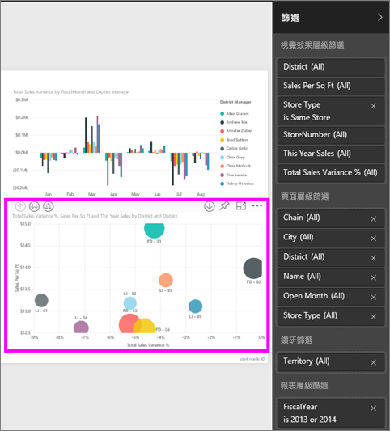

有些篩選旁邊有 **All** 字組，這表示所有值作為一個篩選。  例如，下方螢幕擷取畫面中的 [Chain(All)] 表示此報表頁面包含所有連鎖店的相關資料。  相反地，[FiscalYear is 2013 or 2014] 的報表層級篩選表示報表只包含會計年度 2013 年及 2014 年的資料。

檢視此報表的任何人都可以使用這些篩選器互動。

* 暫留然後選取篩選旁邊的箭號，即可檢視篩選的詳細資料。
  
   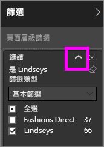
* 變更篩選，例如將 [Lindseys] 變更為 [Fashions Direct]。
  
     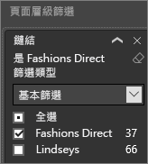
* 選取篩選名稱旁邊的 **x** 即可刪除篩選。
  
  刪除篩選會將其從清單移除，但不會從報表刪除資料。  例如，如果您刪除 [FiscalYear is 2013 or 2014] 篩選，會計年度資料仍會留在報表中，但不會再篩選為僅顯示 2013 年及 2014年；將顯示資料包含的所有會計年度。  不過，刪除篩選後即無法再加以修改，因為其已從清單移除。 清除篩選是較佳的選擇，方法是選取橡皮擦圖示 。
  
  

## [編輯檢視] 中的篩選
在 [編輯檢視] 中開啟報表時，[篩選] 窗格會顯示於 [視覺效果] 窗格底部的報表畫布右方。 若未看見窗格，請選取右上角的箭號展開窗格。

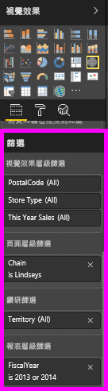.  

如果在畫布上不選取任何視覺效果，則 [篩選] 窗格只會顯示套用至整份報表分頁和整個報表的篩選，以及任何鑽研篩選 (如有設定)。 在下列範例中，未選取任何視覺效果，也沒有頁面層級或鑽研篩選，但是有報表層級篩選。  

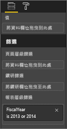  

如果在畫布上選取視覺效果，您也會看到只套用到該視覺效果的篩選：   

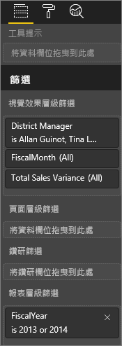

若要顯示特定篩選的選項，選取篩選名稱旁邊的向下箭號。  在下列範例中，報表層級篩選設為 2013 年和 2014 年。 而且這是**基本篩選**範例。  若要顯示進階選項，請選取 [進階篩選]。

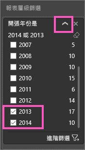

## 清除篩選
 在進階或基本篩選模式中，選取橡皮擦圖示  重設篩選。 

## 新增篩選
* 在編輯檢視中，藉由從 [欄位] 窗格選取欄位，並將它拖曳到適當的篩選 (您會看到 [將欄位拖曳到這裡] 文字)，以將篩選新增至視覺效果、分頁、鑽研或報表。 將欄位作為篩選新增時加以微調，方法是使用 [基本篩選] 及 [進階篩選] 控制項 (如下所述)。

將新的欄位拖曳至視覺效果層級篩選區域不會將該欄位新增至視覺效果，但能讓您使用此新欄位篩選該視覺效果。 在下方範例中，[Chain] 作為新篩選新增至視覺效果。 請注意，僅將 [Chain] 作為篩選新增並不會更改視覺效果，除非您使用 [基本篩選] 或 [進階篩選] 控制項。

    

* 用來建立視覺效果的所有欄位也可以作為篩選。 首先，選取要啟用的視覺效果。 視覺效果正使用的欄位列於 [視覺效果] 窗格中 (如果您在 [編輯] 檢視中)，以及 [視覺效果層級篩選] 標題下的 [篩選] 窗格中。
  
   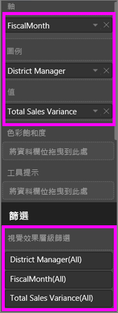  
  
   微調這些欄位中的任何項目，方法是使用 [基本篩選] 及 [進階篩選] 控制項 (如下所述)。

## 篩選類型：文字欄位篩選
### 清單模式
勾選核取方塊可以選取或取消選取值。 [所有]  核取方塊可以用來開啟或關閉所有核取方塊的切換狀態。 核取方塊代表該欄位所有可用的值。  當您調整篩選之後，會更新重新計算陳述式以反映您的選擇。 

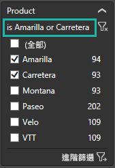

請注意現在的重新計算陳述式寫著 "is Amarilla or Carretera"

### 進階模式
選取 [進階篩選]  以切換到進階模式。 使用下拉式清單控制項和文字方塊，來識別要包含哪些欄位。 您可以選擇 [And] 和 [Or]，建立複雜的篩選運算式。 當您已設定想要的值之後，請選取 [套用篩選]  按鈕。  

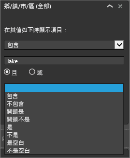

## 篩選類型：數值欄位篩選
### 清單模式
如果這些值為有限時，選取欄位名稱之後就會顯示清單。  如需使用核取方塊的說明，請參閱上述 [文字欄位篩選] &gt; [清單模式]。   

### 進階模式
如果值為無限或代表某種範圍，則選取欄位名稱之後會開啟進階篩選模式。 使用下拉式清單和文字方塊來指定您想要查看值的範圍。 

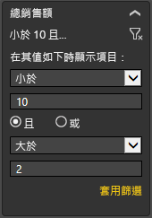

您可以選擇 [And] 和 [Or]，建立複雜的篩選運算式。 當您已設定想要的值之後，請選取 [套用篩選]  按鈕。

## 篩選類型：日期和時間
### 清單模式
如果這些值為有限時，選取欄位名稱之後就會顯示清單。  如需使用核取方塊的說明，請參閱上述 [文字欄位篩選] &gt; [清單模式]。   

### 進階模式
如果欄位值代表日期或時間，則可以在使用日期/時間篩選時指定開始/結束時間。  

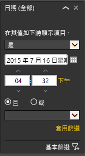

## 後續步驟
[報表的篩選和醒目提示](power-bi-reports-filters-and-highlighting.md)  
[在 [閱讀檢視] 中與篩選條件及醒目提示互動](service-interact-with-a-report-in-reading-view.md)  
[在報表的編輯檢視中建立篩選條件](power-bi-report-add-filter.md)  
[變更報表視覺效果相互交叉篩選及交叉醒目提示的方式](service-reports-visual-interactions.md)

深入了解 [Power BI 中的報表](service-reports.md)  
[Power BI - 基本概念](service-basic-concepts.md)

有其他問題嗎？ [試試 Power BI 社群](http://community.powerbi.com/)

