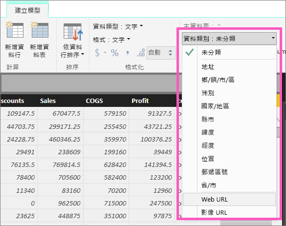

# 將超連結新增至資料表
本主題將教導您如何使用 Power BI Desktop 建立超連結。 然後使用 Desktop 或 Power BI 服務將這些超連結新增至您的報表資料表和矩陣中。 

> [!NOTE]
> [儀表板上的磚](service-dashboard-edit-tile.md)中的超連結和[儀表板上的文字方塊](service-dashboard-add-widget.md)可以使用 Power BI 服務即時建立。 [報表中的文字方塊](service-add-hyperlink-to-text-box.md)中的超連結可以使用 Power BI 服務和 Power BI Desktop 即時建立。
> 
> 

## 若要使用 Power BI Desktop 在資料表或矩陣中建立超連結
在 Power BI Desktop 中可以建立資料表與矩陣內的超連結，而不是從 Power BI 服務中建立。 將活頁簿匯入 Power BI 之前，也可在 Excel Power Pivot 中建立超連結。 以下說明這兩種方法。

## 在 Power BI Desktop 中建立資料表或矩陣超連結
新增超連結的程序取決於您是否已匯入資料，還是已使用 DirectQuery 連接資料。 以下說明這兩種案例。

### 資料匯入 Power BI
1. 如果超連結在資料集中未以欄位形式存在，請使用 Desktop 將其新增為[自訂資料行](desktop-common-query-tasks.md)。
2. 在 [資料] 檢視中，選取資料行，且在 [模型] 索引標籤中選擇 [資料類別] 的下拉式清單。
   
    
3. 選取 [Web URL] 。
4. 切換至 [報表] 檢視，並使用分類為 Web URL 的欄位建立資料表或矩陣。 超連結為藍色加底線。

    

    > [!NOTE]
    > URL 的開頭必須是 **http://、 https://** 或 **www**。
    >
   
1. 如果您不想在表格中顯示完整的 URL，可以改為顯示超連結圖示   。 請注意，您無法在矩陣中顯示圖示。
   
   * 選取要使用的圖表。
   * 選取油漆滾筒圖示  以開啟 [格式化] 索引標籤。
   * 展開 [值]、找到 **URL 圖示**並將它**開啟**。
6. (選擇性) [將報表從 Desktop 發佈到 Power BI 服務](guided-learning/publishingandsharing.yml?tutorial-step=2)，然後在 Power BI 服務中開啟報表。 超連結在該處也可以運作。

### 使用 DirectQuery 連接資料
您無法在 DirectQuery 模式中建立新的資料行。  但若資料已經包含 URL，您可以將它們轉換成超連結。

1. 在 [報表] 檢視中，使用包含 URL 的欄位建立資料表。
2. 選取該資料行，且在 [模型] 索引標籤中選擇 [資料類別] 的下拉式清單。
3. 選取 [Web URL] 。 超連結為藍色加底線。
4. (選擇性) [將報表從 Desktop 發佈到 Power BI 服務](guided-learning/publishingandsharing.yml?tutorial-step=2)，然後在 Power BI 服務中開啟報表。 超連結在該處也可以運作。

## 在 Excel Power Pivot 中建立資料表或矩陣超連結
將超連結新增至 Power BI 資料表和矩陣的另一種方式，是先在資料集內建立超連結，然後才從 Power BI 匯入/連線至該資料集。 這個範例會使用 Excel 活頁簿。

1. 請在 Excel 中開啟活頁簿。
2. 選取 [PowerPivot]  索引標籤，然後選擇 [管理] 。
   
   
1. 當 PowerPivot 開啟時，選取 [進階] 索引標籤。
   
   ![PowerPivot [進階] 索引標籤](media/power-bi-hyperlinks-in-tables/createhyperlinkinpowerpivot3.png)
4. 將游標放在包含 URL 的資料行，其中的 URL 想要轉換成 Power BI 資料表中的超連結。
   
   > [!NOTE]
   > URL 的開頭必須是 **http://、 https://** 或 **www**。
   > 
5. 在 [報表屬性]  群組中，選取 [資料類別目錄]  下拉式清單，然後選擇 [Web URL] 。 
   
   

6. 從 Power BI 服務或 Power BI Desktop，連接至或匯入此活頁簿。
7. 建立包含 [URL] 欄位的資料表視覺效果。
   
   

## 考量與疑難排解
問：是否可以在資料表或矩陣中使用自訂 URL 作為超連結？    
答：否。 您可以使用連結圖示。 如果您需要針對超連結使用自訂文字，且您的 URL 清單很短，請考慮改用文字方塊。

## 後續步驟
[Power BI 報表的視覺效果](visuals/power-bi-report-visualizations.md)

[Power BI - 基本概念](consumer/end-user-basic-concepts.md)

有其他問題嗎？ [試試 Power BI 社群](http://community.powerbi.com/)

