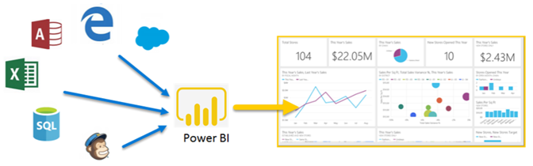
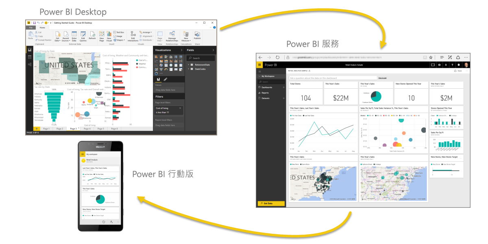

# Power BI 是什麼？
**Power BI** 是軟體服務、應用程式和連接器的集合，它們搭配使用來將不相關的資料來源轉換成相關、視覺上融入的互動式深入剖析。 不論您的資料是簡單的 Excel 試算表，或是一組雲端和內部部署混合式資料倉儲， **Power BI** 都可讓您輕鬆地連線到資料來源、以視覺化方式檢視及探索 重要資料，以及與任何人或您想要的任何人共用該資料。

**Power BI** 可以十分簡單和快速；能夠透過 Excel 試算表或本機資料庫建立快速深入剖析。 但是 **Power BI** 也是穩定和企業等級、準備好進行廣泛模型化和即時分析，以及可進行自訂開發。 因此，它可以是您的個人報告和視覺效果工具， 也可以是群組專案、部門或整個公司的分析和決策引擎。

## Power BI 的各部分
Power BI 包含稱為 **Power BI Desktop** 的 Windows 傳統型用程式、稱為 **Power BI 服務**的線上 SaaS (*軟體即服務*) 服務，以及 Windows、iOS 和 Android 裝置適用的 Power BI **應用程式**。

**Power BI Desktop**、**服務**和**行動應用程式**這三個元素是設計成讓人員建立、共用和使用透過最有效方式服務他們或其角色的商業見解。

第四個元素，**Power BI 報表伺服器**，可讓您在 Power BI Desktop 中建立 Power BI 報表之後，將它們發行至內部部署報表伺服器。 深入了解 [Power BI 報表伺服器](#on-premises-reporting-with-power-bi-report-server)。

## Power BI 如何符合您的角色
Power BI 的使用方式可能取決於您在專案或小組中的角色。 而其他角色的其他人可能會以不同的方式使用 Power BI，這沒有問題。

例如，您可能主要使用 **Power BI 服務**。 但是您的數字處理、業務報表建立同事可能會大量使用 **Power BI Desktop** 建立報表，並將 Desktop 報表發行到 Power BI 服務進行檢視。 而銷售部門的另一個同事可能主要使用她的 Power BI 電話應用程式來監視其銷售配額進度，並鑽研到新的潛在客戶詳細資料。

如果您是開發人員，便可以使用 Power BI API 將資料推送至資料集，或將儀表板和報表內嵌至您自己的自訂應用程式。 有新視覺效果的構想嗎？ 您可以自行建置並與其他人分享。  

您也可能會根據您嘗試達成的目標或您在指定專案中的角色，在不同的時間使用 **Power BI** 的每個元素。

或許您會使用 **Power BI Desktop** 為客戶參與統計資料的相關專屬小組建立報表。 或許您也檢視了服務中即時儀表板內的庫存和製造進度。 Power BI 的使用方式取決於 Power BI 的哪些功能或服務是最適合您解決方案的工具。 您可以使用 Power BI 的每個部分，這就是它如此具有彈性且吸引人的原因。

探索與您角色相關的文件：
- 適用於[***設計師***](desktop-what-is-desktop.md)的 Power BI
- 適用於[***取用者***](consumer/end-user-consumer.md)的 Power BI
- 適用於[***開發人員***](developer/what-can-you-do.md)的 Power BI
- 適用於[***系統管理員***](service-admin-administering-power-bi-in-your-organization.md)的 Power BI

## Power BI 中的工作流程
Power BI 中的一般工作流程是從在 **Power BI Desktop** 中連線至資料來源並建置報表開始。 接著，您會將該報表從 **Power BI Desktop** 發佈至 **Power BI 服務**並共用，讓**服務**和**行動裝置**中的終端使用者可以檢視報表及與報表互動。
此工作流程是常見的情況，並示範三個主要 Power BI 元素如何彼此互補。

以下是詳細的 [Power BI Desktop 與 Power BI 服務的比較](service-service-vs-desktop.md)。

但如果您尚未做好移至雲端的準備，而想要將報表保留在公司防火牆後方，該怎麼辦？  請繼續閱讀。

## 使用 Power BI 報表伺服器的內部部署報表
使用 Power BI 報表伺服器所提供的多種可立即使用的工具及服務，建立、部署及管理內部部署的 Power BI 報表、行動報表及編頁報表。

「Power BI 報表伺服器」是一項解決方案，您會將其部署在防火牆後方，然後以各種不同方式 (不論是在網頁瀏覽器中、行動裝置上還是以電子郵件形式檢視) 將報表傳遞給正確的使用者。 而由於「Power BI 報表伺服器」與雲端 Power BI 相容，因此您可以在準備就緒後就移至雲端。 

深入了解 [Power BI 報表伺服器](report-server/get-started.md)。

## 後續步驟
[登入、取得一些資料以及持續學習 Power BI 服務](service-the-new-power-bi-experience.md)   
[教學課程：開始使用 Power BI 服務](service-get-started.md)
[快速入門：在 Power BI Desktop 中連線至資料](desktop-quickstart-connect-to-data.md)