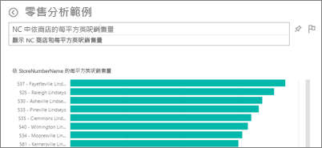
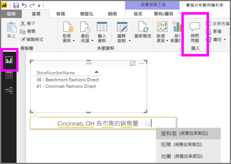

# Power BI 服務和 Power BI Desktop 中的問與答
## 問與答是什麼？
有時若要從您的資料獲得解答，最快的方法是使用自然語言詢問問題。 例如，「去年總銷售額是多少」。  使用問與答來探索資料，可使用直覺式的自然語言功能，並以圖表和圖形形式接收回應。 問與答不同於搜尋引擎 -- 問與答只會提供有關 Power BI 中資料的結果。

本文是所有項目問與答的跳躍點。 選取下方的連結以了解問與答在 Power BI 服務 (儀表板和報表)、Power BI Desktop (報表)、Power BI Embedded，和 Power BI Mobile 中如何運作。  

提問只是第一步。  縮小或擴充您的問題，讓查閱資料更加有趣，探索值得信賴的新資訊、聚焦於詳細資料，並且放寬條件以求得更廣泛的檢視。 您獲得的深入資訊和發現，讓人雀躍不已。

這種體驗真正充滿互動...而且快速！ 採用記憶體內部儲存體的回應幾乎可瞬間完成。

##  「取用者」的問與答
當同事與您共用儀表板時，您會在 Power BI 服務 (app.powerbi.com) 的儀表板、Power BI 行動版儀表板的底部，以及 Power BI Embedded 的視覺效果上方，發現問與答問題方塊。 除非擁有者已授與您編輯權限，否則您將能夠使用問與答來探索資料，但無法儲存以問與答建立的任何視覺效果。

## 「建立者」的問與答
如果您是 Power BI 報表的「建立者」，或具有資料集的編輯權限，則您會在 Power BI 服務的儀表板上，以及 Power BI 服務和 Power BI Desktop 中的每個報表頁面上，發現問與答問題方塊。 您使用問與答所建立的任何視覺效果可儲存至儀表板，並儲存在報表中。

除了使用問與答來瀏覽資料，建立者和資料集擁有者也可以藉由[修改他們的資料集](service-prepare-data-for-q-and-a.md)、新增[精選問題](service-q-and-a-create-featured-questions.md)，和針對內部部署即時連線資料集[啟用和停用問與答](service-q-and-a-direct-query.md)，來改善取用者的問與答體驗。 在[內嵌案例](developer/qanda.md)中，開發人員可以選擇 2 種模式：**互動式**和**只產生結果**。

## 問與答如何知道要怎麼回答問題？
### 問與答使用了哪些資料集？
問與答怎知道要如何回答特定資料的問題？ 它依賴基礎資料集中的資料表、資料行與導出欄位的名稱。 因此您 (或資料集擁有者) 為其命名的方式相當重要！

例如，假設您有一個名為「銷售」的 Excel 資料表，其資料行標題為「產品」、「月」、「單位銷售」、「銷售毛額」和「利潤」。 您可以詢問有關任何這些實體的問題。  您可以詢問「顯示銷售」、「各月份的總收益」、「依單位銷售排序產品」等等問題。

問與答可以回答的問題，取決於您的資料集是如何組織的。 在 Salesforce 中的資料也能使用問與答嗎？ 當您連線到 salesforce.com 帳戶時，Power BI 會自動產生儀表板。  開始使用問與答詢問問題之前，請先查看在儀表板視覺效果中顯示的資料，以及問與答下拉式清單中顯示的資料。

* 如果視覺效果軸的標籤和值包含「銷售」、「客戶」、「月」與「商機」，您可以放心地詢問：哪位「客戶」的「商機」最大等問題，或顯示每月「銷售」的橫條圖。
* 如果下拉式清單中包含「銷售人員」、「州」及「年」，您可以放心地詢問：「2013  年時，佛羅里達州  哪位銷售人員  的銷售量 最低」等問題。

如果您在 Google Analytics 網站有效能資料，您或許可以詢問問與答有關花在網頁的時間、特定網頁瀏覽次數和使用者參與率。 或者，如果您要查詢人口統計資料，您可能會想詢問各地區年齡和家庭收入的相關問題。

### 問與答會使用哪一種視覺效果？
問與答會根據要顯示的資料挑選最佳視覺效果。 有時在基礎資料集中資料的定義是特定類型或類別目錄，這就有助於問與答知道要如何加以顯示。 例如，如果將資料定義為日期類型，則較有可能顯示為折線圖。 分類為城市的資料比較有可能顯示為地圖。

您也可以告知問與答要使用哪一種視覺效果，方法是將視覺效果類型加入您的問題中。 但是請記住，以您要求的視覺效果類型讓問與答顯示資料，並不一定可行。

如需問與答可辨識的關鍵字相關資訊，請參閱[詢問問題的秘訣](service-q-and-a-tips.md)。

## 如需 Power BI 問與答的詳細資訊
[概觀：如何在 Power BI 儀表板和報表中使用問與答](power-bi-tutorial-q-and-a.md)：使用問與答的逐步解說，以及問與答運作方式的概觀。

[Microsoft Power BI 行動應用程式](mobile-apps-ios-qna.md)，適用於 iPad、iPhone 及 iPod Touch 裝置的 iOS。

[Microsoft Power BI Embedded](developer/qanda.md)，將問與答納入應用程式中。

[在問與答中提問的秘訣](service-q-and-a-tips.md)：了解如何與問與答溝通，以取得最佳的結果。

[將精選問題新增至您的資料集](service-q-and-a-create-featured-questions.md)，則問與答會向您的同事建議這些問題。

[為您的內部部署資料集啟用問與答](service-q-and-a-direct-query.md)，如果您需要閘道來連線到資料集，請使用 Power BI 設定來開啟和關閉問與答。

[教學課程：在 Power BI 服務中使用問與答與零售範例](power-bi-visualization-introduction-to-q-and-a.md)：使用實際業界教學課程的問與答。

[讓資料適用於問與答](service-prepare-data-for-q-and-a.md)：您是製作資料集與資料模型的人員嗎？  如果是，則這個主題再適合不過了。

有其他問題嗎？ [試試 Power BI 社群](http://community.powerbi.com/)
